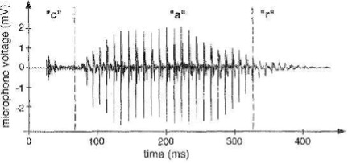
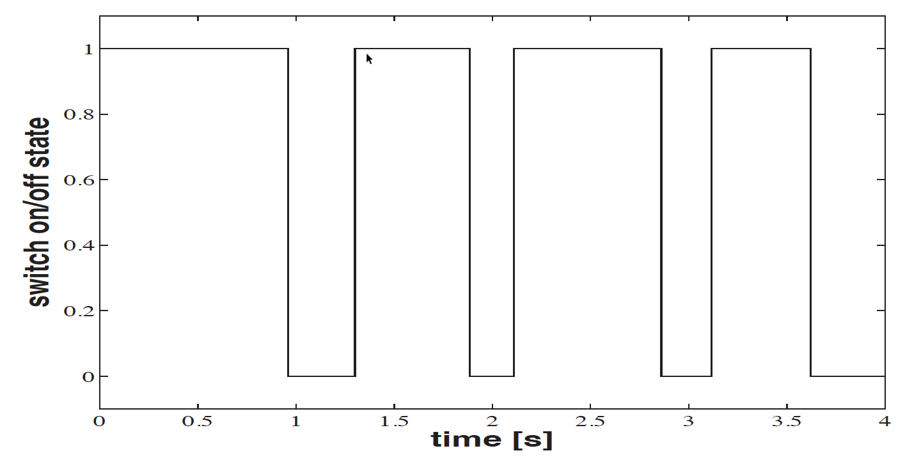
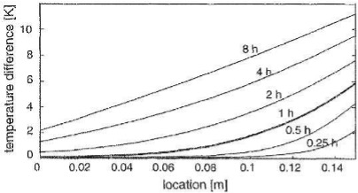
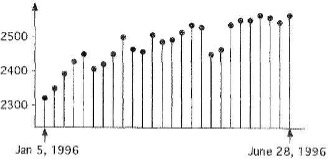
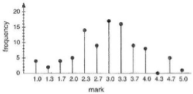
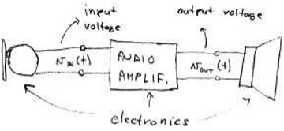
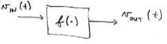
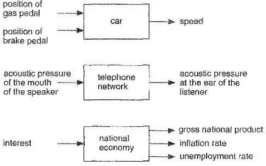
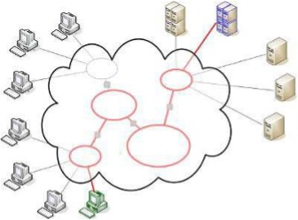

---
jupytext:
  formats: ipynb,md:myst
  text_representation:
    extension: .md
    format_name: myst
    format_version: 0.13
    jupytext_version: 1.14.4
kernelspec:
  display_name: Python 3 (ipykernel)
  language: python
  name: python3
---

+++ {"slideshow": {"slide_type": "slide"}}

(concepts)=
# Unit 1.3: Introduction to the Concepts to be Studied

+++ {"slideshow": {"slide_type": "subslide"}}

Follow along at [cpjobling.github.io/eg-150-textbook/introduction/concepts](https://cpjobling.github.io/eg-150/introduction/concepts)

+++ {"slideshow": {"slide_type": "slide"}}

In this section we will present some concepts that are important for the dvelopment of your knowlege of signals and signals and use that knowledge for the analysis and design of signal processing signals.

## Coming up

* {ref}`concepts:signals` and {ref}`concepts:example_signals`
* {ref}`concepts:systems` and {ref}`concepts:example_systems`
* {ref}`concepts:system_models`
* {ref}`concepts:system_design`
* {ref}`concepts:signal_processing`
* {ref}`concepts:feedback`

+++ {"slideshow": {"slide_type": "slide"}}

(concepts:signals)=
## Signals

* Signals are numerical functions of one or more independent variables (e.g. room temperature over time and spatial location)

+++ {"slideshow": {"slide_type": "fragment"}}

* Signals are defined in order to convey some information for subsequent signal processing (eg: to find average room temperature during one day).

+++ {"slideshow": {"slide_type": "notes"}}

The actual units (e.g. temperature in degrees Celsius and time in hours) are not important for signal processing, but it is useful to be aware of them.

+++ {"slideshow": {"slide_type": "fragment"}}

* Models of signals are often called waveforms (eg: sine wave model)

+++ {"slideshow": {"slide_type": "subslide"}}

### Examples of signals

* Electrical signals (voltages, currents)

+++ {"slideshow": {"slide_type": "fragment"}}

* Electromagnetic signals (electromagnetic waves)

+++ {"slideshow": {"slide_type": "fragment"}}

* Biological signals (electrocardiogram, sound waves)

+++ {"slideshow": {"slide_type": "fragment"}}

* Man made signals (text files)

+++ {"slideshow": {"slide_type": "slide"}}

(concepts:example_signals)=
## Some Example Signals

+++ {"slideshow": {"slide_type": "subslide"}}

### Microphone output
 
:::{figure-md} microphone

Microphone output (continuous-time, continuous values)
:::

+++ {"slideshow": {"slide_type": "notes"}}

In {numref}`microphone` sound pressure has been converted to a voltage signal.

+++ {"slideshow": {"slide_type": "subslide"}}

### On/off switch state
 
:::{figure-md} on-off

On/off switch state (continuous time, discrete values)
:::

+++ {"slideshow": {"slide_type": "notes"}}

{numref}`microphone` shows the output of a switched device. The signal has only two discrete values but time is continuous. That is the switching can happen at any time instant.

+++ {"slideshow": {"slide_type": "subslide"}}

### Temperature difference

:::{figure-md} temp-diff

The temperature difference of a 15cm thick wall (contunuous space, continuous time)
:::

+++ {"slideshow": {"slide_type": "notes"}}

{numref}`temp-diff` shows the temperature difference of 15cm thick wall (continuous space, continuous value). The spatial location is independent variable, and time is a parameter.

+++ {"slideshow": {"slide_type": "subslide"}}

### Stock market prices

:::{figure-md} stocks

Stock market prices (discrete time, continuous values)
:::

+++ {"slideshow": {"slide_type": "notes"}}

{numref}`temp-diff` shows the value of a particular stock sold on a stock market on particular dates. This is an example of a discrete-time signal with continuous values.

+++ {"slideshow": {"slide_type": "subslide"}}

###  Frequency of marks in a test 

:::{figure-md} marks

Frequency of marks in a test (discrete time, discrete values)
:::

+++ {"slideshow": {"slide_type": "notes"}}

{numref}`marks` shows the range of marks for a particular tests. The mark is one of a discete set of values. The frequency is the number of times a particular mark was achieved. It is an integer so the measured values are also discrete.

+++ {"slideshow": {"slide_type": "slide"}}

(concepts:systems)=
## What are systems?

+++ {"slideshow": {"slide_type": "subslide"}}

### Systems

+++ {"slideshow": {"slide_type": "fragment"}}

* modify and manipulate signals in order to extract some useful information

+++ {"slideshow": {"slide_type": "fragment"}}

* implement signal processing (first as mathematical models, then in hardware and software)

+++ {"slideshow": {"slide_type": "fragment"}}

* have inputs (to feed in signals) and outputs (to read out transformed signals) Physical system

+++ {"slideshow": {"slide_type": "subslide"}}

### A Physical System

:::{figure-md} physical_system

A physical system for amplifying sound.
:::

+++ {"slideshow": {"slide_type": "notes"}}

In {numref}`physical_system sound waves are converted to an electrical signal by a microphone
and the electrical signal is amplified by the audio amplifier before being converted back to sound waves by the speaker.

+++ {"slideshow": {"slide_type": "subslide"}}

### Mathematical model of a system

:::{figure-md} math_model

A mathematical model of a system
:::

+++ {"slideshow": {"slide_type": "notes"}}

For the system shown in schematic (block diagram) form in {numref}`math_model`

$$v_\mathrm{OUT}(t) = f (v_\mathrm{IN}(t))$$

E.g. $v_\mathrm{OUT}(t) = Av_\mathrm{IN}(t)$ where $A$ is a positive real number ($A \in \mathbb{R}^+$)(positive real number)

Mathematical abstractions of physical systems are necessary to devise approaches to signal processing problems.

+++ {"slideshow": {"slide_type": "subslide"}}

(concepts:example_systems)=
## Some example systems

:::{figure-md} systems

Some example systems
:::

+++ {"slideshow": {"slide_type": "subslide"}}

(concepts:system_models)=
## Why do we make models of systems?

+++ {"slideshow": {"slide_type": "fragment"}}

* We make mathematical models of every possible system on the Earth (biological, social, technological, geological,$\ldots$ systems)

+++ {"slideshow": {"slide_type": "fragment"}}

* Usually, the more complicated the model, the better it reflects the reality, but the more difficult it is to deal with (mathematically)

+++ {"slideshow": {"slide_type": "fragment"}}

* We are ‘digitalizing the world’ (Big Data, Internet of Things,$ldots$)

+++ {"slideshow": {"slide_type": "subslide"}}

### Can you recognize these systems?

+++

**Add pictures and poll**

+++ {"slideshow": {"slide_type": "slide"}}

(concepts:system_design)=
## System design

+++ {"slideshow": {"slide_type": "fragment"}}

### Top-down design
* Start from overall specifications, e.g. user requirements [Apple products]

+++ {"slideshow": {"slide_type": "fragment"}}

### Bottom-up design

* design sub-systems, then interconnect them to achive the desired system (Cloud computing, Internet, computer and cellular networks)

+++ {"slideshow": {"slide_type": "subslide"}}

### Example:  The Internet

:::{figure-md} internet

A simple model of the internet
:::

+++ {"slideshow": {"slide_type": "subslide"}}

Basic design requirments are (often) simple:

* e.g. send packets of data between two nodes in a network

+++ {"slideshow": {"slide_type": "subslide"}}

But	the	implementation	is	(almost	always) complicated:

+++ {"slideshow": {"slide_type": "fragment"}}

* how to distinguish end-nodes?

+++ {"slideshow": {"slide_type": "fragment"}}

* how to find the route?

+++ {"slideshow": {"slide_type": "fragment"}}

* how to share network (resources) among billions end-nodes?

+++ {"slideshow": {"slide_type": "fragment"}}

* how to deal with lost and delayed packets?

+++ {"slideshow": {"slide_type": "fragment"}}

* how to deal with mobility and nodes leaving and arriving?

+++ {"slideshow": {"slide_type": "slide"}}

(concepts:signal_processing)=
## What is Signal Processing?

+++ {"slideshow": {"slide_type": "subslide"}}

### Example scenarios
 
1. Given a system, find the signal that will pass through it well (e.g. design a transmitter signal in a communication system)

+++ {"slideshow": {"slide_type": "fragment"}}

2. Given a signal, find the system that will pass it well (e.g. design an audio amplifier)

+++ {"slideshow": {"slide_type": "fragment"}}

3. Design a system to make a desired change to the signal (e.g. design an audio equalizer)

+++ {"slideshow": {"slide_type": "fragment"}}

4. Design a system to extract information from the signal (e.g. design a communication receiver to recover transmitted data symbols)

+++ {"slideshow": {"slide_type": "subslide"}}

(concepts:feedback)=
## Feedback

+++ {"slideshow": {"slide_type": "fragment"}}

* Feedback is a key concept in Control Engineering.

+++ {"slideshow": {"slide_type": "fragment"}}

* It is found in all technological, biological, financial, social etc. systems.

+++ {"slideshow": {"slide_type": "fragment"}}

* In positive feedback: a change is amplified (including noise), e.g. useful to produce oscillations.

+++ {"slideshow": {"slide_type": "fragment"}}

* Negative feedback: a change is neutralized (noise is suppressed), e.g. useful to stabilize a system.

+++

## Summary

In this section we have presented some concepts from the field of **Signals and Systems** that we will study further in this and later courses.

We looked at

* {ref}`concepts:signals` and {ref}`concepts:example_signals`
* {ref}`concepts:systems` and {ref}`concepts:example_systems`
* {ref}`concepts:system_models`
* {ref}`concepts:system_design`
* {ref}`concepts:signal_processing`
* {ref}`concepts:feedback`

+++ {"slideshow": {"slide_type": "slide"}}

## Coming Next

In the following sections, we introduce the mathematical description and representation of signals and systems and their classifications. We also define several important basic signals essesntial to your studies.

The first of these will be {ref}`sig_intro`.
