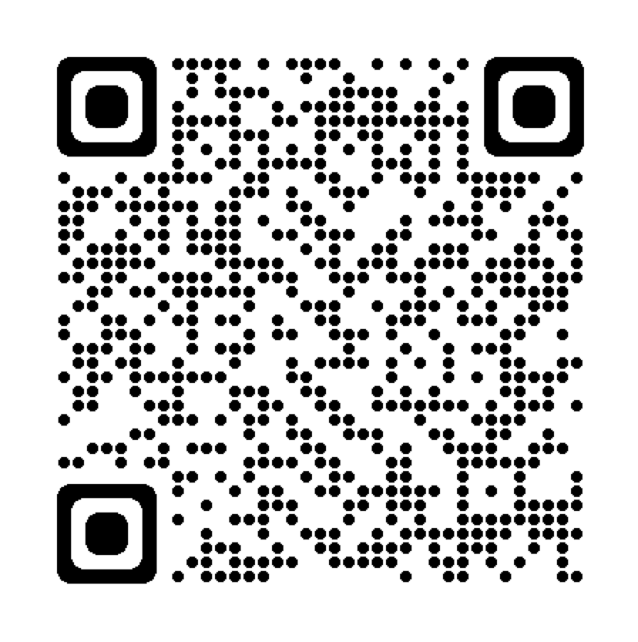

---
jupytext:
  formats: ipynb,md:myst
  text_representation:
    extension: .md
    format_name: myst
    format_version: 0.13
    jupytext_version: 1.15.2
kernelspec:
  display_name: Python 3 (ipykernel)
  language: python
  name: python3
---

+++ {"slideshow": {"slide_type": "slide"}}

(unit1_1)=
# Unit 1.1: Setting the Scene


Follow along at [cpjobling.github.io/eg-150-textbook/introduction/intro](https://cpjobling.github.io/eg-150-textbook/introduction/intro)


+++ {"slideshow": {"slide_type": "slide"}}

## Pingo

(change this to Slido?)

We will be using a web-based audience response system called Pingo for in-class quizzes and informal surveys.

+++ {"slideshow": {"slide_type": "subslide"}}

### Setup

Browse to: [pingo.coactum.de](https://pingo.coactum.de).


:::{figure-md} pingo-qr


QR Code for Pingo
:::

When prompted: enter the session ID

The Session ID for this Course is: **804079**
<!-- #endregion -->

+++ {"slideshow": {"slide_type": "subslide"}}

### Icebreaker Questions

+++ {"slideshow": {"slide_type": "fragment"}}

**-> Launch Icebreaker Poll**

+++ {"slideshow": {"slide_type": "subslide"}}

### End of setup

+++ {"slideshow": {"slide_type": "fragment"}}

**-> Start lecture recording**

+++ {"slideshow": {"slide_type": "slide"}}

## What are signals?

What comes to mind when I say "What is a signal?"

+++ {"slideshow": {"slide_type": "fragment"}}

**-> Poll**

+++ {"slideshow": {"slide_type": "subslide"}}

According to the [Oxford English Dictionary](https://www.oed.com/viewdictionaryentry/Entry/179518) one definition of a signal is:

> A gesture, action, sound, etc., intended to convey warning, direction, or information; an intimation.”

+++ {"slideshow": {"slide_type": "fragment"}}

In this course we are going to be most concerned with electronic signals which represent physical quantities inside a digital or analogue circuit. So the definition given in the [Signals and Systems wikibook](http://en.wikibooks.org/wiki/Signals_and_Systems/Definition_of_Signals_and_Systems) {cite}`wikibook` is perhaps nearer the mark.

> ”A detectable physical quantity or impulse (as a voltage, current, or magnetic field strength) by which messages or information can be transmitted.“

+++ {"slideshow": {"slide_type": "subslide"}}

## What is a system?

What comes to mind when I say "What is a system?"

+++ {"slideshow": {"slide_type": "fragment"}}

**-> Poll**

+++ {"slideshow": {"slide_type": "subslide"}}

According to the [Oxford English Dictionary](https://www.oed.com/view/Entry/196665) a system is defined as:

> “A group or set of related or associated things perceived or thought of as a unity or complex whole.”

The definition given in the [Signals and Systems wikibook](http://en.wikibooks.org/wiki/Signals_and_Systems/Definition_of_Signals_and_Systems) {cite}`wikibook` is:

> "any physical set of components that takes a signal, and produces a signal."

+++ {"slideshow": {"slide_type": "subslide"}}

## A Short Video Introduction

Darryl Morrell, educator and producer of a series of short instructional videos on [Signals and Systems](https://sites.google.com/a/asu.edu/signals-and-systems/) ({cite}`morrell`) provides this useful [Signals and Systems Introduction](https://youtu.be/YBMGMF-DAVU) (YouTube).

%%HTML
<iframe width="560" height="315" src="https://www.youtube.com/embed/YBMGMF-DAVU" title="YouTube video player" frameborder="0" allow="accelerometer; autoplay; clipboard-write; encrypted-media; gyroscope; picture-in-picture; web-share" allowfullscreen></iframe>


Next: {ref}`unit1_2`

+++ {"slideshow": {"slide_type": "notes"}}

## References

```{bibliography}
:filter: docname in docnames
```
