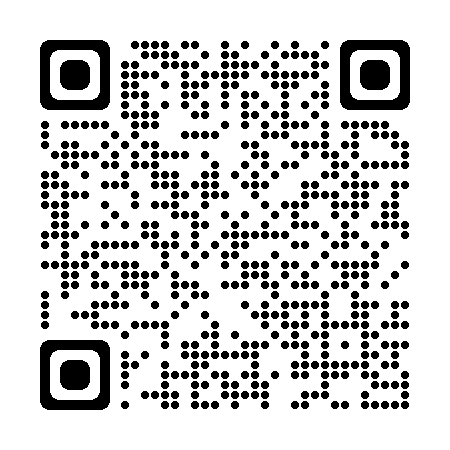

(unit1_2)=
# Unit 1.2: About this Course

Follow along at [cpjobling.github.io/eg-150-textbook/introduction/thecourse](https://cpjobling.github.io/eg-150/introduction/thecourse)

## What will I learn?

We will be following this online textbook and you can see the draft table of contents on the left. 

Each class will be based around one or two section of the online course notes and we will also mke use of the examples classes to provide more practice in the mathematical techniques that are being introduced.

We will make use of MATLAB (and other tools) for computing and Simulink for modelling.

At the end of the module, you should be able to deal with the various mathematical models used in the modelling and design of systems that are used in electronic signal processing applications and be comfortable using MATLAB and Simulink to gain insight into your models.

## How will I learn?

We are going to try a flipped-classroom approach in which you will be expected to read the week's required reading in advance of each week's sessions. We will then use the classroom time to summarize the text and solve the examples given. There will be fortnightly MATLAB lab class and we will use the lab time to learn how to use MATLAB and Simulink to model, analyse and design signal processing systems.

## What is expected of me?

You are required to read the week's readings in advance so that you come to class prepared to take an active part in the active classes and laboratories.

You may also find that group study and discussion outside classes will help reinforce your learning and we will provide a weekly discussion board to facilitate that.

## What can I expect from my teacher?

This is the first time I have taught this course, so I will have a lot to learn about how best to present the material and ensure your success. I am looking forward to finding out what you will teach me this year as I try to help to introduce you to the fundamentals of signals and systems.

## A Tour of the Canvas Site and Other Resources

We will take a few minites at the start of the first class to show you around this textbook and the canvas site and other resources we have made available to you.

## Next

{ref}`concepts`.
