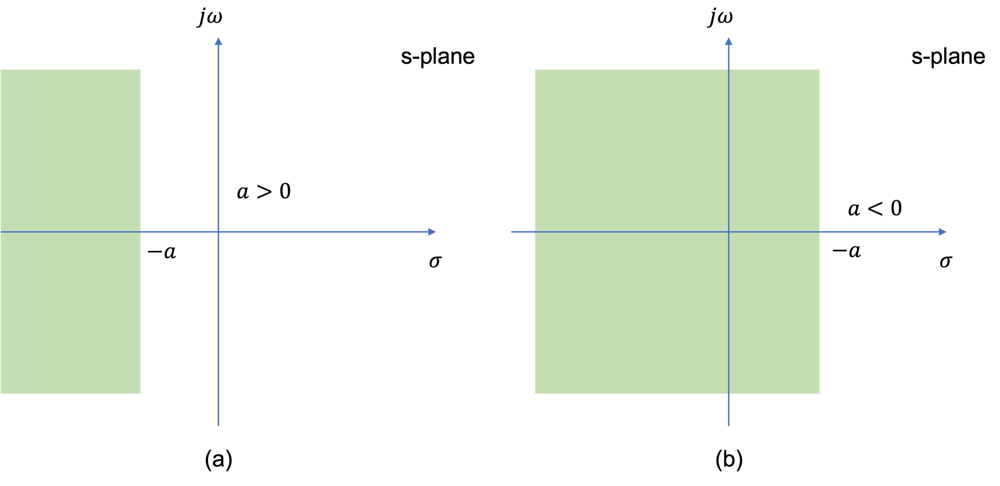

---
jupytext:
  formats: md:myst,ipynb
  text_representation:
    extension: .md
    format_name: myst
    format_version: 0.13
    jupytext_version: 1.14.4
kernelspec:
  display_name: MATLAB
  language: matlab
  name: imatlab
---

+++ {"nbpresent": {"id": "90f3c07d-3646-44b0-a549-7020fc10d16f"}, "slideshow": {"slide_type": "slide"}}

# Unit 4.1: The Laplace Transformation

The preparatory reading for this section is [Chapter 2](https://ebookcentral.proquest.com/lib/swansea-ebooks/reader.action?docID=3384197&ppg=43) of  {cite}`karris` and [Chapter 3]() of {cite}`schaum`.

+++

Follow along at [cpjobling.github.io/eg-150-textbook//laplace_transform/1/laplace](https://cpjobling.github.io/eg-150-textbook/laplace_transform/1/laplace)


+++ {"nbpresent": {"id": "f651cafb-8c2b-4d27-aec9-3491dbcce1aa"}, "slideshow": {"slide_type": "slide"}}

## Agenda

+++ {"nbpresent": {"id": "cdff914d-604d-4ae8-a8e6-8e5caf8bd41e"}, "slideshow": {"slide_type": "fragment"}}

* {ref}`laplace:laplace`

+++

* {ref}`laplace:matlab`

+++ {"nbpresent": {"id": "74c922da-bfb7-4f82-808d-a89b61bd1ab6"}, "slideshow": {"slide_type": "fragment"}}

* {ref}`laplace:roc`

+++ {"nbpresent": {"id": "11a99664-2fdb-4eff-8389-043965b5a6a5"}, "slideshow": {"slide_type": "subslide"}}

* {ref}`laplace:pops_roc`

+++ {"nbpresent": {"id": "a2796ec3-fd12-49d3-99b8-fdc640f0af04"}, "slideshow": {"slide_type": "fragment"}}

* {ref}`laplace:pandz`

+++ {"nbpresent": {"id": "b90e7c7c-1096-4140-81b3-53a0b7e12f6d"}, "slideshow": {"slide_type": "fragment"}}

* {ref}`laplace:example`

+++ {"nbpresent": {"id": "b8f02dd9-8876-4679-89fd-038772c205b9"}, "slideshow": {"slide_type": "slide"}}

(laplace:laplace)=
## The Laplace Transform

+++ {"nbpresent": {"id": "b8f02dd9-8876-4679-89fd-038772c205b9"}, "slideshow": {"slide_type": "fragment"}}

In {ref}`eigenfunctions_of_continuous_time_LTI_systems` we saw that for a continuous-time LTI system with impulse response $h(t)$, the output of the system in response to a complex input of the form $x(t)=e^{st}$ is

$$y(t) = \mathbf{T}\left\{x(t)\right\} = H(s)e^{st}$$

+++ {"nbpresent": {"id": "b8f02dd9-8876-4679-89fd-038772c205b9"}, "slideshow": {"slide_type": "fragment"}}

where

$$H(s) = \int_{-\infty}^{\infty}h(t)e^{-st}\,dt$$

+++ {"nbpresent": {"id": "b8f02dd9-8876-4679-89fd-038772c205b9"}, "slideshow": {"slide_type": "subslide"}}

(laplace:definition)=

### Definition

The function $H(s)$ above is referred to as the Laplace transform of $h(t)$.

+++ {"nbpresent": {"id": "b8f02dd9-8876-4679-89fd-038772c205b9"}, "slideshow": {"slide_type": "fragment"}}

For a general continuous-time signal $x(t)$, the Laplace transform $X(s)$ is defined as

$$X(s) = \int_{-\infty}^{\infty}h(t)e^{-st}\,dt$$

+++ {"nbpresent": {"id": "b8f02dd9-8876-4679-89fd-038772c205b9"}, "slideshow": {"slide_type": "fragment"}}

The variable $s$ is generally complex valued and is expressed as

$$\sigma + j\omega$$

+++ {"nbpresent": {"id": "b8f02dd9-8876-4679-89fd-038772c205b9"}, "slideshow": {"slide_type": "subslide"}}

The Laplace transform defined above is often called the *bilateral* (or *two-sided*) Laplace transform in contrast the the *unilateral* (or *one-sided*) Laplace transform which is defined as

$$X_I(s) = \int_{0^-}^{\infty}h(t)e^{-st}\,dt$$

where $0^-=\lim_{\epsilon\to 0}(0-\epsilon)$.

+++ {"nbpresent": {"id": "b8f02dd9-8876-4679-89fd-038772c205b9"}, "slideshow": {"slide_type": "fragment"}}

Clearly the bilateral and unilateral tranforms are equivalent only if $x(t)=0$ for $t\lt 0$.

+++ {"nbpresent": {"id": "b8f02dd9-8876-4679-89fd-038772c205b9"}, "slideshow": {"slide_type": "notes"}}

In this course, because we are dealing with causal signals and systems, we will be concerned only with unilateral Laplace transform.

+++ {"nbpresent": {"id": "b8f02dd9-8876-4679-89fd-038772c205b9"}, "slideshow": {"slide_type": "subslide"}}

The laplace tranform equation is sometimes considered an operator that transforms a signal $x(t)$ into a function $X(s)$ represented symbolically as

$$X(s) = \mathcal{L}\left\{x(t)\right\}$$

+++ {"nbpresent": {"id": "b8f02dd9-8876-4679-89fd-038772c205b9"}, "slideshow": {"slide_type": "fragment"}}

and the signal $x(t)$ and its Laplace transform $X(s)$ are said to form a Laplace transform pair denoted as

$$x(t)\Leftrightarrow X(s)$$

+++ {"slideshow": {"slide_type": "fragment"}}

Laplace transform pairs are tabulated for ease of reference.

+++ {"nbpresent": {"id": "b8f02dd9-8876-4679-89fd-038772c205b9"}, "slideshow": {"slide_type": "notes"}}

```admonition note
By convention, lower-case symbols are used for continuous-time signals and uppercase symbols for their Laplace tranforms.
```

+++ {"nbpresent": {"id": "b8f02dd9-8876-4679-89fd-038772c205b9"}, "slideshow": {"slide_type": "subslide"}}

(laplace:matlab)=
### MATLAB Representation

The Laplace transform operator is provided in the MATLAB symbolic math toolkit by the function `laplace` and can be used as follows:

```{code-cell} matlab
---
slideshow:
  slide_type: fragment
---
syms s t x(t) % define Laplace transform variable and time as symbols
X(s) = laplace(x(t))
```

+++ {"slideshow": {"slide_type": "slide"}}

(laplace:roc)=
## Region of Convergence

+++ {"nbpresent": {"id": "4ad52fcd-e2e8-4d41-8827-511753bd1148"}, "slideshow": {"slide_type": "fragment"}}

For a Laplace transfomation to exist, the integral must be bounded. That is
$$\left| {\int_0^\infty  {f(t){e^{ - st}}dt} } \right| < \infty $$

+++ {"nbpresent": {"id": "4ad52fcd-e2e8-4d41-8827-511753bd1148"}, "slideshow": {"slide_type": "fragment"}}

The range of values for the complex variables $s$ for which the Laplace tranform converges is called the *region of convergence* (ROC). To illustrate this concept, let us consider some examples.

+++ {"nbpresent": {"id": "4ad52fcd-e2e8-4d41-8827-511753bd1148"}, "slideshow": {"slide_type": "subslide"}}

(laplace:ex1)=
### Example 1

Consider the signal

$$x(t) = e^{-at}u_0(t)\quad a\, \mathrm{real}$$

+++ {"nbpresent": {"id": "4ad52fcd-e2e8-4d41-8827-511753bd1148"}, "slideshow": {"slide_type": "fragment"}}

The Laplace transform of $x(t)$

$$X(s)=\int_{-\infty}^{\infty}e^{-at}u_0(t)e^{-st}\,dt = \int_{0^+}^{\infty}e^{-(s+a)t}\,dt$$

+++ {"nbpresent": {"id": "4ad52fcd-e2e8-4d41-8827-511753bd1148"}, "slideshow": {"slide_type": "fragment"}}

$$X(s) = \left.-\frac{1}{s+a}e^{-(s+a)t}\right|_{0^+}^\infty=\frac{1}{s+a}\quad \mathrm{Re}(s)> -a$$

+++

:::{figure-md} ROC1


ROC for Example 1
:::

+++ {"nbpresent": {"id": "4ad52fcd-e2e8-4d41-8827-511753bd1148"}, "slideshow": {"slide_type": "notes"}}

because $\lim_{t\to \infty}e^{-(s+a)t} = 0$ only if $\mathrm{Re}(s + a)\gt 0$ or $\mathrm{Re}(s)\gt -a$.

+++ {"slideshow": {"slide_type": "notes"}}

Thus, the ROC for {ref}`laplace:ex1` for {ref}`laplace:ex1` is specified as $\mathrm{Re}(s)\gt -a$ and is illustrated in the complex plane as showm in {numref}`ROC2` by the shaded area to the right of the line $\mathrm{Re}(s)=-a.

In Laplace transform applications, the complex plane is commonly referred to as the s-plane. The horizontal and vertical axes are sometimes referred to as the $\sigma$-axis ($\mathrm{Re}(s)$) and the $j\omega$-axis ($\mathrm{Im}(s)$), respectively.

+++ {"nbpresent": {"id": "4ad52fcd-e2e8-4d41-8827-511753bd1148"}, "slideshow": {"slide_type": "subslide"}}

(laplace:ex2)=
### Example 2

Consider the signal

$$x(t) = -e^{-at}u_0(-t)\quad a\, \mathrm{real}$$

+++ {"nbpresent": {"id": "4ad52fcd-e2e8-4d41-8827-511753bd1148"}, "slideshow": {"slide_type": "fragment"}}

Its Laplace transform $X(s)$ is given by {ref}`ex:9.1`


$$X(s)=\frac{1}{s+a}\quad \mathrm{Re}(s)\lt -a$$

+++ {"slideshow": {"slide_type": "notes"}}

Thus the ROC for {ref}`laplace:ex2` is specified as $\mathrm{Re}(s)\lt -a$ and is illustrated in the complex plane as showm in {numref}`ROC2` by the shaded area to the left of the line $\mathrm{Re}(s)=-a$.

+++ {"slideshow": {"slide_type": "subslide"}}

:::{figure-md} ROC2


ROC for Example 2
:::

+++ {"slideshow": {"slide_type": "subslide"}}

Comparing the results of {ref}`laplace:ex1` and {ref}`laplace:ex2`, we see that that algebraic expressions for $X(s)$ for these two signals are identical apart from the ROCs.

+++ {"slideshow": {"slide_type": "fragment"}}

Therefore, in order for the Laplace transform to be unique for each signal $x(t)$, *the ROC must be specified as part of the transform*.

+++ {"nbpresent": {"id": "352d0877-b48f-4b8d-9082-371f06fef621"}, "slideshow": {"slide_type": "slide"}}

(laplace:pandz)=
## Poles and Zeros of X(s)

+++ {"slideshow": {"slide_type": "fragment"}}

Usually, $X(s)$ will be a rational polynomial in $s$; that is

$$X(s)=\frac{b_ms^m+b_{m-1}s^{m-1}+\cdots b_1s + b_0}{a_ns^n+a_{n-1}s^{n-1}+\cdot a_1s + a_0}=\frac{b_m}{a_m}\,\frac{\left(s-z_1\right)\cdots\left(s-z_m\right)}{\left(s-p_1\right)\cdots\left(s-p_n\right)}$$

+++ {"slideshow": {"slide_type": "fragment"}}

The coefficients $b_k$ and $a_k$ are real constants, and $m$ and $n$ are positive integers.

+++ {"slideshow": {"slide_type": "subslide"}}

The transform $X(s)$ is called a *proper* rational function if $n>m$, and an *improper* rational function if $n\le m$.

+++ {"slideshow": {"slide_type": "fragment"}}

The roots of the numerator polynomial, $z_k$, are called the *zeros* of $X(s)$ because $X(s) = 0$ for those values of $s$.

+++ {"slideshow": {"slide_type": "fragment"}}

Similarly, the zeros of the denominator polynomial, $p_k$, are called the *poles* of $X(s)$ because $X(s)$ is infinite for those values of $s$.

+++ {"slideshow": {"slide_type": "fragment"}}

Therefore, the poles of $X(s)$ lie outside the ROC since, by definition, $X(s)$ does not converge on the poles.

+++ {"slideshow": {"slide_type": "fragment"}}

The zeros, on the other hand, may lie inside or outside the ROC.

+++ {"slideshow": {"slide_type": "subslide"}}

Except for the scale factor $b_m/a_n$, $X(s)$ can be completely specified by its poles and zeros.

+++ {"slideshow": {"slide_type": "fragment"}}

Thus a very compact representation of $X(s)$ is the s-plane is to show the locatioons of the poles and zeros in addition to the ROC.

+++ {"slideshow": {"slide_type": "fragment"}}

Traditionally, an "x" is used to indicate each pole and a "o" is used to indicate each zero.

+++ {"slideshow": {"slide_type": "fragment"}}

This is illustrated in {numref}`laplace:pzmap` for $X(s)$ given by

$$X(s) = \frac{2s+4}{s^2+4s+3} = 2 \frac{s+2}{(s+1)(s+3}\quad \mathrm{Re}(s)\gt -1$$

+++

:::{figure-md} Laplace:pzmap


s-plane representation of $X(s)=(2s^2+4)(s^2+rs+3)$
:::

+++ {"slideshow": {"slide_type": "notes"}}

Note that $X(s)$ has one zero at $s=-2$ and two poles at $s=-1$ and $s=-3$ with scale factor 2. The ROC is $\mathrm{Re}(s)>-1$.

+++ {"nbpresent": {"id": "352d0877-b48f-4b8d-9082-371f06fef621"}, "slideshow": {"slide_type": "slide"}}

(laplace:pops_roc)=
## Properties of the ROC

[not examinable]

The properties of the ROC are summarised in 3.1 D of {ref}`schaum` and as they are not examinable, we leave their study to the interested student.

+++ {"slideshow": {"slide_type": "notes"}}

(laplace:examples)=
## Examples 9


(ex9.1)=
### Example 9.1

Find the Laplace transform of

a). $x(t)=-e^{-at}u_0(-t)$

b). $x(t)=-e^{at}u_0(-t)$

### Solution

a) 

\begin{align}
X(s) &= -\int_{-\infty}^{\infty}e^{-at}u_o(-t)e^{-st}\,dt=-\int_{-\infty}^{0^{-}}e^{-(s+a)t}\\
&= \left.\frac{1}{s+a}e^{-(s+a)t}\right|_{-\infty}^{0^{-}}=\frac{1}{s+a}\quad\mathrm{Re}(s)\lt-a
\end{align}

Thus we obtain

$$-e^{-at}u_0(-t) \Leftrightarrow\frac{1}{s+a}\quad\mathrm{Re}(s)\lt-a$$

b). Similarly

\begin{align}
X(s) &= -\int_{-\infty}^{\infty}e^{at}u_o(-t)e^{-st}\,dt=-\int_{-\infty}^{0^{-}}e^{-(s-a)t}\\
&= -\left.\frac{1}{s+a}\right|_{-\infty}^{0^{-}}e^{-(s-a)t}=\frac{1}{s-a}\quad\mathrm{Re}(s)\lt a
\end{align}

Thus we obtain

$$e^{at}u_0(-t) \Leftrightarrow\frac{1}{s-a}\quad\mathrm{Re}(s)\lt a$$

+++

## Next Time

We move on to consider 

* {doc}`../laplace_transform/2/laplace_of_common_signals`

## References

```{bibliography}
:filter: docname in docnames
```
