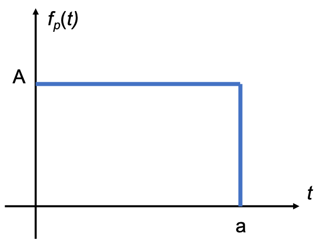
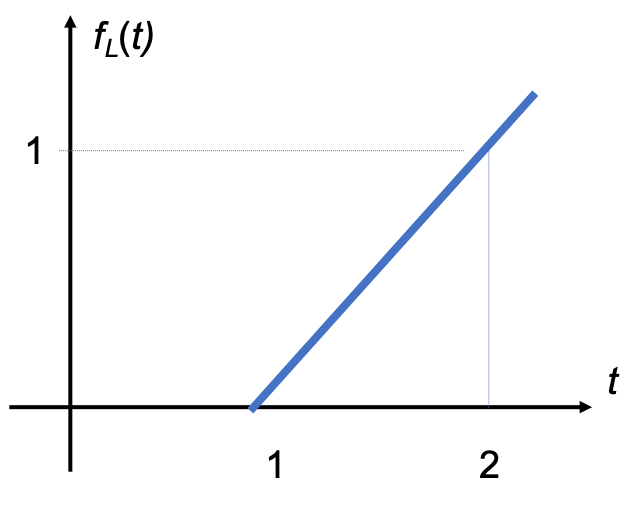
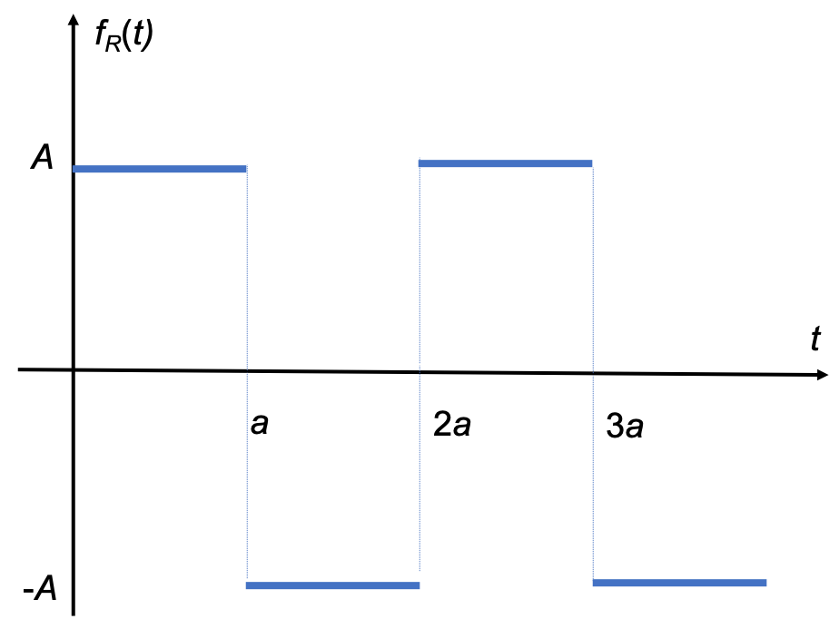
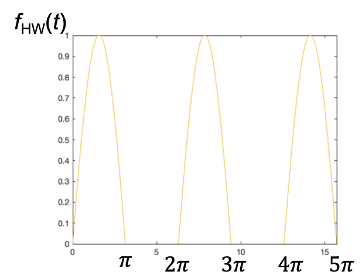

---
jupytext:
  formats: md:myst,ipynb
  text_representation:
    extension: .md
    format_name: myst
    format_version: 0.13
    jupytext_version: 1.14.4
kernelspec:
  display_name: Python 3 (ipykernel)
  language: python
  name: python3
---

+++ {"nbpresent": {"id": "90f3c07d-3646-44b0-a549-7020fc10d16f"}, "slideshow": {"slide_type": "slide"}}

(unit4.3)=
# Unit 4.3 Properties of the Laplace Transform

The preparatory reading for this section is Chapter 2.3 of {cite}`karris` and Chapter 3.3 of {cite}`schaum`.

+++ {"slideshow": {"slide_type": "subslide"}}

Follow along at [cpjobling.github.io/eg-150-textbook/laplace_transform/3/laplace_properties](https://cpjobling.github.io/eg-150-textbook/laplace_transform/3/laplace_properties)


+++ {"nbpresent": {"id": "11a99664-2fdb-4eff-8389-043965b5a6a5"}, "slideshow": {"slide_type": "notes"}}

## Agenda

* {ref}`selected_props`

* {ref}`table_of_props`

* {ref}`examples10`

+++ {"nbpresent": {"id": "352d0877-b48f-4b8d-9082-371f06fef621"}, "slideshow": {"slide_type": "slide"}}

(selected_props)=
## Some Selected Properties of the Laplace transform

+++

Basic properties of the Laplace transform are presented in the following. Verification of these properties is given in Worked Problems 3.8 to 3.16 in {cite}`schaum` and in Section 2.2 in {cite}`karris`.

We will verify some of the properties in MATLAB Lab 4, but will not examine them further in this course.

You will, however, be expected to use **Tables of Properties**, such as that given in {ref}`table_of_props` below, to solve problems.

+++ {"nbpresent": {"id": "1c9ba9ad-1952-4838-966c-f5c382aed98d"}, "slideshow": {"slide_type": "subslide"}}

(lprops:linearity)=
### Linearity

$$c_1f_1(t) + c_2f_2(t) + \ldots + c_nf_n(t) \Leftrightarrow c_1F_1(s) + c_2F_2(s) + \ldots + c_nF_n(s)$$

+++ {"nbpresent": {"id": "30dac3b5-90de-4b96-870a-762a98a9ec14"}, "slideshow": {"slide_type": "subslide"}}

### Time shift

$$f(t-a)u_0(t-a)\Leftrightarrow e^{-as}F(s)$$

+++ {"nbpresent": {"id": "ba9b31a1-0629-4a44-a66d-396a7db21360"}, "slideshow": {"slide_type": "subslide"}}

### Frequency shift

$$e^{-at}f(t)\Leftrightarrow F(s+a)$$

+++ {"nbpresent": {"id": "54b6a552-29a2-4907-a318-57a92c793a7e"}, "slideshow": {"slide_type": "subslide"}}

### Scaling

$$f(at)\Leftrightarrow \frac{1}{a}F\left(\frac{s}{a}\right)$$

+++ {"nbpresent": {"id": "9385975e-7004-4c81-b8f7-1e59b6c578bb"}, "slideshow": {"slide_type": "subslide"}}

(lap:diff_prop)=
### Differentiation in the time domain

$$f'(t) = \frac{d}{dt} f(t) \Leftrightarrow sF(s) - f(0^-)$$

This property facilitates the solution of differential equations

+++ {"nbpresent": {"id": "94a596bc-4117-4098-8b78-5776baa85cd2"}, "slideshow": {"slide_type": "notes"}}

The differentiation property can be extended to higher-orders as follows
$$f''(t) = \frac{d^2}{dt^2}f(t) \Leftrightarrow s^2F(s) - sf(0^-) - f'(0^-)$$

$$f''(t) = \frac{d^3}{dt^3}f(t) \Leftrightarrow s^3F(s) - s^2f(0) - sf'(0^-) - f''(0^-)$$

and in general

$$f^{(n)}(t) = \frac{d^n}{dt^n}f(t) \Leftrightarrow s^nF(s) - s^{n-1}f(0^-) - s^{n-2}f'(0^-) - \cdots - f^{(n-1)}(0^-)$$

+++ {"nbpresent": {"id": "bc0e0601-4390-4fa4-861b-87554a960643"}, "slideshow": {"slide_type": "subslide"}}

### Differentiation in the complex frequency domain

$$tf(t) \Leftrightarrow -\frac{d}{ds}F(s)$$

and in general

$$t^nf(t) \Leftrightarrow (-1)^n\frac{d^n}{ds^n}F(s)$$

+++ {"nbpresent": {"id": "f93fd2fa-8072-4953-abbc-6e950b92352a"}, "slideshow": {"slide_type": "subslide"}}

### Integration in the time domain

$$\int_{-\infty}^tf(\tau)d\tau \Leftrightarrow \frac{F(s)}{s}+\frac{f(0^-)}{s}$$

+++ {"nbpresent": {"id": "f93fd2fa-8072-4953-abbc-6e950b92352a"}, "slideshow": {"slide_type": "notes"}}

This property is important because it provides a way to model the solution of a differential equation using op-amp integrators in so-called [Analogue Computers](https://en.wikipedia.org/wiki/Analog_computer) and is now the basis for numerical integration systems like Simulink.

+++ {"nbpresent": {"id": "6abec7fb-dc16-4dee-a4e6-78bc0a4ef4f8"}, "slideshow": {"slide_type": "subslide"}}

### Integration in the complex frequency domain

Providing that 

$$\lim_{t\to 0} \frac{f(t)}{t}$$

exists

$$\frac{f(t)}{t}\Leftrightarrow \int_s^\infty F(s)ds$$

+++ {"nbpresent": {"id": "9c3efaa7-edf9-42e1-b35d-302a88719f7b"}, "slideshow": {"slide_type": "subslide"}}

### Time periodicity property

If $f(t)$ is a periodic function with period $T$ such that $f(t) = f(t+nT)$ for $n=1,2,3,\ldots$ then

$$f(t+nT) \Leftrightarrow \frac{\int_0^T f(t)e^{-st}dt}{1-e^{-sT}}$$

+++ {"nbpresent": {"id": "2d3c3350-228e-4b8f-8a2f-8244033a00af"}, "slideshow": {"slide_type": "subslide"}}

### Initial value theorem

$$\lim_{t\to 0}f(t) \Leftrightarrow \lim_{s\to \infty} sF(s) = f(0^-)$$

+++ {"nbpresent": {"id": "9b6d70ca-bf5a-4366-8701-b5ec61b24e93"}, "slideshow": {"slide_type": "subslide"}}

### Final value theorem

$$\lim_{t\to \infty}f(t) \Leftrightarrow \lim_{s\to 0} sF(s) = f(\infty)$$

+++ {"nbpresent": {"id": "509b27f0-eef5-446b-b7be-6be1757afd6a"}, "slideshow": {"slide_type": "subslide"}}

(lap3:conv)=
### Convolution in the time domain

$$f_1(t)*f_2(t) = \int_{0}^{t}f_1(\tau)f_2(t-\tau) d\tau \Leftrightarrow F_1(s) F_2(s)$$

+++ {"nbpresent": {"id": "509b27f0-eef5-446b-b7be-6be1757afd6a"}, "slideshow": {"slide_type": "notes"}}

This is another important result as it allows us to compute the response of a system by simply multiplying the Laplace transforms of the system and the signal and then inverse Laplace transforming the result. 

This is usually much simpler than computing the convolution integral in the time domain &ndash; an operation we we met in {ref}`convolution_integral`.

+++ {"nbpresent": {"id": "c9bee9cc-fcec-4bbf-922d-74d59842e5b7"}, "slideshow": {"slide_type": "subslide"}}

### Convolution in the complex frequency domain

Multiplying two signals together in the time domain is the same as performing convolution in the complex frequency domain. 

$$f_1(t)f_2(t) \Leftrightarrow \frac{1}{2\pi j}F_1(s) * F_2(s) = \frac{1}{2\pi j}\lim_{T\to \infty}\int_{c-jT}^{c+jT}F_1(\sigma)F_2(s-\sigma)d\sigma$$

Convolution in the complex frequency domain is nasty &ndash; multiplication in the time domain is relatively painless.

+++ {"nbpresent": {"id": "e58f747d-f0a8-464d-b62f-f7bb9ce8b605"}, "slideshow": {"slide_type": "slide"}}

(table_of_props)=
## Table of Laplace Transform Properties

| No. | **Name** | **Time Domain** $f(t)$ | Complex Frequency Domain $F(s)$ |
|----:|----------|--------|--------------|
| 1.   | Linearity | $a_1f_1(t)+a_2f_2(t)+\cdots+a_nf_n(t)$ | $a_1F_1(s)+a_2F_2(s)+\cdots+a_nF_n(s)$ |
| 2.  | Time shifting | $\displaystyle{f(t-a)}u_0(t-a)$ | $\displaystyle{e^{-a s}F(s)}$ 
| 3.  | Frequency shifting | $\displaystyle{e^{-as}f(t)}$ | $\displaystyle{F(s+a)}$ |
| 4.  | Time scaling | $f(a t)$ | $\displaystyle{\frac{1}{a}F\left(\frac{s}{a}\right)}$ |
| 5.  | Time differentiation | $\displaystyle{\frac{d}{dt}\,f(t)}$ | $\displaystyle{F(s)-f(0^-)}$ |
| 7.  | Frequency differentiation | $\displaystyle{tf(t)}$ | $\displaystyle{-\frac{d}{ds}F(s)}$ |
| 8.  | Time integration | $\displaystyle{\int_{-\infty}^{t}f(\tau)d\tau}$ | $\displaystyle{\frac{F(s)}{s}+ \frac{F(0^-)}{s}}$ |
| 9.  | Frequency integration | $\displaystyle{\frac{f(t)}{t}}$ | $\displaystyle{\int_s^\infty F(s)\,ds}$ |
| 10.  | Time Periodicity | $\displaystyle{f(t + nT)}$ | $\displaystyle{\frac{\int_0^T f(t)e^{-st}\,dt}{1 - e^{-sT}}}$ |
| 11. | Initial value theorem | $\displaystyle{\lim_{t\rightarrow 0} f(t)}$ | $\displaystyle{\lim_{s\rightarrow \infty}sF(s) = f(0^-)}$ |
| 12. | Final value theorem | $\displaystyle{\lim_{t\rightarrow \infty} f(t)}$ | $\displaystyle{\lim_{s\rightarrow 0}sF(s) = f(\infty)}$ |
| 13. | Time convolution | $\displaystyle{f_1(t)*f_2(t)}$ | $\displaystyle{F_1(js) F_2(s)}$ |
| 14. | Frequency convolution | $\displaystyle{f_1(t)f_2(t)}$ | $\displaystyle{\frac{1}{j2\pi}F_1(s)*F_2(s)}$ |

See also: [Wikibooks: Engineering_Tables/Laplace_Transform_Properties](https://en.wikibooks.org/wiki/Engineering_Tables/Laplace_Transform_Properties) and [Laplace Transform&mdash;WolframMathworld](https://mathworld.wolfram.com/LaplaceTransform.html) for more complete references.

+++ {"nbpresent": {"id": "f49c045e-0507-4c62-8cb2-9389df04b6b9"}, "slideshow": {"slide_type": "slide"}}

(examples10)=
## Examples 10: Laplace transforms of common waveforms

We will work through a few of the following on the board in class

* {ref}`ex10.1`
* {ref}`ex10.2`
* {ref}`ex10.3`
* {ref}`ex10.4`
* {ref}`ex10.5`

+++ {"nbpresent": {"id": "f49c045e-0507-4c62-8cb2-9389df04b6b9"}, "slideshow": {"slide_type": "subslide"}}

(ex10.1)=
### Example 10.1: Pulse

Use the tables of Laplace transforms and properties as appropriate to compute the Laplace transform of the pulse shown in {numref}`ig:ex10.1`.

:::{figure-md} fig:ex10.1


A rectangular pulse.
:::

+++ {"nbpresent": {"id": "f49c045e-0507-4c62-8cb2-9389df04b6b9"}, "slideshow": {"slide_type": "notes"}}

For full solution see [Example 2.4.1](https://ebookcentral.proquest.com/lib/swansea-ebooks/reader.action?docID=3384197&ppg=63) in Karris.

<pre style="border: 2px solid blue">


</pre>

+++ {"nbpresent": {"id": "f49c045e-0507-4c62-8cb2-9389df04b6b9"}, "slideshow": {"slide_type": "subslide"}}

(ex10.2)=
### Example 10.2: Line segment

Use the tables of Laplace transforms and properties as appropriate to compute the Laplace transform of the line segment shown in {numref}`ig:ex10.2`.

:::{figure-md} fig:ex10.2


A line segment.
:::

+++ {"nbpresent": {"id": "f49c045e-0507-4c62-8cb2-9389df04b6b9"}, "slideshow": {"slide_type": "notes"}}

For full solution see [Example 2.4.2](https://ebookcentral.proquest.com/lib/swansea-ebooks/reader.action?docID=3384197&ppg=64) in Karris.

<pre style="border: 2px solid blue">


</pre>

+++ {"nbpresent": {"id": "f49c045e-0507-4c62-8cb2-9389df04b6b9"}, "slideshow": {"slide_type": "subslide"}}

(ex10.3)=
### Example 10.3: Triangular Pulse

Use the tables of Laplace transforms and properties as appropriate to compute the Laplace transform of the triangular pulse shown in {numref}`ig:ex10.3`.

:::{figure-md} fig:ex10.3


A triangular pulse.
:::

+++ {"nbpresent": {"id": "f49c045e-0507-4c62-8cb2-9389df04b6b9"}, "slideshow": {"slide_type": "notes"}}

For full solution see [Examples in 2.4.3](https://ebookcentral.proquest.com/lib/swansea-ebooks/reader.action?docID=3384197&ppg=65) in Karris.

<pre style="border: 2px solid blue">


</pre>

+++ {"nbpresent": {"id": "f49c045e-0507-4c62-8cb2-9389df04b6b9"}, "slideshow": {"slide_type": "subslide"}}

(ex10.4)=
### Example 10.4: Square Wave

Use the tables of Laplace transforms and properties as appropriate to compute the Laplace transform of the of the periodic function shown in {numref}`ig:ex10.4`.

:::{figure-md} fig:ex10.4


A square wave.
:::

+++ {"nbpresent": {"id": "f49c045e-0507-4c62-8cb2-9389df04b6b9"}, "slideshow": {"slide_type": "notes"}}

For full solution see [Example 2.4.4](https://ebookcentral.proquest.com/lib/swansea-ebooks/reader.action?docID=3384197&ppg=66) in Karris.

<pre style="border: 2px solid blue">


</pre>

+++ {"nbpresent": {"id": "f49c045e-0507-4c62-8cb2-9389df04b6b9"}, "slideshow": {"slide_type": "subslide"}}

(ex10.5)=
### Example 10.5: Half-rectified Sinewave

Use the tables of Laplace transforms and properties as appropriate to compute the Laplace transform of the half-rectified sine wave shown in {numref}`ig:ex10.5`.

:::{figure-md} fig:ex10.5


Half-rectified sine wave.
:::

+++ {"nbpresent": {"id": "f49c045e-0507-4c62-8cb2-9389df04b6b9"}, "slideshow": {"slide_type": "notes"}}

For full solution see [Example 2.4.5](https://ebookcentral.proquest.com/lib/swansea-ebooks/reader.action?docID=3384197&ppg=67) in Karris.

<pre style="border: 2px solid blue">


</pre>

+++ {"nbpresent": {"id": "f49c045e-0507-4c62-8cb2-9389df04b6b9"}, "slideshow": {"slide_type": "notes"}}

## Homework

Attempt at least one of the end-of-chapter exercises from each question 1-7 of [Section 2.7](https://ebookcentral.proquest.com/lib/swansea-ebooks/reader.action?docID=3384197&ppg=75#ppg=71) of {cite}`karris`. Don't look at the answers until you have attempted the problems.

If we have time, I will work through one or two of these in class.

+++ {"slideshow": {"slide_type": "notes"}}

## Summary

In this section we have presented some of the most useful and commonly used properties of the Laplace transform, provided a table of Laplace Transform properties, and given examples of how properties and transform tables can be used to determine the Laplace transform of some useful aperiodic and periodic signals. 

### Take Aways

There are a number of useful properties of the Laplace transform that we can use to simplify more complex problems in signals and systems, for example to find the laplace transforms of more complex signals than those studied in {ref}`unit4.2`. In particular we found that the time delay property $f(t-a) \Leftrightarrow e^{-as}F(s)$ and the linearity property $c_1f_1(t) + c_2f_2(t) + \ldots + c_nf_n(t) \Leftrightarrow c_1F_1(s) + c_2F_2(s) + \ldots + c_nF_n(s)$ are particularly useful. 

If you have a periodic signal $x(t) = x(t + nT)$, you *must* use the periodicity property

$$f(t+nT) \Leftrightarrow \frac{\int_0^T f(t)e^{-st}dt}{1-e^{-sT}}$$

to compute its Laplace transform.

### Still to come

The use of the *derivative property* and *integration property* will be useful when defining the complex frequency equavalent of the time domain models used to define electrical circuit components. We study these in detail in {ref}`unit4.5`. The use of the *derivative property* will be used to determine the complete solution of continuous-time LTI systems defined by differential equations in {ref}`unit4.6`. More practice in the use of Laplace transforms will be covered in Lab 4.

+++ {"slideshow": {"slide_type": "notes"}}

## Next time

We move on to consider 

* {ref}`unit4.4`

## References

```{bibliography}
:filter: docname in docnames
```

+++ {"nbpresent": {"id": "f49c045e-0507-4c62-8cb2-9389df04b6b9"}, "slideshow": {"slide_type": "subslide"}}

## Answers to Examples 10

{ref}`ex10.1`

$$Au_0(t)-Au_0(t-a)\Leftrightarrow \frac{A\left(1-e^{-as}\right)}{s}.$$

{ref}`ex10.2`

$$(t-1)u_0(t-1)\Leftrightarrow \frac{e^{-s}}{s}.$$

{ref}`ex10.3` 

$$f_T(t)\Leftrightarrow \frac{\left(1-e^{-s}\right)^2}{s^2}.$$

{ref}`ex10.4`

$$f_R(t)\Leftrightarrow \frac{A}{s}\tanh \left(\frac{As}{2}\right).$$

{ref}`ex10.5`

$$f_{HW}(t) \Leftrightarrow \frac{1}{\left(s^2 + 1\right)\left(1-e^{-\pi s}\right)}.$$
