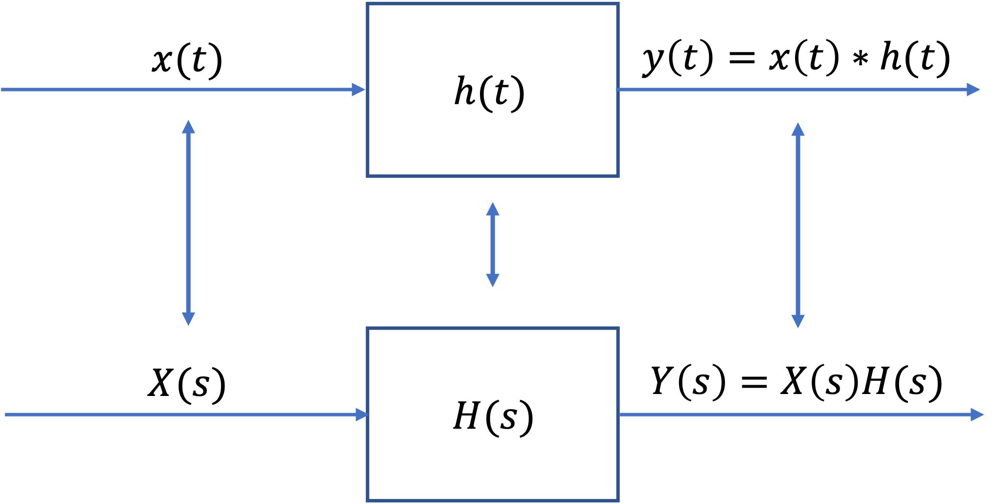
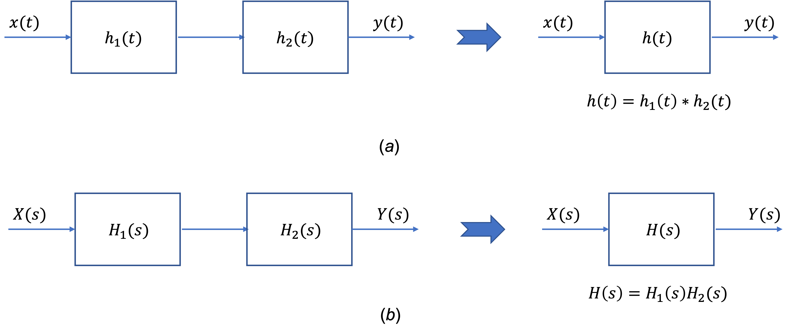
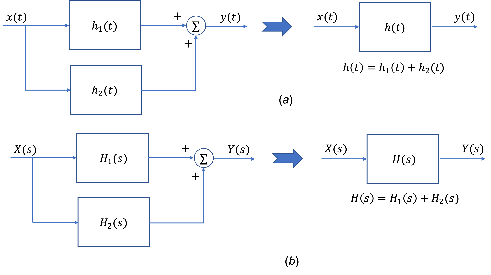

---
jupytext:
  formats: ipynb,md:myst
  text_representation:
    extension: .md
    format_name: myst
    format_version: 0.13
    jupytext_version: 1.14.4
kernelspec:
  display_name: Matlab
  language: matlab
  name: matlab
---

+++ {"slideshow": {"slide_type": "slide"}}

(unit4.6)=
# Unit 4.6: Transfer Functions

+++ {"slideshow": {"slide_type": "notes"}}

The preparatory reading for this section is [Chapter 4.4](https://ebookcentral.proquest.com/lib/swansea-ebooks/reader.action?docID=3384197&ppg=75#ppg=113) {cite}`karris` which discusses transfer function models of electrical circuits. We have also adapted content from [3.6 The System Function](https://www.accessengineeringlibrary.com/content/book/9781260454246/toc-chapter/chapter3/section/section28) from {cite}`schaum`.

+++

Follow along at [cpjobling.github.io/eg-150-textbook/laplace_transform/6/transfer_functions](https://cpjobling.github.io/eg-150-textbook/laplace_transform/6/transfer_functions)


+++ {"slideshow": {"slide_type": "notes"}}

## Agenda

* {ref}`system_function`

* {ref}`char_LTI_systems`

* {ref}`tf_for_LCCODE`

* {ref}`block_diagrams`

* {ref}`examples13`

+++ {"slideshow": {"slide_type": "slide"}}

(system_function)=
## The Transfer Function

In {ref}`Response_of_a_Continuous_Time_LTI_System_and_the_Convolution_Integral` we showed that the output $y(t)$ of a continuous-time LTI system equals the convolution of the input $x(t)$ with the impulse response $h(t)$; that is,

$$y(t) = x(t) * h(t)$$ (eq:335)

+++ {"slideshow": {"slide_type": "subslide"}}

Applying the {ref}`lap3:conv` property, we obtain

$$Y(s) = X(s)H(s)$$ (eq:336)

where $Y(s)$, $X(s)$, and $H(s)$ are the Laplace transforms of $y(t)$, $x(t)$, and $h(t)$, respectively.

+++ {"slideshow": {"slide_type": "fragment"}}

Equation {eq}`eq:336` can be expressed as

$$H(s) = \frac{Y(s)}{X(s)}$$ (eq:337)

+++ {"slideshow": {"slide_type": "subslide"}}

The laplace transform $H(s)$ of $h(t)$ is called the *transfer function* (or *system function*) of the system.

+++ {"slideshow": {"slide_type": "fragment"}}

By {eq}`eq:337`, the transfer function $H(s)$ can also be defined as the ratio of the Laplace transforms of the output $y(t)$ and the input $x(t)$.

+++ {"slideshow": {"slide_type": "fragment"}}

The transfer function $H(s)$ completely characterizes the system because the impulse response $h(t)$ completely characterizes the system.

+++ {"slideshow": {"slide_type": "subslide"}}

{numref}`fig:3-7` illustrates the relationship of Equations {ex}`eq:335` and {ex}`eq:336`.

:::{figure-md} fig:3-7


Impulse response and system function
:::

+++ {"slideshow": {"slide_type": "notes"}}

(char_LTI_systems)=
## Characterization of LTI Systems

```{note}
This section is for reference only and is not examinable.
```

Many properties of continuous-time LTI systems can be closely associated with the characteristics of $H(s)$ in the $s$-plane and in particular with the pole locations and the region of convergence (ROC).

(hs_casuality)=
### Causality

Fot a causal continuous-time LTI system, we have

$$h(t) = 0\qquad t<0$$

Since $h(t)$ is a right-sided signal, the corresponding requirement on $H(s)$ is that the ROC of $H(s)$ must be of the form

$$\mathrm{Re}(s) > \sigma_\mathrm{max}$$

That is, the ROC is the region in the $s$-plane to the right of all the system poles. Similarly, if the system is anticausal, then

$$h(t) = 0\qquad t>0$$

and $h(t)$ is left-sided. Thus, the ROC of $H(s)$ must be of the form 

$$\mathrm{Re}(s) < \sigma_\mathrm{max}$$

That is, the ROC is the region in the $s$-plane to the left of all the system poles.

(hs_stability)=
### Stability

In {ref}`c_Stability` we stated that a continuous-time LTI system is BIBO stable if and only if [Eq. {eq}`eq:221`]

$$\int_{-\infty}^{\infty}\left|h(\tau)\right|\,d\tau \lt \infty$$

The corresponding requirement on $H(s)$ is that the ROC of $H(s)$ contains the $j\omega$ axis (that is $s = j\omega). This is key result, proved in Prob. 3.26 in {ref}`schaum`, that is fundamental to systems and control theory. 

(hs_causal_and_stable)=
### Causal and stable systems
If a system is both causal and stable then all the poles must be in the left-half of the $s$-plane: that is they all have negative real parts because the ROC is of the form $\mathrm{Re}(s) > \sigma_\mathrm{max}$ and since the $j\omega$ axis is included in the ROC, we must have $\sigma_\mathrm{max} < 0$.

The conditions for which the closed-loop poles in continuous-time LTI systems with feedback are stable is a key underlyting principle of the control theory to be studied in **EG-243 Control Systems** next year.

+++ {"slideshow": {"slide_type": "slide"}}

(tf_for_LCCODE)=

## Transfer functions for LTI system described by Linear Constant-Coefficient Ordinary Differential Equations

In {ref}`Systems_Described_by_Differential_Equations` we considered a continuous-time LTI systemfor which input $x(t)$ and output $y(t)$ satisfy the general linear constant-coefficient ordinary differential equation (LCCODE) of the form

$$\sum_{k=0}^N a_k \frac{d^k}{dt^k} y(t)=\sum_{k=0}^M b_k \frac{d^k}{dt^k} x(t)$$ (eq:338)

+++ {"slideshow": {"slide_type": "subslide"}}

Applying the Laplace transform and using the {ref}`lap:diff_prop` of the Laplace transform, we obtain

$$\sum_{k=0}^N a_k s^k Y(s)=\sum_{k=0}^M b_k s^k X(s)$$

+++ {"slideshow": {"slide_type": "fragment"}}

or

$$Y(s) \sum_{k=0}^N a_k s^k = X(s) \sum_{k=0}^M b_k s^k $$ (eq:339)

+++ {"slideshow": {"slide_type": "subslide"}}

Thus,

$$H(s) = \frac{Y(s)}{X(s)} = \frac{\displaystyle \sum_{k=0}^M b_k s^k}{\displaystyle\sum_{k=0}^N a_k s^k}$$ (eq:340)

+++ {"slideshow": {"slide_type": "subslide"}}

Expanding {eq}`eq:340`, $H(s)$ can be written in the more familiar form

$$H(s) = \frac{Y(s)}{X(s)} = \frac{b_M s^M + b_{M-1}s^{M-1}+ \cdots + b_1 s + b_0}{a_{N} s^N + b_{N-1}s^{N-1}+ \cdots + a_1 s + a_0}$$ (eq:341)

+++ {"slideshow": {"slide_type": "fragment"}}

Hence, $H(s)$ is always a rational polynomial in $s$.

+++ {"slideshow": {"slide_type": "notes"}}

Note the ROC of $H(s)$ is not specified by {eq}`eq:340` but must be inferred with additional requirements on the system such as causality and stability.

+++ {"slideshow": {"slide_type": "slide"}}

(block_diagrams)=
## Block diagrams for Systems Interconnection

For two LTI systems (with $h_1(t)$ and $h_2(t)$, respectively) in cascade ({numref}`Fig:3-8`(a)), the overall impulse response is given

$$h(t) = h_1(t) * h_2(t)$$

+++ {"slideshow": {"slide_type": "fragment"}}

Thus, the corresponding transfer functions are related by the product

$$H(s) = H_1(s)H_2(s)$$ (eq:341)

This relationship is illustrated in {numref}`Fig:3-8`(b)

+++ {"slideshow": {"slide_type": "subslide"}}

:::{figure-md} Fig:3-8


Two systems in cascade (a) Time-domain representation; (b) s-domain representation.
:::

+++ {"slideshow": {"slide_type": "subslide"}}

Similarly, the impulse response of a parallel combination of two LTI systems ({numref}`Fig:3-9`(a)) is given by 

$$h(t) = h_1(t) + h_2(t)$$

+++ {"slideshow": {"slide_type": "fragment"}}

Thus,

$$H(s) = H_1(s) + H_2(s)$$ (eq:342)

+++ {"slideshow": {"slide_type": "fragment"}}

This relationship is illustrated in {numref}`Fig:3-9`(b).

+++ {"slideshow": {"slide_type": "subslide"}}

:::{figure-md} Fig:3-9


Two systems in parallel. (a) Time-domain representation; (b) s-domain representation.
:::

+++ {"slideshow": {"slide_type": "slide"}}

(examples13)=
## Examples 13: Transfer functions

+++ {"slideshow": {"slide_type": "subslide"}}

(ex:13.1)=

### Example 13.1

Find the transfer function $H(s)$ and the impulse reponse $h(t)$ of the RC circuit in {numref}`fig:rc_circuit` ({ref}`ex4.1`).

+++ {"slideshow": {"slide_type": "notes"}}

For the answer, refer to the lecture recording or see solved problem 3.23 in in {cite}`schaum`.

+++ {"slideshow": {"slide_type": "subslide"}}

(ex:13.2)=
### Example 13.2

Use the Laplace transform to redo {ref}`ex5_5`.

+++ {"slideshow": {"slide_type": "notes"}}

For the answer, refer to the lecture recording or see solved problem 3.24 in in {cite}`schaum`.

+++ {"slideshow": {"slide_type": "subslide"}}

(ex:13.3)=
### Example 13.3

The output $y(t)$ of a continuous-time LTI system is found to be $2e^{-3t}u_0(t)$ when the input $x(t)$ is $u_0(t)$.

a). Find the impulse response $h(t)$ of the system.

b). Find the output $y(t)$ when the input is $e^{-t}u_0(t)$.

+++ {"slideshow": {"slide_type": "notes"}}

For the answer, refer to the lecture recording or see solved problem 3.25 in in {cite}`schaum`.

+++ {"slideshow": {"slide_type": "subslide"}}

(ex:13.4)=
### Example 13.4

Use the Laplace transform to redo {ref}`ex6_6`.

+++ {"slideshow": {"slide_type": "notes"}}

For the answer, refer to the lecture recording or see solved problem 3.27 in in {cite}`schaum`.

+++ {"slideshow": {"slide_type": "subslide"}}

(ex:13.5)=
### Example 13.5

Use the Laplace transform to redo {ref}`ex8_6`.

+++ {"slideshow": {"slide_type": "notes"}}

For the answer, refer to the lecture recording or see solved problem 3.28 in in {cite}`schaum`.

+++ {"slideshow": {"slide_type": "subslide"}}

(ex:13.6)=
### Example 13.6

Use the Laplace transform to redo {ref}`ex8_8`.

+++ {"slideshow": {"slide_type": "notes"}}

For the answer, refer to the lecture recording or see solved problem 3.29 in in {cite}`schaum`.

+++ {"slideshow": {"slide_type": "subslide"}}

(ex:13.7)=
### Example 13.7

Consider a continuous-time LTI system for which the input $x(t)$ and output $y(t)$ are related by

$$\frac{d^2 y(t)}{dt^2} + \frac{dy(t)}{dt} - 2y(t) = x(t)$$ (eq:386)

a) Find the transfer function $H(s)$

b) Find the impulse response $h(t)$

+++ {"slideshow": {"slide_type": "notes"}}

For the answer, refer to the lecture recording or see solved problem 3.30 in in {cite}`schaum`.

+++ {"slideshow": {"slide_type": "subslide"}}

(ex:13.8)=
### Example 13.8

The feedback interconnection of two causal subsytems with transfer functions $F(s)$ and $G(s)$ is shown in {numref}`fig:ex13.8`. Find the overall system function $H(s)$ for this feedback system.

:::{figure-md} fig:ex13.8


Feedback system
:::

+++ {"slideshow": {"slide_type": "notes"}}

For the answer, refer to the lecture recording or see solved problem 3.31 in in {cite}`schaum`.

+++ {"slideshow": {"slide_type": "notes"}}

## Homework

Attempt any of the questions in {ref}`examples12` of these course notes that have not been covered in the examples class.

The solutions for Unit 4.6 are in **Section 3.8 Solved Problems** {schaum}`schaum` starting at 3.23. (The actual numbers are listed with the examples above.)

We will do some problems from these sets in Examples Class 4.

### Supplementary Problems
Supplementary problems 3.52-3.55 in {cite}`schaum` are related to the content covered in this unit.

+++

## Summary

In this unit we have presented the idea of a *transfer function* (or *system function*) that allows us to represent the impulse response $h(t)$ by the Laplace transform $H(s)$. We also looked at the characteristics of the Laplace transform, transform functions for LCCODEs and series and parallel combination of transfer functions. 

* {ref}`system_function`

* {ref}`char_LTI_systems`

* {ref}`tf_for_LCCODE`

* {ref}`block_diagrams`

* {ref}`examples13`

### Take Aways

#### Transfer function

The summary of the time-domain and s-domain transforms are illustrated in {numref}`fig:3-7`. The key result is $Y(s) = H(s)X(s)$ which simplifies the computation of the system response $y(t) = h(t)*x(t)$ which has to be done using time-convolution.

If we know $Y(s)$ and $X(s)$ we can determine $H(s)$ using

$$H(s) = \frac{Y(s)}{X(s)}$$

and $h(t) = \mathcal{L}^{-1}\left\{H(s)\right\}$

#### Characterization of LTI Systems

For continuous-time LTI systems the causality and stabilty of a system is guaranteed if all the poles of the transfer function are in the left-half of the $s$-plane and the $j\omega$ axis is included in the region of convergence. That is, if the poles of the system $H(s)$, $s_k$ have real part $-\sigma_k$, the system will be causal and stable if $\sigma_k < 0$ for all $k$.

#### Laplace transforms of LCCODEs

The linear constant coefficient ordinary differential equation (LLCODE) of a system involving input signal $x(t)$ and output signal $y(t)$ is given in {eq}`eq:338`. When we take Laplace transforms of this differential equation, ignoring initial conditions, we get the polynomial equation {eq}`eq:339` from which we can determine the transfer function:

$$H(s) = \frac{Y(s)}{X(s)} = \frac{b_M s^M + b_{M-1}s^{M-1}+ \cdots + b_1 s + b_0}{a_{N} s^N + b_{N-1}s^{N-1}+ \cdots + a_1 s + a_0}$$

This is a rational polynomial in $s$ and it can be solved for any input $x(t)$ that has a Laplace transform $X(s)$ by forming

$$Y(s) = H(s)X(s)$$

and taking inverse Laplace transforms using the Partial Fraction Expansion method discussed in {ref}`unit4.5`.

Several examples are given in {ref}`examples12` in which the problems given in {ref}`examples8` of {ref}`unit3.3` are redone as Laplace transform problems. 

My main message to you is that, as an engineer faced with a LCCODE to solve, you should use Laplace transforms!

#### Block diagrams

Complex systems can be broken down into subsystems which may be represented by block diagrams which have either series or parallel connections (see {numref}`Fig:3-8` and {numref}`Fig:3-9` and feedback (See {ref}`ex"13.8`)


### Still to come

We will use transfer functions to solve circuit problems in {ref}`unit4.6` and conclude our study of Laplace transforms in {ref}`unit4.8` with a look at the use of Transfer functions in the MATLAB control systems toolbox and the sumulation tool Simulink. We will also look at some of the problems you have studied in **EG-152 Analogue Design** hopefully confirming some of the results you have obbserved in the lab.

In **EG-247 Digital Signal Processing** we will start from the knowledge gained in {ref}`Unit 4` developing transform ideas further via the Fourier Transform, Z-Transform and the design of systems for signal processing. In **EG-243 Control Systems** you will model feedback control signals using block diagrams and transfer functions. You will also study how knowledge of poles and zeros can be exploited in the design of systems with stable responses.

+++ {"slideshow": {"slide_type": "notes"}}

## Next time

We move on to consider 

* {ref}`unit4.7`

## References

```{bibliography}
:filter: docname in docnames
```
