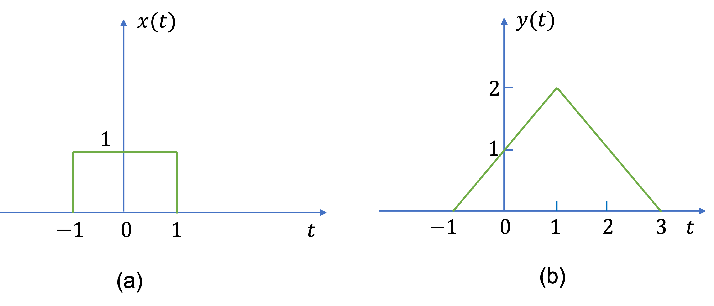
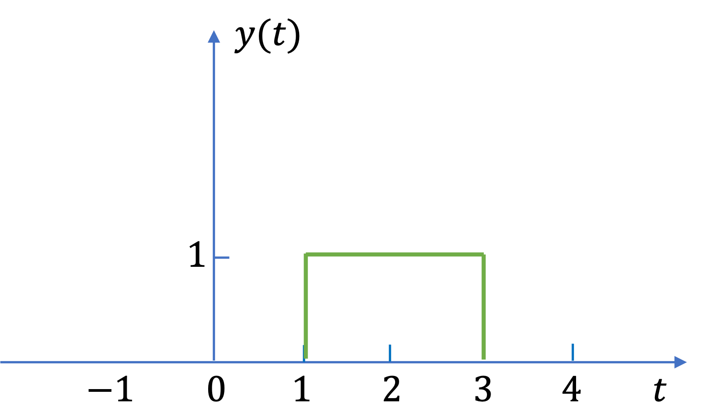
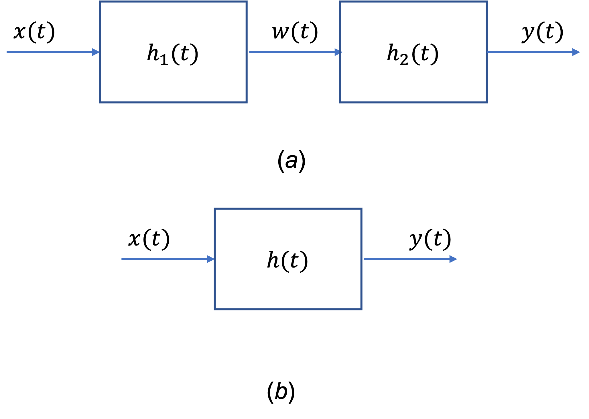

---
jupytext:
  formats: ipynb,md:myst
  text_representation:
    extension: .md
    format_name: myst
    format_version: 0.13
    jupytext_version: 1.14.0
kernelspec:
  display_name: Matlab
  language: matlab
  name: matlab
---

+++ {"slideshow": {"slide_type": "slide"}}

(lti_systems)=
# Properties and Eigenfunctions of Continuous-Time LTI Systems

This section is based on Sections 2.3 and 2.4 of {cite}`schaum` 

+++ {"slideshow": {"slide_type": "slide"}}

## Subjects to be covered

* {ref}`Properties_of_Continuous_Time_LTI_Systems`
* {ref}`eigenfunctions_of_continuous_time_LTI_systems`
* {ref}`examples_6`
* {ref}`examples_7`

+++ {"slideshow": {"slide_type": "slide"}}

(Properties_of_Continuous_Time_LTI_Systems)=
## Properties of Continuous-Time LTI Systems

* {ref}`a_systems_with_and_without_memory`
* {ref}`b_causality`
* {ref}`c_Stability`

+++ {"slideshow": {"slide_type": "slide"}}

(a_systems_with_and_without_memory)=
### A. Systems with or without memory

+++ {"slideshow": {"slide_type": "fragment"}}

Since the output $y(t)$ of a memoryless system depends only on the current input $x(t)$, then, if the system is also linear and time-invariant, this relationship can only be of the form

$$y(t) = Kx(t)$$

where $K$ is a (gain) constant. 

+++ {"slideshow": {"slide_type": "subslide"}}

Thus the corresponding impulse response $h(t)$ is simply

$$h(t) = K\delta(t)$$

+++ {"slideshow": {"slide_type": "fragment"}}

Therefore, if $h(t_0) \neq 0$ for $t_0 \neq 0$, then the continuous-time LTI system has memory.

+++ {"slideshow": {"slide_type": "slide"}}

(b_causality)=
### B. Causality

(causal_systems)=
#### Causal continuous-time LTI systems

As discussed in Section {ref}`causal_and_non-causal_systems`, a causal system does not respond to an input event until that event actually occurs.

+++ {"slideshow": {"slide_type": "fragment"}}

Therefore, for a causal LTI system, we have

$$h(t) = 0\quad t \lt 0$$

+++ {"slideshow": {"slide_type": "subslide"}}

Applying the causality condition to the convolution integral, the output of a causal continuous-time LTI system is expressed as

$$y(t) = \int_0^{\infty}h(\tau)x(t=\tau)\,d\tau$$

+++ {"slideshow": {"slide_type": "subslide"}}

Alternatively, applying the causality to the convolution integral (defined in Section {ref}`convolution_integral`)

$$y(t) = \int_{-\infty}^{\infty}x(t)h(t-\tau)\,d\tau$$

we have

$$y(t) = \int_{-\infty}^{t}x(t)h(t-\tau)\,d\tau$$

+++ {"slideshow": {"slide_type": "fragment"}}

This equation shows that the only values of the input $x(t)$ used to evaluate the output $y(t)$ are those for $\tau \le   t$.

+++ {"slideshow": {"slide_type": "subslide"}}

(causal_signals)=
#### Causal signals

Based on the causality condition, any signal is called *causal* if

$$x(t)=0\quad t \lt 0$$

and is called *anticausal* if

$$x(t)=0\quad t \gt 0$$

+++ {"slideshow": {"slide_type": "subslide"}}

Combining the definition of a causal signal with a causal signal, when the input $x(t)$ is causal, the output of a causal continuous-time LTI system is given by

$$y(t) = \int_{0}^{t}h(t)x(t-\tau)\,d\tau =  \int_{0}^{t}x(t)h(t-\tau)\,d\tau$$

+++ {"slideshow": {"slide_type": "slide"}}

(c_Stability)=
### C. Stability

The BIBO (bounded-input/bounder-output) stability of an LTI system (Section {ref}`stable_systems`) is readily acertined by the impuse response. It can be shown (Example 6.x) that a continuous-time LTI system is BIBO stable if its  impulse response is absolutely integrable; that is,

$$\int_{-\infty}^{\infty}\left[h(\tau)\right|\,d\tau \lt \infty$$

+++ {"slideshow": {"slide_type": "slide"}}

(eigenfunctions_of_continuous_time_LTI_systems)=
## Eigenfunctions of Continuous-Time LTI Systems

In Chapter [Systems and Classification of Systems
](/systems_and_signals/signals_and_systems/systems/index) (Example {ref}`ex4_7`) we saw that the eigenfunctions of continuous-time LTI system represented by the complex exponentials $e^{st}$, with $s$ a complex variable. 

+++ {"slideshow": {"slide_type": "fragment"}}

That is

$$\mathbf{T}\left\{e^{st}\right\}=\lambda e^{st}$$

where $\lambda$ is the eigenvalue of $\mathbf{T}$ associated with $e^{st}$.

+++ {"slideshow": {"slide_type": "subslide"}}

Setting $x(t)=e^{st}$ in the convolution integral, we have

$$y(t) = \mathbf{T}\left\{e^{st}\right\}$$

+++ {"slideshow": {"slide_type": "fragment"}}

$$y(t) = \int_{-\infty}^{\infty}h(\tau)e^{s(t-\tau)}\,d\tau$$

+++ {"slideshow": {"slide_type": "fragment"}}

$$y(t) = \left[\int_{-\infty}^{\infty}h(\tau)e^{-s\tau}\,d\tau\right]e^{st}$$

+++ {"slideshow": {"slide_type": "fragment"}}

$$y(t) = H(s)e^{st} = \lambda e^{st}$$

+++ {"slideshow": {"slide_type": "subslide"}}

where 

$$\lambda = H(s) = \int_{-\infty}^{\infty}h(\tau)e^{-s\tau}\,d\tau$$

+++ {"slideshow": {"slide_type": "subslide"}}

Thus, the eigenvalue of a continuous-time LTI system associated with the eigenfunction $e^{st}$ is given by $H(s)$ which is a complex constant whose value is determined by the value of $s$ via the equation

$$H(s) = \int_{-\infty}^{\infty}h(\tau)e^{-s\tau}\,d\tau.$$

+++ {"slideshow": {"slide_type": "notes"}}

Note from the equation

$$y(t) = H(s)e^{st}$$

that $y(0) = H(s)$ (see {ref}`ex:6_6`).

+++ {"slideshow": {"slide_type": "subslide"}}

### Looking Ahead
The above results inderline the definition of the Laplace transform and Fourier transform. The {doc}`../laplace_transform/1/laplace.md` will be discussed later in this course. The Fourier Transform will be introduced in **EG-247 Digital Signal Processing** next year.

+++ {"slideshow": {"slide_type": "slide"}}

(examples_6)=
## Examples 6: Properties of Continuous-Time LTI Systems

+++ {"slideshow": {"slide_type": "subslide"}}

(ex6_1)=
### Example 6.1 

The signals in {numref}`fig:ex6.1`(a) and (b) are the input $x(t)$ and the output $y(t)$, respectively, of a certain continuous-time LTI system. 

:::{figure-md} fig:ex6.1

Input and output signals for a continuous-time LTI system
:::

Sketch the output to the following inputs:

(a)$x(t-2)$;

(b) $\frac{1}{2}x(t)$.

+++ {"slideshow": {"slide_type": "notes"}}

For the answer, refer to the lecture recording or see solved problem 2.9 in in {cite}`schaum`.

+++ {"slideshow": {"slide_type": "subslide"}}

(ex6_2)=
### Example 6.2 

Consider a continuous-time LTI system whose step response is given by

$$y(t) = e^{-t}u_0(t)$$

Determine and sketch the output of the system to the input $x(t)$ shown in {numref}`fig:ex6.2`.

:::{figure-md} fig:ex6.2

Signal for Exercise 6.2
:::

+++ {"slideshow": {"slide_type": "notes"}}

For the answer, refer to the lecture recording or see solved problem 2.2 in in {cite}schaum.

+++ {"slideshow": {"slide_type": "subslide"}}

(ex6_3)=
### Example 6.3

Consider a continuous-time LTI system system described by

$$y(t) = \mathbf{T}\left\{x(t)\right\} = \frac{1}{T}\int_{t-\frac{T}{2}}^{t+\frac{T}{2}}x(\tau)\,d\tau$$

(a) Find and sketch the impulse response $h(t)$ of the system.

(b) Is this system causal?

+++ {"slideshow": {"slide_type": "notes"}}

For the answer, refer to the lecture recording or see solved problem 2.11 in in {cite}`schaum`.

+++ {"slideshow": {"slide_type": "subslide"}}

(ex6_4)=
### Example 6.4

Let $y(t)$ be the output of a continuous-time LTI system with input $x(t)$. Find the output of the system if ths input is $x'(t)$, where $x'(t)$ is the first derivative of $x(t)$.

+++ {"slideshow": {"slide_type": "notes"}}

For the answer, refer to the lecture recording or see solved problem 2.12 in in {cite}`schaum`.

+++ {"slideshow": {"slide_type": "subslide"}}

(ex6_5)=
### Example 6.5

Verify the BIBO stability condition ({ref}`c_Stability`) for continuous-time LTI systems.

+++ {"slideshow": {"slide_type": "notes"}}

For the answer, refer to the lecture recording or see solved problem 2.13 in {cite}`schaum`.

+++ {"slideshow": {"slide_type": "subslide"}}

(ex6_6)=
### Example 6.6

The system shown in {numref}`fig:ex6.6`(a) is formed by connecting two systems in *cascade*. The impulse responses of the two systems are $h_1(t)$ and $h_2(t)$, respectively, and

$$h_1(t) = e^{=2t}u_0(t)\quad h_2(t)=2e^{-t}u_0(t)$$

(a) Find the impulse response $h(t)$ of the overall system shown in {numref}`fig:ex6.2`(b).

(b) Determine if the overall system is BIBO stable.

:::{figure-md} fig:ex6.6

A cascade connection of two continuous-time LTI systems
:::

+++ {"slideshow": {"slide_type": "notes"}}

For the answer, refer to the lecture recording or see solved problem 2.14 in {cite}`schaum`.

+++ {"slideshow": {"slide_type": "slide"}}

(examples_7)=
## Examples 7: Eigenfunctions of Continuous-Time LTI systems

+++ {"slideshow": {"slide_type": "slide"}}

## Summary

* {ref}`Properties_of_Continuous_Time_LTI_Systems`
* {ref}`eigenfunctions_of_continuous_time_LTI_systems`

+++ {"slideshow": {"slide_type": "slide"}}

## Next Time

* {ref}`Systems_Described_by_Differential_Equations`
