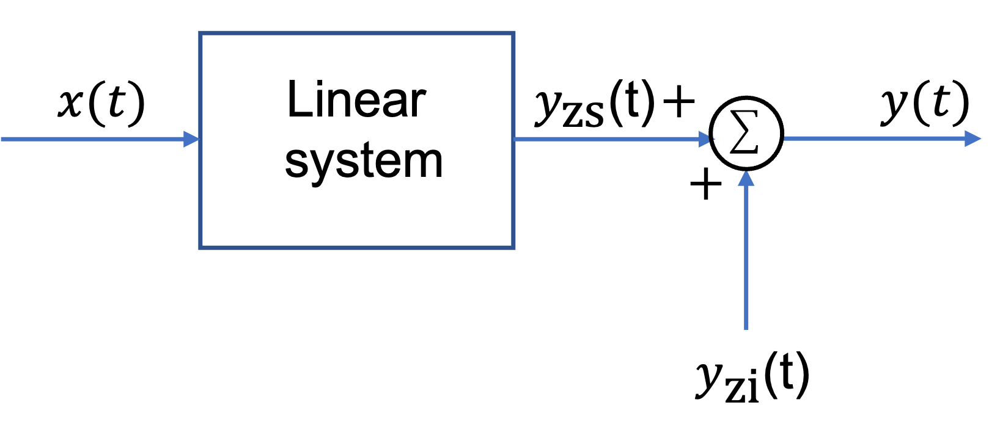
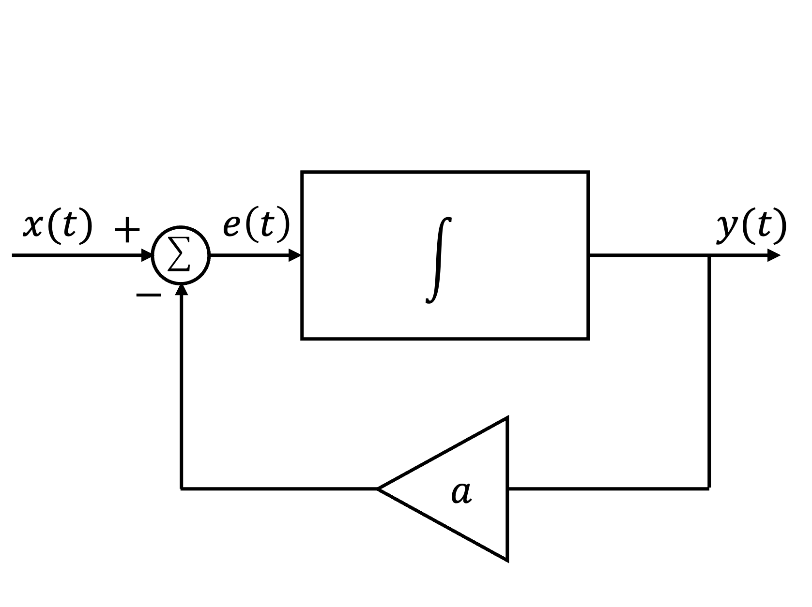
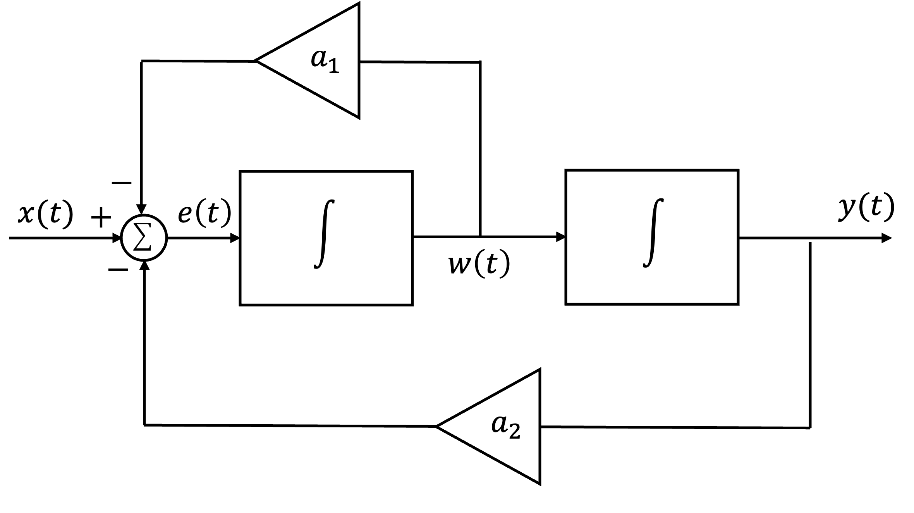

---
jupytext:
  formats: ipynb,md:myst
  text_representation:
    extension: .md
    format_name: myst
    format_version: 0.13
    jupytext_version: 1.14.0
kernelspec:
  display_name: Matlab
  language: matlab
  name: matlab
---

+++ {"slideshow": {"slide_type": "slide"}}

(Systems_Described_by_Differential_Equations)=
# Systems Described by Differential Equations

This section is based on Section 2.5 of {cite}`schaum`

+++ {"slideshow": {"slide_type": "slide"}}

## Subjects to be covered

We conclude our introduction to continuous-time LTI system by considering

* {ref}`Systems_Described_by_Differential_Equations`
* {ref}`examples_8`

+++ {"slideshow": {"slide_type": "slide"}}

(Continuous_Time_LTI_Systems_Described_by_Differential_Equations)=
## Continuous-Time LTI Systems Described by Differential Equations

* {ref}`ccde_a_linear_constant_coefficient_differential_equations`
* {ref}`ccde_b_linearity`
* {ref}`ccde_c_causality`
* {ref}`ccde_c_causality`
* {ref}`ccde_c_causality`

+++ {"slideshow": {"slide_type": "subslide"}}

(ccde_a_linear_constant_coefficient_differential_equations)=
### A. Linear constant-coefficient differential equations

A general $N$th-order linear constant-coefficient differential (LCCDE) equation is given by

$$\sum_{k=0}^N a_k \frac{d^ky(t)}{dt^k}=\sum_{k=0}^M b_k \frac{d^k x(t)}{dt^k}$$

where the coeeficients $a_k$ and $b_k$ are real constants.

+++ {"slideshow": {"slide_type": "fragment"}}

The order $N$ refers to the highest derivative of $y(t)$ in the differential equation.

+++ {"slideshow": {"slide_type": "subslide"}}

#### Applications of linear constant-coefficient differential equations

LCCDEs play a central role in describing the input-output relationships of a wide variety of electrical, mechanical, chemical and biological systems.

+++ {"slideshow": {"slide_type": "subslide"}}

#### Illustration: An RC Circuit

For instance, in the RC circuit considered in {refnum}`ex4.1`, the input $x(t)=v_s(t)$ and the output $y(t)=v_c(t)$ are related by a first-order constant-coefficient differential equation

$$\frac{dy(t)}{dt}+\frac{1}{RC}y(t)=\frac{1}{RC}x(t)$$

+++ {"slideshow": {"slide_type": "fragment"}}

So, by inspection, $N=1$, $a_1 = 1$, $a_0 = b_0 = 1/RC$.

+++ {"slideshow": {"slide_type": "subslide"}}

#### General solution of the general linear constant-coefficient differential equation

The general solution of the general linear constant-coefficient differential equation for a particular input $x(t)$ is given by

$$y(t)=y_p(t)+y_h(t)$$

+++ {"slideshow": {"slide_type": "fragment"}}

where $y_p(t)$ is a *particular solution* satisfying the linear constant-coefficient differential equation and $y_h(t)$ is a *homegeneous solution* (or *complementary solution*) satisfying the homegeneous differential equation

$$\sum_{k=0}^N a_k \frac{d^ky(t)}{dt^k}=0$$

+++ {"slideshow": {"slide_type": "fragment"}}

The exact form of $y_h(t)$ is determined by $N$ auxiliary conditions.

+++ {"slideshow": {"slide_type": "subslide"}}

Note that 

$$\sum_{k=0}^N a_k \frac{d^ky(t)}{dt^k}=\sum_{k=0}^M b_k \frac{d^k x(t)}{dt^k}$$

does not completely specify the the output $y(t)$ in terms of $x(t)$ unless auxiliary conditions are defined. In general. a set of auxiliary conditions are the values of

$$y(t),\frac{dy(t)}{dt},\ldots,\frac{d^{N-1}y(t)}{dt^N-1}$$

at some point in time.

+++ {"slideshow": {"slide_type": "subslide"}}

(ccde_b_linearity)=
### B. Linearity

The system defined by 

$$\sum_{k=0}^N a_k \frac{d^ky(t)}{dt^k}=\sum_{k=0}^M b_k \frac{d^k x(t)}{dt^k}$$

will be linear only if all the auxilliary conditions are zero (see {numref}`ex8_4`).

+++ {"slideshow": {"slide_type": "subslide"}}

If the auxilliary conditions are not zero, then the response $y(t)$ of a system can be expressed as

$$y(t) = y_\mathrm{zi}(t) + y_\mathrm{zs}(t)$$

where $y_\mathrm{zi}(t)$ called the *zero-input response*, is the response to the aunxilliary conditions, and $y_\mathrm{zs}(t)$, called the *zero-state response*, is the response of a linear system with zero auxiliary conditions.

+++ {"slideshow": {"slide_type": "subslide"}}

This is illustrated in {refnum}`fig:zs_and_zi_responses`

:::{figure-md} fig:zs_and_zi_responses

Zero-state and zero-input responses
:::

+++ {"slideshow": {"slide_type": "fragment"}}

Note that $y_\mathrm{zi}(t) \neq y_h(t)$ and $y_\mathrm{zs}(t) \neq y_p(t)$ and that in general $y_\mathrm{zi}(t)$ contains $y_h(t)$ and $y_\mathrm{zs}(t)$ contains both $y_h(t)$ and $y_p(t)$ (see {numref}`ex8_3`).

+++ {"slideshow": {"slide_type": "subslide"}}

(ccde_c_causality)=
### C. Causality

In order for the linear system described by a linear constant-coefficient differential equation

$$\sum_{k=0}^N a_k \frac{d^ky(t)}{dt^k}=\sum_{k=0}^M b_k \frac{d^k x(t)}{dt^k}$$

to be causal, we must assume the condition of *initial rest* (or an *initially relaxed condition*).

+++ {"slideshow": {"slide_type": "subslide"}}

That is, if $x(y)=0$ for $t\le t_0$, then assume $y(t) = 0$ for $t\le t_0$ (See {numref}`ex4_6`).

+++ {"slideshow": {"slide_type": "subslide"}}

Thus, the response for $t > t_0$ can be calculated from the linear constant-coefficient differential equation with the initial conditions

$$y(t_0)=\frac{dy(t_0)}{dt}=\cdots=\frac{d^{N-1}y(t_0)}{dt^{N-1}}=0$$

where

$$\frac{d^ky(t_0)}{dt^k} = \left.\frac{d^ky(t)}{dt^k}\right|_{t=t_0}$$

+++ {"slideshow": {"slide_type": "fragment"}}

Clearly, at initial rest, $y_\mathrm{zs}(t)=0$.

+++ {"slideshow": {"slide_type": "subslide"}}

(ccde_c_causality)=
### D. Time-invariance

For a linear causal system, initial rest also implies time-invariance ({numref}`ex8_6`).

+++ {"slideshow": {"slide_type": "subslide"}}

(ccde_c_causality)=
### E. Impulse response

The impulse response $h(t)$ of a linear constant-coefficient differential equation satisfies the differential equation

$$\sum_{k=0}^N a_k \frac{d^ky(t)}{dt^k}=\sum_{k=0}^M b_k \frac{d^k \delta(t)}{dt^k}$$

with the initial rest condition.

+++ {"slideshow": {"slide_type": "fragment"}}

Examples of finding impulse responses are given in {numre}`ex8_6` to {numref}`ex8_8`.

+++ {"slideshow": {"slide_type": "subslide"}}

#### A peek into the future

Later in this course, and probably for the rest of your career, you will find the impulse response by using the Laplace transform.

+++ {"slideshow": {"slide_type": "slide"}}

(examples_8)=
## Examples 8: Systems described by differential equations

+++ {"slideshow": {"slide_type": "subslide"}}

(ex8_1)=
### Example 8.1 

The continuous-time system shown in {numref}`fig:ex:8.1` consists of one integrator and one scalar multiplier. Write the differential equation that relates the output $y(t)$ to the input $x(t)$.

:::{figure-md} fig:ex:8.1

A one-integrator linear system
:::

+++ {"slideshow": {"slide_type": "notes"}}

For the answer, refer to the lecture recording or see solved problem 2.18 in {cite}`schaum`.

+++ {"slideshow": {"slide_type": "subslide"}}

(ex8_2)=
### Example 8.2

The continuous-time system shown in {numref}`fig:ex:8.2` consists of two integrators and two scalar multipliers. Write the differential equation that relates the output $y(t)$ to the input $x(t)$.

:::{figure-md} fig:ex:8.1

A one-integrator linear system
:::

+++ {"slideshow": {"slide_type": "notes"}}

For the answer, refer to the lecture recording or see solved problem 2.19 in in {cite}`schaum`.

+++ {"slideshow": {"slide_type": "subslide"}}

(ex8_3)=
### Example 8.3

Consider a continuous-time system whose input $x(t)$ and output $y(t)$ are related by

$$\frac{dy(t)}{dt}+ay(t)=x(t)$$

where $a$ is a constant.

(a) Find $y(t)$ with the auxilliary condition $y(0) = y_0$ and

$$x(t) = Ke^{bt}u_0(t)$$

(b) Express $y(t)$ in terms of the zero-input and zero-state responses.

+++ {"slideshow": {"slide_type": "notes"}}

For the answer, refer to the lecture recording or see solved problem 2.20 in {cite}`schaum`.

+++ {"slideshow": {"slide_type": "subslide"}}

(ex8_4)=
### Example 8.4

Consider the system in {ref}`ex8_3`.

(a) Show that the system is not linear if $y(0)=y_0\neq 0$.

(b) Show that the system is linear if $y(0) = 0$.

+++ {"slideshow": {"slide_type": "notes"}}

For the answer, refer to the lecture recording or see solved problem 2.21 in {cite}`schaum`.

+++ {"slideshow": {"slide_type": "subslide"}}

(ex8_5)=
### Example 8.5

Consider the system in {ref}`ex8_3`. Show that the initial rest condition $y(0) = 0$ also implies that the system is time-invariant.

+++ {"slideshow": {"slide_type": "notes"}}

For the answer, refer to the lecture recording or see solved problem 2.22 in {cite}`schaum`.

+++ {"slideshow": {"slide_type": "subslide"}}

(ex8_6)=
### Example 8.6

Consider the system in {ref}`ex8_3`. Find the impulse response $h(t)$ of the system.

+++ {"slideshow": {"slide_type": "notes"}}

For the answer, refer to the lecture recording or see solved problem 2.23 in {cite}`schaum`.

+++

(ex8_7)=
### Example 8.7

Consider the system in {ref}`ex8_3` with $y(0)=0$. 

(a) Find the step response $s(t)$ of the system without using the impulse response $h(t)$.

(b) Find the step response $s(t)$ of the system with the impulse response $h(t)$ obtained in {ref}`ex8_6`.

(c) Find the impulse response $h(t)$ from the step response $s(t)$.

+++

For the answer, refer to the lecture recording or see solved problem 2.24 in {cite}`schaum`.

+++

(ex8_8)=

### Example 8.8

Consider the system described by

$$\frac{dy(t)}{dt} + 2y(t) = x(t) + \frac{dx(t)}{dt}$$

Find the impulse response $h(t)$ of the system.

+++

For the answer, refer to the lecture recording or see solved problem 2.25 in {cite}`schaum`.

+++ {"slideshow": {"slide_type": "slide"}}

## Summary

In this lecture we have started our look at LTI systems.

In particular, we have looked at

* {ref}`Response_of_a_Continuous_Time_LTI_System_and_the_Convolution_Integral`

+++ {"slideshow": {"slide_type": "slide"}}

## Summary

We have concluded our look at continuous-time LTI systems by considering

* {ref}`Systems_Described_by_Differential_Equations`

+++ {"slideshow": {"slide_type": "slide"}}

## Next Time

We move on to consider 

* {doc}`../laplace_transform/index`
