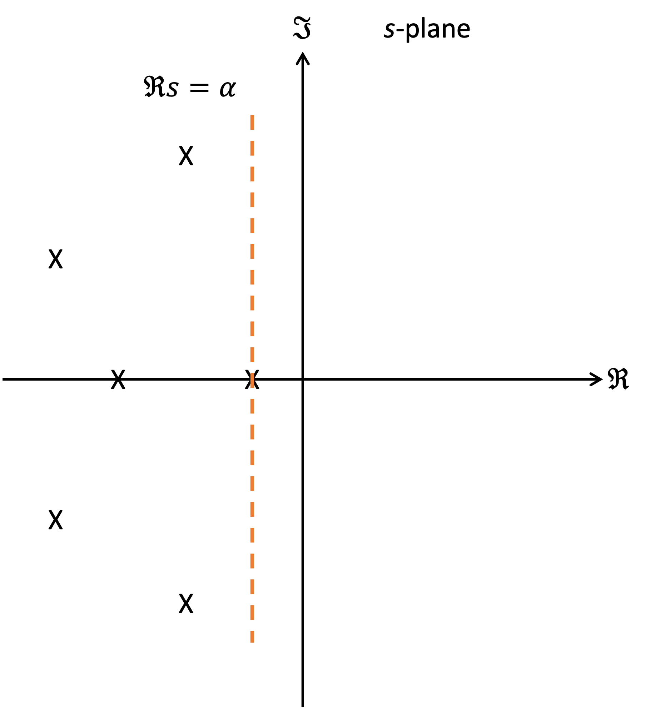

---
jupytext:
  formats: ipynb,md:myst
  text_representation:
    extension: .md
    format_name: myst
    format_version: 0.13
    jupytext_version: 1.16.7
kernelspec:
  display_name: MATLAB Kernel
  language: matlab
  name: jupyter_matlab_kernel
---

+++ {"slideshow": {"slide_type": "slide"}}

(unit5.1)=
# Unit 5.1: Qualitative Properties of Signals and Transfer functions

+++ {"slideshow": {"slide_type": "notes"}}

Follow along at [cpjobling.github.io/eg-150-textbook/poles_and_zeros/qualitative_properties](https://cpjobling.github.io/eg-150-textbook/poles_and_zeros/qualitative_properties)


+++ {"slideshow": {"slide_type": "notes"}}

## Acknowledgements

The notes for this section have been adapted from [Qualitative properties of signals & Laplace transforms](https://web.stanford.edu/~boyd/ee102/qualitative.pdf) {cite}`boyd93` and was also partly influenced by the MATLAB LiveScript **PoleZeroAnalysis.mlx** from the MathWorks curriculum module [Transfer Function Analysis of Dynamic Systems](https://uk.mathworks.com/matlabcentral/fileexchange/94635-transfer-function-analysis-of-dynamic-systems) {cite}`tfads`.

```{code-cell}
---
slideshow:
  slide_type: notes
---
format compact
cd matlab
```

+++ {"slideshow": {"slide_type": "notes"}}

## Agenda

* {ref}`unit5.1.1`
* {ref}`unit5.1.2`
* {ref}`unit5.1.3`
* {ref}`unit5.1.4`
* {ref}`unit5.1.5`
* {ref}`unit5.1.6`
* {ref}`unit5.1.7`
* {ref}`unit5.1.8`

+++ {"slideshow": {"slide_type": "slide"}}

(unit5.1.1)=
## Inverse Laplace transform of a rational $F(s)$

Suppose $F(s) = N(s)/D(s)$ is rational and strictly proper[^pz_note1] with $\mathcal{L}^{-1}\left\{F(s)\right\} = f(t)$ each term in the partial fraction expansion of $F(s)$ gives a term in $f(t)$:

+++ {"slideshow": {"slide_type": "fragment"}}

* For a single pole at $s = \lambda$[^pz_note2],

$$\mathcal{L}^{-1}\left\{\frac{1}{s-\lambda} \right\} = e^{\lambda t}$$ (eq:pz:1)

+++ {"slideshow": {"slide_type": "subslide"}}

* For a pole at $s = \lambda$ of multiplicity $k$,

$$\mathcal{L}^{-1}\left\{\frac{1}{\left(s-\lambda\right)^k} \right\} = \frac{1}{\left(k-1\right)!}t^{k-1}e^{\lambda t} $$ (eq:pz:2)

+++ {"slideshow": {"slide_type": "fragment"}}

* The *poles* of $F(s)$ determine the types of terms that appear in $f(t)$.

+++ {"slideshow": {"slide_type": "fragment"}}

* The *zeros* (or *residues*) of $F(s)$ determine the coeficients multiplying each term, or the amplitude and phase of oscillitory terms.

+++ {"slideshow": {"slide_type": "notes"}}

[^pz_note1]: If the numerator $N(s)$ is a polynomial $b_ms^m + b_{m-1}s^{m-1} + \cdots b_1s + b_0$ and the denominator $D(s)$ is a polynomial $a_ns^n + a_{n-1}s^{n-1} + \cdots a_1s + a_0$, the rational polynomial $F(s) = N(s)/D(s)$ is strictly proper if $n > m$. We examined the case of improper rational polynomials in {ref}`ilap:improper`.

[^pz_note2]: The term $\lambda$ may be complex, in which case there will be two complex poles $\lambda_1$ and $\lambda_2$ which form the complex conjugate pairs $\lambda_{1,2} = \sigma \pm j\omega$. In this case, the poles will be represented as the roots of the quadratic factor $\left(s - \sigma - j\omega\right)\left(s - \sigma + j\omega\right) = s^2 + 2\sigma s + \left(\sigma^2 + \omega^2\right)$. The inverse Laplace transform of a such a quadratic factor will be oscilliatory.

+++ {"slideshow": {"slide_type": "slide"}}

(unit5.1.2)=
## Qualitative properties of terms

+++ {"slideshow": {"slide_type": "subslide"}}

### Real poles

+++ {"slideshow": {"slide_type": "fragment"}}

* Real, positive poles correspond to growing exponential terms.

+++ {"slideshow": {"slide_type": "fragment"}}

* Real, negative poles correspond to decaying exponential terms.

+++ {"slideshow": {"slide_type": "fragment"}}

* A pole at $s = 0$ corresponds to a constant (DC) term.

+++ {"slideshow": {"slide_type": "subslide"}}

### Complex poles

+++ {"slideshow": {"slide_type": "fragment"}}

* Complex pole pairs with positive real part correspond to exponentially growing sinusoidal terms.

+++ {"slideshow": {"slide_type": "fragment"}}

* Complex pole pairs with negative real part correspond to exponentially decaying sinusoidal terms.

+++ {"slideshow": {"slide_type": "subslide"}}

### Imaginary poles

* Pure imaginary pole pairs correspond to sinusoidal terms.

+++ {"slideshow": {"slide_type": "subslide"}}

### Repeated poles

* Repeated poles yield the same types of terms, multiplied by powers of $t$.

+++ {"slideshow": {"slide_type": "subslide"}}

(unit5.1.3)=
## Quantitative properties of terms

+++ {"slideshow": {"slide_type": "fragment"}}

The pole $\lambda_1 = \sigma + j\omega$ and its conjugate pair $\bar{\lambda} = \overline{\left(\sigma + j\omega\right)} = \sigma - j\omega$[^pz:note3]

$$\mathbf{Re}\lambda=\sigma,\qquad\mathbf{Im}\lambda = \omega$$

will yield a time domain term 

$$ae^{\sigma t}\cos\left(\omega t + \phi\right).$$ (eq:pz:3)

+++ {"slideshow": {"slide_type": "notes"}}

[^pz_note3]: Here we are using the bar notation $\bar{x}$ to represent the complex conjugate of complex number $x$.

+++ {"slideshow": {"slide_type": "fragment"}}

* The real part of the pole gives the *growth rate* (if positive) or *decay rate* (if negative) of the corresponding term in $f(t)$.

+++ {"slideshow": {"slide_type": "fragment"}}

* The imaginary part gives the oscillation *frequency*.

+++ {"slideshow": {"slide_type": "subslide"}}

### Example 1

Quantifying the response for $f(t) = e^{\sigma t}\cos\left(\omega t\right)$: rows $\omega = 30, 15, 0$; columns: $\sigma = -1.5, -0.75, 0, 0.75, 1.5$

```{code-cell}
---
slideshow:
  slide_type: '-'
---
example1
```

```{code-cell}

```

+++ {"slideshow": {"slide_type": "subslide"}}

The MATLAB code to reproduce this figure is given in [example1.mlx](matlab/example1.mlx)

```{code-cell}
---
slideshow:
  slide_type: '-'
---
open example1
```

+++ {"slideshow": {"slide_type": "subslide"}}

### Qualitative analysis from the pole-zero map

By plotting the poles and zeros on the $s$-plane we can say quite a lot about the expected response.
These ideas are summarized in {numref}`fig:pz:1`.

+++ {"slideshow": {"slide_type": "subslide"}}

:::{figure-md} fig:pz:1


Illustrating the quantitive properties of the terms $f(t)$ resulting from the poles of $F(s)$
:::

+++ {"slideshow": {"slide_type": "slide"}}

(unit5.1.4)=
## Complex poles: Damping ratio $\zeta$ and quality factor $Q$

For a pole at $s = \lambda = \sigma + j\omega$ (hence also at $\bar{\lambda}$) with $\sigma < 0$:

$$F(s) = \frac{r}{s+\sigma + j\omega} + \frac{\bar{r}}{s+\sigma - j\omega}$$

+++ {"slideshow": {"slide_type": "fragment"}}

$$F(s) =\frac{2\mathbf{Re}\left(r\right)s-2\mathbf{Re}\left(r\lambda\right)}{s^2 + 2\sigma s +\left(\sigma^2 + \omega^2\right)}$$

+++ {"slideshow": {"slide_type": "fragment"}}

which resolves to

$$f(t) = ae^{-\sigma t}\cos\left(\omega t + \phi\right)$$

+++ {"slideshow": {"slide_type": "subslide"}}

There are two measures of the decay rate per cycle of oscillation:

+++ {"slideshow": {"slide_type": "subslide"}}

* **damping ratio**

$$\zeta = \frac{-\sigma}{\sqrt{\sigma^2 + \omega^2}}$$ (eq:pz:4)

+++ {"slideshow": {"slide_type": "subslide"}}

* **quality factor**

$$Q = \frac{1}{2} \sqrt{\frac{\sigma^2 + \omega^2}{\sigma^2}} = \frac{1}{2\zeta} $$ (eq:pz:5)

+++ {"slideshow": {"slide_type": "subslide"}}

The damping ratio (or $Q$) is related to the $angle$ of the pole in the complex plane as shown in {numref}`fig:pz:2`:

:::{figure-md} fig:pz:2


The damping ratio is related the the angle of the pole in the complex plane
:::

+++ {"slideshow": {"slide_type": "notes"}}

There is another concept in this diagram that we will refer to later. 

If we consider the polar form of the pole illustrated by the red line in {numref}`fig:pz:3`

$$\lambda_{1,2} = -\sigma \pm j\omega = -\omega_n e^{\pm j\theta}$$

where $\theta = \cos^{-1}\zeta$ and $\omega_n = \sqrt{\sigma^2 + \omega^2}$ is called the *natural frequency*. 

We will say more about the damping ratio $\zeta$ and natural frequency $\omega_n$ in {ref}`unit5.2`.

+++ {"slideshow": {"slide_type": "subslide"}}

The oscillation is

+++ {"slideshow": {"slide_type": "fragment"}}

* underdamped: $\zeta < 1$ ($Q > 1/2$)

+++ {"slideshow": {"slide_type": "fragment"}}

* critically damped: $\zeta = 1$ ($Q = 1/2$)

+++ {"slideshow": {"slide_type": "subslide"}}

(pz:example2)=
### Example 2: parallel RLC circuit

Consider the parallel RLC citcuit shown in {numref}`fig:pz:3`.

:::{figure-md} fig:pz:3


Parallel RLC circuit (reproduced from page 6-8 of {cite}`boyd93`)
:::

+++ {"slideshow": {"slide_type": "subslide"}}

#### Solution to example 2

We have 

$$v(t) = -L\frac{di(t)}{dt}$$ (eq:pz:c1)

+++ {"slideshow": {"slide_type": "fragment"}}

and

$$C\frac{dv(t)}{dt}= i(t) - \frac{v(t)}{R}$$ (eq:pz:c2)

+++ {"slideshow": {"slide_type": "subslide"}}

Integrating both sides of {eq}`eq:pz:c1` we get

$$\int_0^tv(\tau)\,d\tau = -Li(t)$$  (eq:pz:c3)

+++ {"slideshow": {"slide_type": "subslide"}}

We rewrite {eq}`eq:pz:c3` as

$$i(t) = - \frac{1}{L} \int_0^tv(\tau)\,d\tau$$  (eq:pz:c4)

+++ {"slideshow": {"slide_type": "subslide"}}

Substituting {eq}`eq:pz:c4` into {eq}`eq:pz:c2` we eliminate $i(t)$ and obtain

$$C\frac{dv(t)}{dt}= - \frac{1}{L} \int_0^tv(\tau)\,d\tau - \frac{v(t)}{R}$$ (eq:pz:c5)

+++ {"slideshow": {"slide_type": "subslide"}}

Taking the derivative of both sides of {eq}`eq:pz:c5` and gathering terms yields the differential equation

$$\frac{d^2v(t)}{dt^2} + \frac{1}{RC}\frac{dv(t)}{dt} + \frac{1}{LC} v(t) = 0$$ (eq:pz:c6)

+++ {"slideshow": {"slide_type": "subslide"}}

#### Laplace transforms

Taking Laplace transforms of ({eq}`eq:pz:c6`) we have 

$$\left(s^2 V(s) - sv(0) - v'(0)\right) + \frac{1}{RC}\left(sV(s) - v(0)\right) + \frac{1}{LC}V(s)=0$$ (eq:pz:7)

+++ {"slideshow": {"slide_type": "subslide"}}

Assuming $v'(0) = 0$, then {eq}`eq:pz:7` becomes

$$\left(s^2 + \frac{1}{RC}s + \frac{1}{LC} \right)V(s) = \left(s + \frac{1}{RC}\right)v(0)$$ (eq:pz:8)

+++ {"slideshow": {"slide_type": "subslide"}}

Let $v(0) = k$ (a constant), we can represent {eq}`eq:pz:8` as the rational function

$$V(s) = \frac{k\left(s + \frac{1}{RC}\right)}{s^2 + \frac{1}{RC} s + \frac{1}{LC}}$$ (eq:pz:9)

+++ {"slideshow": {"slide_type": "notes"}}

And we can now take the partial fraction expansion of $V(s)$ and take the inverse Laplace transform to arrive at a solution for $v(t)$.

+++ {"slideshow": {"slide_type": "subslide"}}

#### Types of response

The roots of the denominator of {eq}`eq:pz:9` are given by

$$\begin{align}
\lambda &= \frac{-\frac{1}{RC}  \pm \sqrt{\left(\frac{1}{RC}\right)^2 - \frac{4}{LC}}}{2}\\
&= -\frac{1}{2RC}  \pm \sqrt{\frac{1}{4R^2C^2} - \frac{1}{LC}}\\
\end{align}$$

+++ {"slideshow": {"slide_type": "subslide"}}

There are four possible types of response that would result from this quadratic. 

Which type occurs depends on the *discriminant* of the quadratic formula:

$$\frac{1}{4R^2C^2} - \frac{1}{LC}$$ 

The discriminant depends on the relative values of $L$, $C$ and $R$.

+++ {"slideshow": {"slide_type": "subslide"}}

The four types are discussed below

* {ref}`pz:overdamped`
* {ref}`pz:criticallydamped`
* {ref}`pz:underdamped`
* {ref}`pz:undamped`

+++ {"slideshow": {"slide_type": "subslide"}}

(pz:overdamped)=
##### Type 1: Overdamped response

If the discriminant is positive 

$$\frac{1}{LC} < \frac{1}{4R^2C^2}$$

and the roots $\lambda_1$ and $\lambda_2$ will be real and distinct. The voltage $v(t)$ will be the sum of two exponential decays

$$v(t) = r_1 e^{-\lambda_1 t} + r_2 e^{-\lambda_2 t}$$

where $r_1$ and $r_2$ are the residues of the partial-fraction expansion of {eq}`eq:pz:9`.

+++ {"slideshow": {"slide_type": "subslide"}}

(pz:criticallydamped)=
##### Type 2: Critically damped response

If the discriminant is zero 

$$\frac{1}{LC} = \frac{1}{4R^2C^2}$$

the roots $\lambda_1$ and $\lambda_2$ will be real and equal to $\lambda = -1/(2RC)$. The voltage $v(t)$ will be

$$v(t) = r_1 t e^{-\lambda t} + r_2  e^{-\lambda t}$$

Again, $r_1$ and $r_2$ are the residues of the partial-fraction expansion of {eq}`eq:pz:9`.

+++ {"slideshow": {"slide_type": "subslide"}}

(pz:underdamped)=
##### Type 3: Underdamped response

If the discriminant is negative then

$$\frac{1}{LC} > \frac{1}{4R^2C^2}$$

+++ {"slideshow": {"slide_type": "fragment"}}

and

$$\lambda_{1,2} = -\frac{1}{2RC} \pm j \sqrt{\frac{1}{LC} - \frac{1}{4R^2C^2}}$$

+++ {"slideshow": {"slide_type": "subslide"}}

giving

$$\sigma =  -\frac{1}{2RC}$$

+++ {"slideshow": {"slide_type": "fragment"}}

and

$$\omega = \sqrt{\frac{1}{LC} - \frac{1}{4R^2C^2}}$$

+++ {"slideshow": {"slide_type": "subslide"}}

This will be a decaying sinusoidal waveform and means that

$$Q = \frac{{R}}{\sqrt{L/C}}$$

+++ {"slideshow": {"slide_type": "fragment"}}

and

$$\zeta = \frac{\sqrt{L/C}}{2R}$$

+++ {"slideshow": {"slide_type": "subslide"}}

(pz:undamped)=
##### Type 4: Undamped response

If the resistance $R$ is infinite, the real part $\sigma = $ and the poles $\lambda_1$ and $\lambda_2$ are imaginary. The energy in the circuit will continually flow backwards and forwards between the inductor and the capacitor. This will result in a sinusoidal response $v(t) = \alpha\cos(\omega t + \phi)$. The actual values of amplitude $\alpha$ and phase $\phi$ again depend on the residues of the partial expansion of {eq}`eq:pz:9`.

+++ {"slideshow": {"slide_type": "subslide"}}

(pz:interpretation_of_q)=
### Interpretation of $Q$

$Q$ is a neasure of the number of cycles to decay

* Time to decay to 1% of amplitude us about $4.6/|\sigma|$
* The period of oscilation is $2\pi/\omega$
* The number of cycles to decay to 1% amplitude

$$N_{1\%}\approx \frac{4.6/|\sigma|}{2\pi/\omega} = 1.46 \frac{\omega}{2|\sigma|} $$

A rule of thumb (accurate for $Q>2$ or so):

$$N_{1\%}\approx 1.46 Q $$

Another rule of thumb: $N_{4\%} \approx Q$

+++ {"slideshow": {"slide_type": "subslide"}}

### Example 3

Assume $\omega = 2\pi$ rad/s (so period $T = 1$ s). Plot the response $e^{-\sigma t}\cos\left(\omega t\right)$ for $Q = 20$ and $Q=10$.

+++ {"slideshow": {"slide_type": "subslide"}}

### Solution to example 3

Given that

$$Q = \frac{1}{2} \sqrt{\frac{\omega^2 + \sigma^2}{\sigma^2}}$$

it is relatively easy to show that

$$\sigma = \frac{\omega}{\sqrt{4Q^2 - 1}}$$

+++ {"slideshow": {"slide_type": "subslide"}}

So to plot this:

```{code-cell}
---
slideshow:
  slide_type: '-'
---
omega = 2*pi;
t = linspace(0,30,1000);
Q = 20;
sigma = omega/sqrt(4*Q^2 - 1);
subplot(211)
plot(t,exp(-sigma*t).*cos(omega*t)),title('Q = 20'),grid on
Q = 10;
sigma = omega/sqrt(4*Q^2 - 1);
subplot(212)
plot(t,exp(-sigma*t).*cos(omega*t)),title('Q = 10'), grid on
```

+++ {"slideshow": {"slide_type": "-"}}

The MATLAB code to reproduce this figure is given in [example3.mlx](matlab/example3.mlx)

+++ {"slideshow": {"slide_type": "slide"}}

(unit5.1.5)=
## Dominant Poles

Suppose the poles of $F(s)$ are $p_1,\ldots,p_n$. The asymptotic growth (or decay if $<0$) is determined by the *maximum real part*:

$$\alpha = \max\left\{\Re p_1,\ldots,\Re p_n\right\}$$

+++ {"slideshow": {"slide_type": "fragment"}}

* The pole (pr poles) which achieve this maximum real part are called **dominant**

+++ {"slideshow": {"slide_type": "fragment"}}

* As $t \to \infty$ these terms become larger and larger compared to the other terms, no matter what the residues.

+++ {"slideshow": {"slide_type": "notes"}}

As an example, see {numref}`fig:pz:4`. Although this system has six poles, the pole closest to $s = 0$ has the largest real part and so will be dominant.

+++ {"slideshow": {"slide_type": "subslide"}}

:::{figure-md} fig:pz:4



Dominant poles in a transform $F(s)$
:::

+++ {"slideshow": {"slide_type": "subslide"}}

### Example 4

Let

$$F(s) = \frac{100}{s+2} + \frac{1}{s+1}$$

From transform tables

$$f(t) = 100e^{-2t} + e^{-t}$$

* The assympotic decay rate is determined by the pole at $s = -1$
* Assymptotically, $f(t)$ decays like $e^{-t}$
* Even though the residue associated with for the nondominant pole is 100 times larger, the term associated with the dominant pole is larger for $t > 4.6$.

```{code-cell}
---
slideshow:
  slide_type: subslide
---
t = linspace(0,10,1000);
f1 = 100*exp(-2*t);
f2 = exp(-t);
subplot(2,2,1)
plot(t,f1),grid,ylim([0,0.5]),xlim([0,10])
subplot(2,2,2)
plot(t,f2),ylim([0,0.5]),grid
subplot(2,2,[3,4])
plot(t,f1+f2),ylim([0,0.5]),grid
```

+++ {"slideshow": {"slide_type": "notes"}}

The MATLAB code to reproduce this figure is given in [example4.mlx](matlab/example4.mlx)

+++ {"slideshow": {"slide_type": "slide"}}

(unit5.1.6)=
## Stability of autonomous LCCODEs

The linear constant coefficient ordinary differential equation (LCCODE)

$$a_n\frac{d^n y(t)}{dt^n} + a_{n-1}\frac{d^{n-1} y(t)}{dt^{n-1}}+\cdots+a_0 y(t) = 0$$

is *stable* if all solutions converge to zero, regardless of initial condition.

+++ {"slideshow": {"slide_type": "subslide"}}

Take the Laplace transform

$$
\begin{eqnarray*}
a_n\left(s^n Y(s) - s^{n-1}y(0) - s^{n-2} y'(0)-\cdots-y^{(n-1)}(0)\right)\\
+ a_{n-1}\left(s^{n-1}Y(s) - s^{n-2}y(0) - \cdots - y^{(n-2)}y(0)\right)\\+\cdots+a_0 y(0) = 0
\end{eqnarray*}
$$

+++ {"slideshow": {"slide_type": "fragment"}}

$$Y(s) = \frac{b_{n-1}s^{n-1}+b_{n-2}s^{n-2}+\cdots+b_1 s + b_0}{a_ns^n + a_{n-1}s^{n-1} + \cdots + a_1 s + a_0} =\frac{b(s)}{a(s)}$$

where $b(s)$ depends on the initial conditions.

+++ {"slideshow": {"slide_type": "subslide"}}

The LCCODE is stable only when all poles of $Y(s)$ have *negative real part*, i.e. the roots of $a(s)$ are in the left half plane.

+++ {"slideshow": {"slide_type": "slide"}}

(unit5.1.7)=
## Initial value theorem

A general property of Laplace transforms (not just for rational $F(s)$:

$$\lim_{s\to\infty}sF(s) = f(0^+)$$

(We can take $s$ to be real in the limit).

+++ {"slideshow": {"slide_type": "subslide"}}

This makes a connection between $f(t)$ for small $t$ and $F(s)$ for large $s$.

+++ {"slideshow": {"slide_type": "notes"}}

Reason: for large (real) $s$, $se^{-st}$ is bunched up near $t=0$, so:

$$F(s) = \int_0^\infty se^{-st}f(t)\,dt\approx f(0^+) \int_0^\infty se^{-st}\,dt=f(0^+)$$

+++ {"slideshow": {"slide_type": "subslide"}}

### Examples 5

a) Find the initial value of $f(t) = e^{at}$

b) Find the initial value of the unit step signal $u_0(t)$

+++ {"slideshow": {"slide_type": "subslide"}}

#### Solutions to examples 5

+++ {"slideshow": {"slide_type": "fragment"}}

a) For $f(t) = e^{at}$, $F(s) = 1/(s - a)$ so

$$\lim_{s\to\infty}sF(s) = \lim_{s\to\infty}\frac{s}{s-a} = 1 = f(0^+)$$

+++ {"slideshow": {"slide_type": "fragment"}}

b) For $f(t) = u_0(t)$, $F(s) = 1/s$

$$\lim_{s\to\infty}sF(s) = 1 = f(0^+)$$

+++ {"slideshow": {"slide_type": "slide"}}

(unit5.1.8)=

## Final value theorem

The final value theorem make the connection between $f(t)$ for large $t$ and $F(s)$ for small $s$.

$$\lim_{t\to\infty} f(t) = \left.sF(s)\right|_{s=0}$$

if the limit exists.

+++ {"slideshow": {"slide_type": "notes"}}

Reason: from the relation between Laplace transforms and derivatives,

$$sF(s) - f(0) = \mathcal{L}\left\{\frac{df(t)}{dt} \right\}=\int_0^\infty \frac{df(t)}{dt}e^{-st}\,dt$$

$$s\left.F(s)\right|_{s=0} - f(0) = \int_0^\infty \frac{df(t)}{dt}\,dt=\lim_{t\to\infty} f(t)-f(0)$$

$$s\left.F(s)\right|_{s=0} = \lim_{t\to\infty} f(t)$$

+++ {"slideshow": {"slide_type": "subslide"}}

### Examples 6

a) Find the final value of $f(t) = 1 - e^{-t}$

b) Find the final value of $f(t) = \cos\left(\omega t\right)$

+++ {"slideshow": {"slide_type": "subslide"}}

#### Solutions to examples 6

a) If $f(t) = 1 - e^{-t}$, 

$$F(s) = \frac{1}{s} -\frac{1}{s+1},$$

and

$$\lim_{t\to\infty}f(t) = \left.sF(s)\right|_{s=0} = \frac{s}{s} - \frac{s}{s+1} = 1 - \frac{0}{1} = 1$$

+++ {"slideshow": {"slide_type": "subslide"}}

b) $f(t) = \cos\left(\omega t\right)$ and

$$F(s) = \frac{s}{s^2 + \omega^2}$$

In this case $\lim_{t\to\infty} f(t)$ does not exist; the final value theorem does not apply here.

+++ {"slideshow": {"slide_type": "notes"}}

## Summary

In this unit we have presented some properties of rational polynomials which apply to the Laplace transform of signals and systems represented by transfer functions. In particular, we have developed some tools that help us to reason about the behaviour of a signal or system providing we know the location of its poles and zeros.

We covered the following topics

* {ref}`unit5.1.1`
* {ref}`unit5.1.2`
* {ref}`unit5.1.3`
* {ref}`unit5.1.4`
* {ref}`unit5.1.5`
* {ref}`unit5.1.6`
* {ref}`unit5.1.7`
* {ref}`unit5.1.8`

+++ {"slideshow": {"slide_type": "notes"}}

(unit5.1:takeaways)=
### Unit 5.1: Take Aways

#### Inverse Laplace transform terms
* The *poles* of $F(s)$ determine the types of terms that appear in $f(t)$
* The *zeros* (or *residues*) of $F(s)$ determine the coeficients multiplying each term, or the amplitude and phase of oscillitory terms.

+++ {"slideshow": {"slide_type": "notes"}}

#### Qalitative properties of terms
* Section {ref}`unit5.1.2` summarizes the types of responses that $f(t)$ (a signal or system whose Laplace transform is a rational polynomial $F(s)$[^zp:note4]) can exhibit.
* The growth-rate and decay-rate of each system response term is governed by the real part of the pole $\sigma$.
  * A response term will grow if $\sigma > 0$
  * A response term will decay if $\sigma < 0$
* If the poles are complex, the frequency of the sinusoidal response term will be the imaginary part of the pole $\omega$ rad/s
* The response term will be a pure sinusoid if $\sigma = 0$ and the poles are imaginary.

+++ {"slideshow": {"slide_type": "notes"}}

[^zp:note4]: In the case of a system, $F(s)$ is the impulse response of the system transform of $H(s)$. The rational polynomial is called a *transfer function* (see {ref}`unit4.6` for the definition).

+++ {"slideshow": {"slide_type": "notes"}}

#### Quantative properties of terms

For complex poles, there are two measures of the decay rate per cycle of oscillation. These are defined in {ref}`unit5.1.4`.

In {ref}`pz:example2` we introduced the concepts of *overdamped response*, *critically damped response**, *underdamped response* and *undamped* response. We also provided the definitions for $Q$ and $\zeta$ for this circuit.

+++ {"slideshow": {"slide_type": "notes"}}

#### Interpretation of Q

In {ref}`pz:interpretation_of_q` we declared that the time to decay to 1% of amplitude (called *settling time*) is about $4.6/|\sigma|$ and the number of cycles to decay to 1% amplitude is about $N_{1\%} = 1.46\omega/(2|\sigma|)$ s. $N_{1\%}\approx 1.46 Q$ s for $Q>2$. 

We also stated that $N_{4\%}\approx Q$ s.

+++ {"slideshow": {"slide_type": "notes"}}

#### Dominant poles

The dominant poles of a system are those which have the largest real part $\sigma$. The response term associated with this pole (or pole pair) will eventually come to dominate the overall response $f(t)$.

+++ {"slideshow": {"slide_type": "notes"}}

#### Stability of LTI systems

An LTI system can be represented as an LCCODE.

* Such systems will be *stable* if *all* the poles have negative real part. Such poles will lie in the left-hand-plane of the $s$-plane.
* By the counter argument, a system which has *any* poles that have positive real part will be *unstable*.
* If a complex pole and its conjugate is on the imaginary axis the response will be sinusoidal. We call systems with this property *marginally stable*.
* If a pole is real and zero, it will lie at the origin $s=0$ of the $s$-plane. The corresponding term's response will be a constant value $f(t) = a$.
* If there are two poles are the origin of the $s$-plane, the corresponding term's response would be $f(t) = a t$.

+++ {"slideshow": {"slide_type": "notes"}}

#### Consequences of what we have learned

Knowledge of the dominant poles, the quantative properties, damping ratio $\zeta$ and quality factor $Q$ enable us to evaluate the stability and likely response of a system without needing to compute the actual response.

+++ {"slideshow": {"slide_type": "notes"}}

#### Initial value and final value theorem

The initial value and final value properties of the Laplace transform allow us to compute the initial value and final value of $f(t)$ using knowledge of the transform $F(s)$.

+++ {"slideshow": {"slide_type": "subslide"}}

### Still to come

In the next unit {ref}`unit5.2` we will expand our knowledge of the response of a complex term by defining a *canonical model* of a quadratic pole. We will also do some examples to practice what we have learned in this unit. 

We will build on these ideas in **EG-247 Digital Signal Processing** and you will be able to use what you have learned in **EG-243 Control Systems**.

+++ {"slideshow": {"slide_type": "notes"}}

## References

```{bibliography}
:filter: docname in docnames
```

+++ {"slideshow": {"slide_type": "notes"}}

## Footnotes
