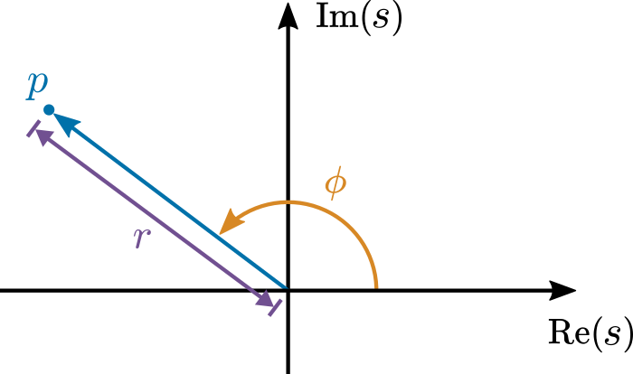
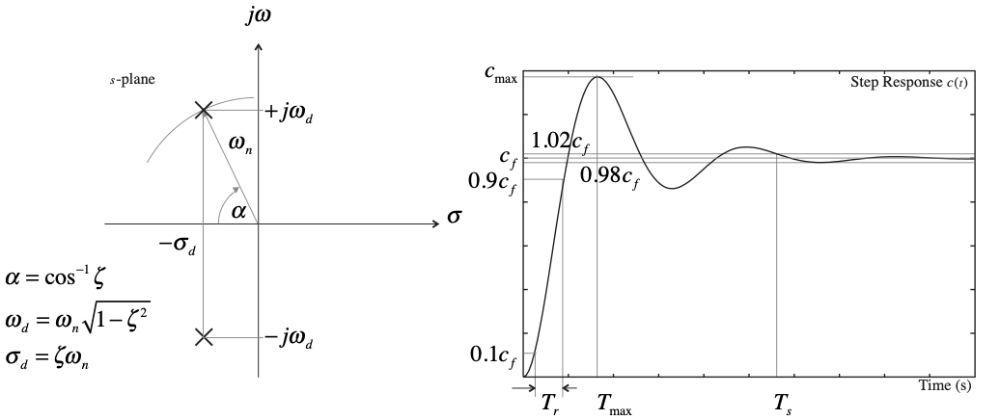
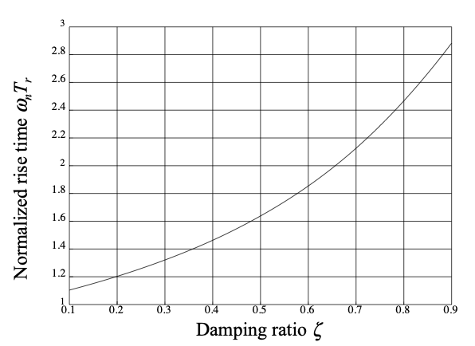

---
jupytext:
  formats: ipynb,md:myst
  text_representation:
    extension: .md
    format_name: myst
    format_version: 0.13
    jupytext_version: 1.15.2
kernelspec:
  display_name: Matlab
  language: matlab
  name: matlab
---

+++ {"slideshow": {"slide_type": "slide"}}

(unit5.2)=
# Unit 5.2: More on the Qualitative and Quantitative Response of First- and Second-Order Poles

+++ {"slideshow": {"slide_type": "notes"}}

Follow along at [cpjobling.github.io/eg-150-textbook/poles_and_zeros/second_order_properties](https://cpjobling.github.io/eg-150-textbook/poles_and_zeros/second_order_properties)


+++ {"slideshow": {"slide_type": "notes"}}

## Acknowledgements

The notes for this unit have been influenced by the MATLAB LiveScript **PoleZeroAnalysis.mlx** from the MathWorks curriculum module [Transfer Function Analysis of Dynamic Systems](https://uk.mathworks.com/matlabcentral/fileexchange/94635-transfer-function-analysis-of-dynamic-systems) {cite}`tfads`. You will find some useful interactive applications with which you can explore the concepts presented here. Some of these will be deomostrated in the lecture.

The examples have been inspired by the recording of the second half of the video recording of Stephen Boyd's 1999 lecture 10 (delivered at Stanford University) which itself is based on [Qualitative properties of signals & Laplace transforms](https://web.stanford.edu/~boyd/ee102/qualitative.pdf) {cite}`boyd93`.

+++ {"slideshow": {"slide_type": "notes"}}

You can watch the video on YouTube here:

<iframe width="560" height="315" src="https://www.youtube.com/embed/I3DZM0rarTA?si=hSVhhDofHEw1y-rV&amp;start=1407" title="YouTube video player" frameborder="0" allow="accelerometer; autoplay; clipboard-write; encrypted-media; gyroscope; picture-in-picture; web-share" referrerpolicy="strict-origin-when-cross-origin" allowfullscreen></iframe>

+++ {"slideshow": {"slide_type": "slide"}}

## Agenda

* {ref}`unit.5.2.1`
* {ref}`unit.5.2.2`
* {ref}`unit.5.2.3`
* {ref}`unit.5.2.4`
* {ref}`examples16`

+++ {"slideshow": {"slide_type": "slide"}}

(unit.5.2.1)=
## Quantitative behaviour of real poles

In {ref}`unit5.1.2` we stated that a response term that corresponds to a real pole $s = \sigma$ will result in a growing expontial if $\sigma > 0$ and a decaying exponential if $\sigma < 0$.

We didn't quantify these effects, so it is useful to do so here.

+++ {"slideshow": {"slide_type": "subslide"}}

### Rate of exponential growth

Given that the rational polynomial $F(s)$ representing the Laplace transfer of a signal or system has a pole $s = \sigma$, one of the terms in the partial fraction expansion will be

$$\frac{r_\sigma}{s-\sigma}$$

where $r_\sigma$ is the residue of the pole.

The corresponding term in $f(t)$ will be $r_\sigma e^{\sigma t}$.

This will be a growing exponential for which the *doubling time* is a useful measure of the growth rate.

Given that at time $t=0$, $r_\sigma e^{0} = r_\sigma$, the doubling time $T$ is the time for which

$$
\begin{align}
r_\sigma e^{\sigma T} &= 2r_\sigma\\
e^{\sigma T} &= 2\\
\sigma T &= \log_e 2\\
T &= \frac{\log_e 2}{\sigma} = \frac{0.693147180559945}{\sigma} \approx \frac{0.7}{\sigma}.
\end{align}
$$

+++ {"slideshow": {"slide_type": "subslide"}}

(unit5.2:ex7)=
### Example 7

Plot the response of the pole

$$\frac{10}{s - 0.1}$$

and confirm that the doubling time is around 7 seconds.

+++ {"slideshow": {"slide_type": "subslide"}}

#### Solution to example 7

Done in MATLAB

```{code-cell}
---
slideshow:
  slide_type: subslide
---
format compact
clear variables
t = linspace(0,15,100);
sigma = 0.1;
% Doubling time
T = log(2)/sigma;
% Plot
plot(t,10*exp(sigma*t)),ylim([0,50]),grid
% Plot and label lines: first doubling
line([T,T],[0,20],'Color','r','LineStyle','--')
line([0,T],[20,20],'Color','r','LineStyle','--')
hold on 
plot(T,20,'o')
text(3,22,'First doubling')
% Plot and label lines: second doubling
plot(2*T,40,'o')
line([2*T,2*T],[0,40],'Color','g','LineStyle','--')
line([0,2*T],[40,40],'Color','g','LineStyle','--')
text(10,42,'Second doubling')
% Label graph
title('Exponential growth'),
ylabel('f(t) = 10*exp(-0.1*t)'),xlabel('Time t [s]')
hold off
```

+++ {"slideshow": {"slide_type": "subslide"}}

Given that $\sigma = 0.1$, the doubling time $T \approx 0.7/\sigma = 7$ s. The initial value is $10$ at $t=0$ s. It has doubled to $20$ at $t\approx 7$ s, and has doubled again to $40$ at $t\approx 14$.

We have added the exact solutions to the plot.

+++ {"slideshow": {"slide_type": "notes"}}

The MATLAB code to reproduce this result is given in [example7.mlx](matlab/example7.mlx)

+++ {"slideshow": {"slide_type": "subslide"}}

### Rate of exponential decay

If $F(s)$ has a pole $s = -\sigma$, one of the terms in the partial fraction expansion will be

$$\frac{r_\sigma}{s+\sigma}$$

where $r_\sigma$ is the residue of the pole.

The corresponding term in $f(t)$ will be $r_\sigma e^{-\sigma t}$.

This will be a decaying exponential for which the time constant $\tau = 1/|\sigma|$ is a useful measure of the decay rate.

Putting the time constant into the response equation

$$r_\sigma e^{-\sigma \tau} = r_\sigma e^{-1} = 0.367879441171442r_\sigma \approx 0.37r_\sigma.$$

Thus the response reaches around $37\%$ of it's initial value in $\tau = 1/|\sigma|$ s.

+++ {"slideshow": {"slide_type": "subslide"}}

Another measure of decay that is sometimes used is the value of $t$ for which the response reaches $1\%$ of its initial value.

$$
\begin{align}
  0.01 r_\sigma &= r_\sigma e^{-t/\tau}\\
  0.01 &= e^{-t/\tau}\\
  \log_e(0.01) &= -t/\tau \\
  t_{1\%} &\approx 4.6 \tau
\end{align}
$$

+++ {"slideshow": {"slide_type": "subslide"}}

(unit5.2:ex7)=
### Example 8

The current in the RC circuit shown in [Fig. 41](https://cpjobling.github.io/eg-150-textbook/laplace_transform/index.html#rc-circuit-l) has the transform

$$i(t) = \frac{1/RC}{s+ 1/RC}$$

If $R = 1$ M$\Omega$ and $C = 10$ $\mu$F, determine:

(a) The initial current $i(0)$.

(b) The time constant $\tau$.

(c) The time at which the current decays to 1% of $i(0)$.

+++ {"slideshow": {"slide_type": "notes"}}

#### Solution to example 8

+++ {"slideshow": {"slide_type": "notes"}}

(a) The initial current is given by[^unit5.2:1]

$$\lim_{s\to\infty} sI(s) = \lim_{s\to\infty}s\frac{1/RC}{s + 1/RC} = 1/RC.$$

Given the component values of $R$ and $C$, $i(0) = 1/RC = 100$ mA.

+++ {"slideshow": {"slide_type": "notes"}}

[^unit5.2:1]: This is easily determined from $\left.f(t)\right|_{t\to 0} = \left.\frac{1}{RC} e^{-t/RC}\right|_{t\to 0} = 1/RC$.

+++ {"slideshow": {"slide_type": "notes"}}

(b) The time constant $\tau = RC = 10$ s.

+++ {"slideshow": {"slide_type": "notes"}}

(c) The time at which the current decays to 1% of $i(0)$ is 46 s.

+++ {"slideshow": {"slide_type": "notes"}}

MATLAB confirmation

```{code-cell}
---
slideshow:
  slide_type: notes
---
t = linspace(0,50,100);
R = 1e6; C = 10e-6;
sigma = -1/(R*C);
% Time constant and initial current
tau = 1/abs(sigma); i0 = 1/(R*C);
% Plot
plot(t,i0*exp(sigma*t)),grid
% Plot and label lines: time constant
line([tau,tau],[0,i0*exp(-1)],'Color','r','LineStyle','--')
line([0,tau],[i0*exp(-1),i0*exp(-1)],'Color','r','LineStyle','--')
text(tau+1,i0*exp(-1),'Time constant: 37% of i0 in 10 seconds')
hold on 
plot(tau,i0*exp(-1),'o')
% Plot and label lines: 1% point
line([4.6*tau,4.6*tau],[0,0.01*i0],'Color','g','LineStyle','--')
line([0,4.6*tau],[0.01*i0,0.01*i0],'Color','g','LineStyle','--')
plot(4.6*tau,0.01*i0,'o')
text(32,0.01*i0+0.005,'1% of initial current in 46 seconds')
% Label graph
title('Exponential decay of current in an RC circuit'),
ylabel('Current i(t) [A]'),xlabel('Time t [s]')
hold off
```

+++ {"slideshow": {"slide_type": "notes"}}

The MATLAB code to reproduce this result is given in [example8.mlx](matlab/example8.mlx)

+++ {"slideshow": {"slide_type": "slide"}}

(unit.5.2.2)=
## Natural frequency

The locations of the poles in the $s$-plane determine the natural oscillation frequencies present in the system.

+++ {"slideshow": {"slide_type": "notes"}}

Consider a pole in the complex plane illustrated in {numref}`fig:unit5.2:1`

+++ {"slideshow": {"slide_type": "subslide"}}

:::{figure-md} fig:unit5.2:1
  

Phase $\phi$ and magnitude $r$ of pole $p$ shown in the complex plane
:::

+++ {"slideshow": {"slide_type": "subslide"}}

* The natural (undamped) frequency (in rad/s) contributed by a pole $p$ is the pole magnitude, $r=\left|p\right|$.
* The phase, $\phi=\arg p$, determines the relative strength of the oscillatory component.

+++ {"slideshow": {"slide_type": "slide"}}

## Analysis of a second-order system

Second-order systems with a pair of conjugate poles and no zeros are useful for illustrating the natural frequency response analytically. It is helpful to write this type of system in the form:

$$G(s) = \frac{K}{s^2 + 2\zeta\omega_n s + \omega_n^2 }$$ 

where 

* $K$ is the gain coefficient
* $\zeta$ is the damping ratio already introduced in {ref}`unit5.1.4`
* and $\omega_n$ is the (undamped) natural frequency.

+++ {"slideshow": {"slide_type": "notes"}}

These parameters are helpful for drawing a connection between the natural response of the system and the properties of the poles. In this section, the poles of the second-order system will be analytically computed and related to the natural response of the system.

+++ {"slideshow": {"slide_type": "subslide"}}

### Pole analysis

The poles of the system occur when the denominator is zero:

$$p_{1,2} = -\zeta\omega_n \pm \omega_n \sqrt{\zeta^2 - 1}$$

+++ {"slideshow": {"slide_type": "fragment"}}

For simplicity, consider $\zeta \in [0,1)$. In this case, the poles are
    
$$p_{1,2} = -\zeta\omega_n \pm j \omega_n \sqrt{1 - \zeta^2}$$

+++ {"slideshow": {"slide_type": "subslide"}}

As stated above, the natural frequency is defined as the magnitude of the pole. The magnitude is computed as :

$$\sqrt{\mathbf{Re}^2 + \mathbf{Im}^2}$$

+++ {"slideshow": {"slide_type": "subslide"}}

Using the definitions illustrated in [Fig. 76](https://cpjobling.github.io/eg-150-textbook/poles_and_zeros/qualitative_properties.html#fig-pz-2), $\mathbf{Re} = -\sigma = -\zeta\omega_n$ and $\mathbf{Im} = \omega = \omega_n \sqrt{1 - \zeta^2}$, so :

+++ {"slideshow": {"slide_type": "fragment"}}

$$
\begin{array}{rl} |p|
 &= \sqrt{\sigma^2 + \omega^2} \\
 &= \sqrt{ (-\zeta \omega_n)^2 + ( \pm \omega_n \sqrt{1-\zeta^2})^2 } \\ 
 &= \sqrt{ \zeta^2 \omega_n^2 + \omega_n^2 (1-\zeta^2) } \\ 
 &= |\omega_n|\ 
\end{array}
$$

+++ {"slideshow": {"slide_type": "notes"}}

This illustrates why this form of the equation is used: the natural frequency is the parameter $\omega_n$.

+++ {"slideshow": {"slide_type": "subslide"}}

The damping ratio $\zeta$ determines the relative strength of the exponential part of the response.

+++ {"slideshow": {"slide_type": "fragment"}}

As $\zeta\to 1$, the complex part of the pole tends to zero, implying less oscillatory and stronger exponential behavior.

+++ {"slideshow": {"slide_type": "fragment"}}

For stable systems, that implies greater damping.

+++ {"slideshow": {"slide_type": "subslide"}}

The gain coefficient $K$ affects the magnitude of the response, not the time-dependent behavior.

+++ {"slideshow": {"slide_type": "subslide"}}

### Natural response

The impulse response of a system $H(s)$ is also called the *natural response*. The natural response $y(t)$ is computed by taking the inverse Laplace transform of

$$\frac{Y(s)}{X(s)} = \frac{Y(s)}{1} = \frac{ K }{s^2 + 2 \zeta \omega_n s  + \omega_n^2}$$
        
because the impulse $x(t)=\delta(t)$ has a Laplace transform $1$. You can find the response's analytic form by referring to a table or using the MATLAB [ilaplace](https://uk.mathworks.com/help/symbolic/sym.ilaplace.html) function.

```{code-cell}
---
slideshow:
  slide_type: subslide
---
syms s t zeta omega_n K Y(s) y(t) 
assume(t > 0)
Y(s) = K/(s^2 + 2*zeta*omega_n*s + omega_n^2)
```

```{code-cell}
---
slideshow:
  slide_type: fragment
---
y(t) = ilaplace(Y); % The impulse response in the time domain
```

+++ {"slideshow": {"slide_type": "fragment"}}

Gives the result

$$y(t) = \frac{K\,{\mathrm{e}}^{-\zeta\, \omega_n \,t } \,\sin \left(\omega_n \,t\,\sqrt{1-\zeta^2 }\right)}{\omega_n \,\sqrt{1-\zeta^2 }}$$ (eq:unit5.1:1)

+++ {"slideshow": {"slide_type": "subslide"}}

Notice that the impulse response is a product of an exponential and sine function. From these functions observe that:
* The sine function frequency (in rads/s) is $\omega_n \,\sqrt{1-\zeta^2 }$. If the damping $\zeta=0$, then the frequency is $\omega_n$. This is the reason $\omega_n$  is often referred to as the *undamped natural frequency*.
* The rate of decay of the exponential damping function is $\zeta\omega_n$. 
* The gain parameter $K$ only contributes as a constant multiplier to the magnitude of the response.

+++ {"slideshow": {"slide_type": "slide"}}

(unit.5.2.3)=
## Step-response of a second-order system

The step response of a system $H(s)$ is often computed. The step response $y_s(t)$ is determined by taking the inverse Laplace transform of

$$Y(s) = \frac{1}{s} \left(\frac{ \omega_n^2 }{s^2 + 2 \zeta \omega_n s  + \omega_n^2}\right)$$
        
because the step function $x(t)=u_0(t)$ has a Laplace transform $1/s$. You can find the response's analytic form by taking partial fraction expansion of $Y(s)$ and then referring to a table of Laplace transforms.

+++ {"slideshow": {"slide_type": "subslide"}}

Here we will state, without proof, that the step response will be

$$y_s(t) = \left(1 - e^{-\sigma t}\left(\cos\left(\omega t\right)+\frac{\sigma}{\omega}\sin\left(\omega t\right)
\right)\right)u_o(t)$$ (eq:unit5.1:2)

where :
* $\omega = \omega_n\sqrt{1 - \zeta^2}$ is the imaginary part of the system's complex pole pair, sometimes called the *damped natural frequency*
* $\sigma = \zeta\omega_n$ is the magnitide of the real part of the system's complex pole pair
* $\phi = \tan^{-1} \zeta/(1 - \zeta^2)$ is the phase shift.

+++ {"slideshow": {"slide_type": "notes"}}

```{note}
The proof requires us to complete the square in the denominator of the term with the complex roots

$$\left(s^2 + 2\zeta\omega_n + \omega_n^2\right)=\left(s + \zeta\omega_n\right)^2 + \left(\omega_n^2\left(1 - \zeta^2\right)\right)$$

Then take the PFE of the terms assuming that the complex poles will yield terms:

$$r_1\frac{s+\zeta\omega_n}{\left(s + \zeta\omega_n\right)^2 +  \left(\omega_n\sqrt{1 - \zeta^2}\right)^2} + r_2\frac{\omega_n\sqrt{1 - \zeta^2}}{\left(s + \zeta\omega_n\right)^2 + \left(\omega_n\sqrt{1 - \zeta^2}\right)^2}$$ (eq:unit5.1:10)

Making the substitutions $\sigma = \zeta\omega_n$ and $\omega = \omega_n \sqrt{1 - \zeta^2}$ we can simplify
{eq}`eq:unit5.1:10` to

$$r_1\frac{s+\sigma}{\left(s + \sigma\right)^2 +  \omega^2} + r_2\frac{\omega}{\left(s + \sigma\right)^2 + \omega^2}$$ (eq:unit5.1:11)
The step-response terms will then be

$$r_1 e^{-\sigma t}\sin(\omega t) + r_2 e^{-\sigma t}\cos(\omega t)$$

Having computed the residues $r_1$ and $r_2$ the sine and cosine terms can be combined to give the final $e^{-\sigma t}\cos(\omega t + \phi)$ expression.
```

+++ {"slideshow": {"slide_type": "subslide"}}

(ex:unit5.2:9)=
### Example 9

Determine the step response for a second order system with $\omega_n = 10$ rad/s and $\zeta = 0.5$. Confirm your result using {eq}`eq:unit5.1:2` and the [`tf`](https://uk.mathworks.com/help/control/ref/tf.html) and [`step`](https://uk.mathworks.com/help/control/ref/dynamicsystem.step.html) functions.

+++ {"slideshow": {"slide_type": "subslide"}}

#### Solution to example 9

+++ {"slideshow": {"slide_type": "fragment"}}

Analytical solution using the symbolic math toolbox

```{code-cell}
---
slideshow:
  slide_type: fragment
---
syms Y_s(s) y_s(t)
zeta = 0.5; omega_n = 10;
X(s) = 1/s;
H(s) = omega_n^2/(s^2 + 2*zeta*omega_n*s + omega_n^2);
Y_s(s) = H(s)*X(s);
```

+++ {"slideshow": {"slide_type": "fragment"}}

$$Y_s(s) = \frac{100}{s\,{\left(s^2 +10\,s+100\right)}}$$ (eq:unit5.1:3)

```{code-cell}
---
slideshow:
  slide_type: fragment
---
% step response 
y_s(t) = ilaplace(Y_s(s));
```

+++ {"slideshow": {"slide_type": "fragment"}}

Gives the result

$$y_s(t) = 1-{\mathrm{e}}^{-5\,t} \,{\left(\cos \left(5\,\sqrt{3}\,t\right)+\frac{\sqrt{3}\,\sin \left(5\,\sqrt{3}\,t\right)}{3}\right)}$$ (eq:unit5.1:4)

+++ {"slideshow": {"slide_type": "subslide"}}

Plot the solution

```{code-cell}
---
slideshow:
  slide_type: fragment
---
fplot(y_s(t)*heaviside(t),[0,1.2]),ylim([0,1.2]),grid
xlabel('Time (seconds)'),ylabel('y_s(t)'),...
title('Step Response: Determined analytically')
```

+++ {"slideshow": {"slide_type": "subslide"}}

Confirming the result with {eq}`eq:unit5.1:2` we get:

```{code-cell}
---
slideshow:
  slide_type: fragment
---
sigma = zeta*omega_n;
omega = omega_n*sqrt(1 - zeta^2);
% Compute response using the formula
t = linspace(0,1.2,100);
yst = (1 - exp(-sigma*t).*(cos(omega*t)+(sigma/omega)*sin(omega*t)));
```

+++ {"slideshow": {"slide_type": "subslide"}}

Plot the result

```{code-cell}
---
slideshow:
  slide_type: fragment
---
plot(t,yst),grid,...
xlabel('Time (seconds)'),ylabel('y_s(t)'),...
title('Step Response: Computed with formula')
```

+++ {"slideshow": {"slide_type": "subslide"}}

Using the `tf` and `step` functions we get:

```{code-cell}
---
slideshow:
  slide_type: fragment
---
num = omega_n^2; den = [1 2*zeta*omega_n,omega_n^2];
Hs = tf(num,den)
```

```{code-cell}
---
slideshow:
  slide_type: subslide
---
step(Hs),title('Step Response: Computed with tf function')
```

+++ {"slideshow": {"slide_type": "notes"}}

The MATLAB code to reproduce this result is given in [example9.mlx](matlab/example9.mlx)

+++ {"slideshow": {"slide_type": "slide"}}

(unit.5.2.4)=
## Useful quantifiers that result from step response

The relationship between the pole locations and the step response are summarized in {numref}`fig:unit5_2:2` [^unit5.1:note:4]

:::{figure-md} fig:unit5_2:2


Relationship between poles and step response
:::

+++ {"slideshow": {"slide_type": "notes"}}

[^unit5.1:note:4]: In the diagram we use a slightly changed notation: $\omega_d = \omega$ is the *damped natural frequency* given by the *imaginary part of the pole* and $\sigma_d = \sigma$ is the *real part of the pole*.

+++ {"slideshow": {"slide_type": "notes"}}

Knowledge of the location of the poles and their damping ratio and natural frequency are useful for qualtitaive anaysis of the response of a complex pole pair. There are also a number of parameters that quantively define the features of the step response which we may be interested in. These are shown in the right-hand picture of {numref}`fig:unit5.2:2`. Knowledge of the poles allows us to predict the step response. But also, usefully for many design problems, knowledge of the step response allows us to predict the location of the poles.

We will explore these ideas in the following sections.

+++ {"slideshow": {"slide_type": "subslide"}}

### Poles

The location of the system poles is important and can be obtained by factorizing the denominator of $H(s)$ either symbolically or numerically. There is also a handy function [`pole`](https://uk.mathworks.com/help/ident/ref/dynamicsystem.pole.html) which will take these values from a transfer function.

+++ {"slideshow": {"slide_type": "subslide"}}

We will illustrate these with the example used in {ref}`ex:unit5.2:9`.

+++ {"slideshow": {"slide_type": "fragment"}}

First we set up the system function $H(s)$

```{code-cell}
---
slideshow:
  slide_type: fragment
---
syms s t
zeta = 0.5; omega_n = 10;
H = omega_n^2/(s^2 + 2*zeta*omega_n*s + omega_n^2)
```

+++ {"slideshow": {"slide_type": "subslide"}}

Find the poles symbolically

```{code-cell}
---
slideshow:
  slide_type: fragment
---
[num,den] = numden(H);
sym_poles = factor(den,'FactorMode','full') % FactorMode needed to reduce quadratic
```

+++ {"slideshow": {"slide_type": "fragment"}}

Factors interpreted as

$$\left(s + 5 + j5\sqrt{3}\right)\left(s + 5 - j5\sqrt{3}\right)$$

+++ {"slideshow": {"slide_type": "subslide"}}

Now find the poles numerically

```{code-cell}
---
slideshow:
  slide_type: fragment
---
% Convert symbolic polynomials to numeric polynomials
n = sym2poly(num); d = sym2poly(den);
```

```{code-cell}
---
slideshow:
  slide_type: fragment
---
% Compute the roots
num_poles = roots(d)
```

+++ {"slideshow": {"slide_type": "subslide"}}

FInally from the transfer function model

```{code-cell}
---
slideshow:
  slide_type: fragment
---
Hs = tf(n,d);
```

```{code-cell}
---
slideshow:
  slide_type: fragment
---
poles = pole(Hs)
```

+++ {"slideshow": {"slide_type": "subslide"}}

### Damping ratio and natural frequencies

These are most conveniently obtained from the transfer function using the [`damp`](https://uk.mathworks.com/help/control/ref/dynamicsystem.damp.html) function.

```{code-cell}
---
slideshow:
  slide_type: fragment
---
[wn,z] = damp(Hs)
```

+++ {"slideshow": {"slide_type": "fragment"}}

The function `damp` can also return the poles

```{code-cell}
---
slideshow:
  slide_type: fragment
---
[wn,z,p] = damp(Hs)
```

+++ {"slideshow": {"slide_type": "subslide"}}

### Rise-tme

The *rise time* $T_r$ is a measure of the speed of response of a system. It is usually taken to be the time taken to transition from 10% to 90% of the final value in the initial rise of the response. It is shown in {numref}`fig:unit5.2:2`.

The rise-time depends on $\omega_n$ but its actual value is also dependent on the damping ratio $\zeta$ so we rely on a calibration curve such as that shown in {numref}`fig:unit5.2:2`.

+++ {"slideshow": {"slide_type": "subslide"}}

:::{figure-md} fig:unit5.2:2


Damping ratio as a function of normalised rise-time for a second-order underdamped response
:::

+++ {"slideshow": {"slide_type": "subslide"}}

For the problem being considered $\zeta = 0.5$, so $\omega_n T_r \approx 1.65$ giving

$$T_r \approx \frac{1.65}{\omega_n} = \frac{1.65}{10} = 0.165\,\mathrm{s}.$$

```{code-cell}
---
slideshow:
  slide_type: fragment
---
step(Hs),line([0,0.1],[0.1,0.1]),line([0,0.25],[0.9,0.9])
```

+++ {"slideshow": {"slide_type": "subslide"}}

### Settling time

The *settling time* $T_s$ is defined as the time taken for the peaks of the oscillations in the step response to be bounded by some arbitrary limit. In {numref}`fig:unit5.2:2` the bounds have been set to 2%.

The actual setting time is related to the real part of the poles and, for this case,

$$2\% T_s \approx \frac{4}{\zeta\omega_n}$$

+++ {"slideshow": {"slide_type": "subslide"}}

For our example

```{code-cell}
---
slideshow:
  slide_type: fragment
---
Ts = 4/(zeta*omega_n) % seconds
```

```{code-cell}
---
slideshow:
  slide_type: fragment
---
step(Hs),line([0,1.2],[1.02,1.02]),line([0,1.2],[0.98,0.98])
```

+++ {"slideshow": {"slide_type": "fragment"}}

The value looks about right!

+++ {"slideshow": {"slide_type": "subslide"}}

### Peak overshoot

The peak overshoot is a measure of damping in a system and is the height of the first peak ($C_\max$ in {numref}`fig:unit5.2:2`). It is usually quoted as a percentage of the final value.

$$\%\mathrm{OS} = \exp\left(\frac{-\zeta\pi}{\sqrt{1-\zeta^2}}\right)\times 100$$

+++ {"slideshow": {"slide_type": "subslide"}}

If we know the peak overshoot, we can calculate the damping ratio $\zeta$ using the formula:

$$\zeta = \frac{-\log_e\left(\%\mathrm{OS}/100\right)}{\sqrt{\pi^2 + \log_e^2\left(\%\mathrm{OS}/100\right)}} $$

+++ {"slideshow": {"slide_type": "subslide"}}

For our example

```{code-cell}
---
slideshow:
  slide_type: fragment
---
POS = exp(-zeta*pi/sqrt(1 - zeta^2))*100
```

```{code-cell}
---
slideshow:
  slide_type: fragment
---
step(Hs),line([0,1.2],[1.16304,1.16304])
```

+++ {"slideshow": {"slide_type": "fragment"}}

Reverse formula check

```{code-cell}
---
slideshow:
  slide_type: fragment
---
z = -log(POS/100)/sqrt(pi^2 + log(POS/100)^2)
```

+++ {"slideshow": {"slide_type": "subslide"}}

### Peak time

We sometimes compute the *peak time* $T_p$, which is the time at which the first peak occurs. It depends on the damped natural frequency:

$$T_p = \frac{\pi}{\omega_d}  = \frac{\pi}{\omega_n\sqrt{1-\zeta^2}}$$

+++ {"slideshow": {"slide_type": "fragment"}}

For our example

```{code-cell}
---
slideshow:
  slide_type: fragment
---
Tp = pi/(omega_n*sqrt(1 - zeta^2))
```

```{code-cell}
---
slideshow:
  slide_type: fragment
---
step(Hs),line([Tp,Tp],[0,1.16304])
```

+++ {"slideshow": {"slide_type": "subslide"}}

### List all properties

MATLAB provides a useful function [stepinfo](https://uk.mathworks.com/help/control/ref/dynamicsystem.stepinfo.html) that computes a step response for a system and takes measurements of the response to summarize the useful quantitative data defined above as well as a few more quantities.

```{code-cell}
---
slideshow:
  slide_type: fragment
---
stepinfo(Hs)
```

+++ {"slideshow": {"slide_type": "fragment"}}

You should compare the values computed with the approximations given in this section.

+++ {"slideshow": {"slide_type": "slide"}}

(examples16)=
## Exercises 16

+++ {"slideshow": {"slide_type": "subslide"}}

(ex16.1)=
### Exercise 16.1

A signal or system response $f(t)$ contains the terms

$$\cdots - e^{-2t} - 0.1 t^2 \cos(3t + 5) \cdots$$ (eq:ex16:1)

(a) How many poles are there in $F(s)$?

(b) What is the nature of the response due to the terms given in {eq}`eq:ex16:1`?

(c) Which are the dominant poles?

+++ {"slideshow": {"slide_type": "subslide"}}

(ex16.2)=
### Exercise 16.2

A system has poles $s = 0,\,1\pm j,\,-1,\, -2\pm j2,\,-3$ and zeros at $s = -1.5,\,-3\pm j3$.

(a) Give the transfer function $F(s)=b(s)/a(a)$

(b) Plot the poles on a pole zero map

(c) Give the time constant $\tau$, doubling time $T$, damping ratio $\zeta$, angle $\theta$, natural frequency $\omega_n$, and quality factor $Q$ as appropriate for each pole or pole pair.

(d) How do the zeros affect the response $f(t)$?

(e) Which is the dominant pole?

(f) Will the system be stable or unstable?

+++ {"slideshow": {"slide_type": "notes"}}

#### Partial solution to Exercise 16.2

The poles and zeros can be entered into MATLAB

```{code-cell}
---
slideshow:
  slide_type: notes
---
z = [-1.5; -3 - 3j; -3 + 3j];
p = [0; 1 + j; 1 - j; -1; -2 + 2j; -2 - 2j; -3];
% Define a transfer function in zero-pole-gain form
Fs = zpk(z,p,1)
```

+++ {"slideshow": {"slide_type": "notes"}}

(a) The transfer function is

```{code-cell}
---
slideshow:
  slide_type: notes
---
tf(Fs)
```

+++ {"slideshow": {"slide_type": "notes"}}

(b) The pole-zero map

```{code-cell}
---
slideshow:
  slide_type: notes
---
pzmap(Fs),xlim([-4,1]),ylim([-4,4]),title('Pole zero map for Example 16.2')
```

+++ {"slideshow": {"slide_type": "notes"}}

**Bonus**: the step response is

```{code-cell}
---
slideshow:
  slide_type: notes
---
step(Fs)
```

+++ {"slideshow": {"slide_type": "subslide"}}

(ex16.3)=
### Exercise 16.3: Spring-Mass-Damper System

You can analyze a mass-spring-damper system ({numref}`fig:unit5.2:3`) by looking at the poles of its transfer function.

:::{figure-md} fig:unit5.2:3


Diagram of a spring-mass-damper system
:::

+++ {"slideshow": {"slide_type": "subslide"}}

Consider a mass-spring-damper that
* is dynamically forced by an arbitrary function 
* has zero initial conditions: $x(0)=0$ and $x'(0)=0$

+++ {"slideshow": {"slide_type": "fragment"}}

The position transfer function is

$$G(s) = \frac{X(s)}{U(s)} = \frac{1}{ms^2 + cs + k} $$

+++ {"slideshow": {"slide_type": "subslide"}}

(a) Write the mass-spring-damper transfer function in the form 
         
$$G(s) = \frac{ K }{s^2 + 2 \zeta \omega_n s  + \omega_n^2}$$

and solve for the expressions of the gain $K$, damping ratio $\zeta$, and natural frequency $\omega_n$ in terms of the mass-spring-damper parameters. Write your answers using the symbolic variables $c$, $m$, and $k$.

```{code-cell}
---
slideshow:
  slide_type: fragment
---
% Use these symbolic variables
syms m c k
% Replace the NaNs with your expressions
K = NaN;
omega_n = NaN;
zeta = NaN;
```

+++ {"slideshow": {"slide_type": "subslide"}}

(b)  Solve for the symbolic expressions of the poles of $G$ in terms of the mass-spring-damper parameters $m$, $c$, and $k$. Store the expressions below in `pplus` and `pminus` where `pplus` stores the positive root.

+++ {"slideshow": {"slide_type": "subslide"}}

(c) Plot the step response of the system $G$ starting with $k = m = 1$ and $c=0$. Note the values of the poles, damping ratio, and natural frequency obtained. Observe the step-response parameters obtained using `sysinfo`. Adjust the values of $k$, $m$ and $c$ and comment on the effects on the step response observed.

+++ {"slideshow": {"slide_type": "notes"}}

## Summary

+++ {"slideshow": {"slide_type": "notes"}}

(unit5.2:takeaways)=
### Take aways

#### Real pole $s=\sigma$:

* Growth rate: $\sigma > 0$, the exponential signal doubles every $T\approx 0.7/\sigma$ s.
* Time constant: $\sigma < 0$, the exponential signal decays to $37\%$ of it's original value in $\tau = 1/\sigma$ s. The exponential signal reaches $1\%$ of it's original value in $t\approx 4.6\tau$ s.

#### Complex pole pair $s = -\sigma \pm j\omega$:

* Representation of denominator: $(s + \sigma + j\omega_n)(s - \sigma + j\omega) = s^2 + 2\sigma s + \left(\sigma^2 + \omega_n^2\right)$
* Natural frequency: $\omega_n = \sqrt{\sigma^2 + \omega^2}$
* Damping ratio: $\zeta = -\sigma/\sqrt{\sigma^2 + \omega^2}$

#### Standard second-order system transfer function

* Transfer function:

$$G(s) = \frac{K}{s^2 + 2\zeta\omega_n s + \omega_n^2} $$

* Poles: $p_{1,2} = -\zeta\omega_n \pm j\omega_n\sqrt{1 - \zeta^2}$

#### Performance parameters for second-order system

* Rise time: $T_r$ is estimated from graph of normaized rise-time $\omega_n T_r$ v $\zeta$ shown in {numref}`fig:unit5.2:2`.
* 2% Setting time: $T_s \approx 4/\sigma$
* Percentage overshoot: $\%\mathrm{OS} = \exp\left(-\zeta\pi/\sqrt{1 - \zeta^2}\right) \times 100$
* Peak time: $T_p = \pi/\omega$


#### Useful MATLAB commands

* `tf`: defines a system as a transfer function $n(s)/d(s)$
* `step`: plots the step response of a system
* `pole`: lists the poles of a system
* `damp`: lists the natural frequency and damping ratios of the poles of a system
* `stepinfo`: lists the properties of the step response of a system

+++ {"slideshow": {"slide_type": "notes"}}

## Further exploration

If you have access to MATLAB (desktop of online), you can install the MATLAB curriculum module [Transfer Function Analysis of Dynamic Systems](https://uk.mathworks.com/matlabcentral/fileexchange/94635-transfer-function-analysis-of-dynamic-systems) {cite}`tfads` and further explore the concepts given here. The MATLAB Live Script **PoleZeroAnalysis.mlx** provides some interactive tools that enable you to interactively explore second order system response and includes the impact of *zeros* which we have not covered here.

+++ {"slideshow": {"slide_type": "notes"}}

## Still to come

We will the conclude this module by considering frequency response analysis of signals and systems defined by rational polynomials in $s$.

+++ {"slideshow": {"slide_type": "notes"}}

## References

```{bibliography}
:filter: docname in docnames
```

+++ {"slideshow": {"slide_type": "notes"}}

## Footnotes

```{code-cell}

```
