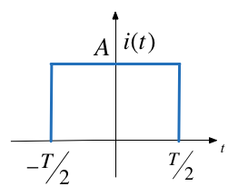

---
jupytext:
  formats: ipynb,md:myst
  text_representation:
    extension: .md
    format_name: myst
    format_version: 0.13
    jupytext_version: 1.14.4
kernelspec:
  display_name: Matlab
  language: matlab
  name: matlab
---

+++ {"slideshow": {"slide_type": "skip"}}

Lecturer: Set up MATLAB

```{code-cell}
---
slideshow:
  slide_type: skip
---
clear all
format compact
```

+++ {"slideshow": {"slide_type": "slide"}}

(worked_examples_3)=
# Examples 3 - Elementary Signals

To accompany {ref}`elementary_signals`.

+++ {"slideshow": {"slide_type": "fragment"}}

Follow along at [cpjobling.github.io/eg-150-textbook/signals_and_systems/elementary_signals/examples3](https://cpjobling.github.io/eg-150-textbook/signals_and_systems/elementary_signals/examples3)


+++

## Plot the Unit Step

```{code-cell}
---
slideshow:
  slide_type: subslide
---
syms t
u0(t) = heaviside(t); % allows us to type u0(t) in our formulae
A = 2; T = 2; % we need numerical values to get a successful plot
fplot(A*u0(t),'LineWidth',2),title('Unit step'),subtitle(texlabel('Au_0(t)')),grid,xlabel('t')
```

+++ {"slideshow": {"slide_type": "slide"}}

(ex3_1)=
## 3.1: Other forms of unit step

```{admonition} MATLAB Example
:class: tip
We will solve this example by hand and then give the solution in the MATLAB lab.
```

Use the MATLAB functions `subplot`, `heaviside` and `fplot` to reproduce {numref}`other_unit_steps`. 


:::{figure-md} other_unit_steps


Other forms of unit step function (Figure 1.8 {cite}`karris`)
:::

We've done the first row for you.

+++ {"slideshow": {"slide_type": "subslide"}}

a). $-Au_0(t)$

```{code-cell}
---
slideshow:
  slide_type: fragment
---
sgtitle('Other forms of the unit step function');
subplot(331)
fplot(-A*u0(t)),title(['a) ',texlabel('-A*u_0(t)')]),grid,xlabel('t')
```

+++ {"slideshow": {"slide_type": "subslide"}}

b). $-A(t - T)$

```{code-cell}
---
slideshow:
  slide_type: fragment
---
subplot(332)
fplot(-A*u0(t - T)),title(['b) ',texlabel('-A*u_0(t-T)')]),grid,xlabel('t')
```

+++ {"slideshow": {"slide_type": "subslide"}}

c). $-A(t + T)$

```{code-cell}
---
slideshow:
  slide_type: fragment
---
subplot(333)
fplot(-A*u0(t + T)),title(['c) ',texlabel('-A*u_0(t+T)')]),xlabel('t')
```

+++ {"slideshow": {"slide_type": "subslide"}}

d). $Au_0(-t)$

e). $Au_0(-t + T)$

f). $Au_0(-t - T)$

g). $-Au_0(-t)$

h). $-Au_0(-t + T)$

i). $-Au_0(-t - T)$

+++

The result should look like {numref}`fig_result`.

:::{figure-md} fig_result


Other forms of unit step function (Figure 1.8 {cite}`karris`) reproduced in MATLAB 
:::

+++ {"slideshow": {"slide_type": "slide"}}

(ex3_2)=
## 3.2: Synthesis of Signals from Unit Step

```{admonition} MATLAB Example
:class: tip
We will solve this example by hand and then give the solution in the MATLAB lab.
```

Unit step functions can be used to represent other time-varying functions such as rectangular pulses, square waves and triangular pulses.

+++ {"slideshow": {"slide_type": "subslide"}}

### a) Synthesize Rectangular Pulse


+++ {"slideshow": {"slide_type": "notes"}}

<pre style="border: 2px solid blue">


</pre>

+++ {"slideshow": {"slide_type": "subslide"}}

### b) Synthesize Square Wave


+++ {"slideshow": {"slide_type": "notes"}}

<pre style="border: 2px solid blue">


</pre>

+++ {"slideshow": {"slide_type": "subslide"}}

### c) Synthesize Symmetric Rectangular Pulse



+++ {"slideshow": {"slide_type": "notes"}}

<pre style="border: 2px solid blue">


</pre>

+++ {"slideshow": {"slide_type": "subslide"}}

### d) Synthesize Symmetric Triangular Pulse


+++ {"slideshow": {"slide_type": "notes"}}

<pre style="border: 2px solid blue">


</pre>

+++ {"slideshow": {"slide_type": "slide"}}

(ex3_3)=
## Example 3.3: Important properties of the delta function

```{admonition} MATLAB Example
:class: tip
We will solve this example by hand and then give the solution in the MATLAB lab.
```


See the accompanying [notes](index).

+++ {"slideshow": {"slide_type": "subslide"}}

Evaluate the following expressions

+++ {"slideshow": {"slide_type": "fragment"}}

a) $3t^4\delta(t-1)$

+++ {"slideshow": {"slide_type": "notes"}}

<pre style="border: 2px solid blue">


</pre>

+++ {"slideshow": {"slide_type": "fragment"}}

b) 

$$\int_{-\infty}^{\infty}t\delta(t-2)dt$$

+++ {"slideshow": {"slide_type": "notes"}}

<pre style="border: 2px solid blue">


</pre>

+++ {"slideshow": {"slide_type": "fragment"}}

$$t^2\delta'(t-3)$$

+++ {"slideshow": {"slide_type": "notes"}}

<pre style="border: 2px solid blue">


</pre>

+++ {"slideshow": {"slide_type": "subslide"}}

(ex3_4)=
## Example 3.4

```{admonition} MATLAB Example
:class: tip
We will solve this example by hand and then give the solution in the MATLAB lab.
```
:::{figure-md} fig:ex3_6


Signal to be symthesized for Example 3.6
:::

+++ {"slideshow": {"slide_type": "subslide"}}

a) Express the voltage waveform $v(t)$ shown in {numref}`fig:ex3_6` as a sum of unit step functions for the time interval $-1 < t < 7$ s

+++ {"slideshow": {"slide_type": "notes"}}

<pre style="border: 2px solid blue">


</pre>

+++ {"slideshow": {"slide_type": "subslide"}}

b) Using the result of 3.6(a), compute the derivative of $v(t)$ and sketch its waveform.

+++ {"slideshow": {"slide_type": "notes"}}

<pre style="border: 2px solid blue">


</pre>

+++ {"slideshow": {"slide_type": "slide"}}

## Lab Work

In the second lab we will solve the examples indicated in these examples.
