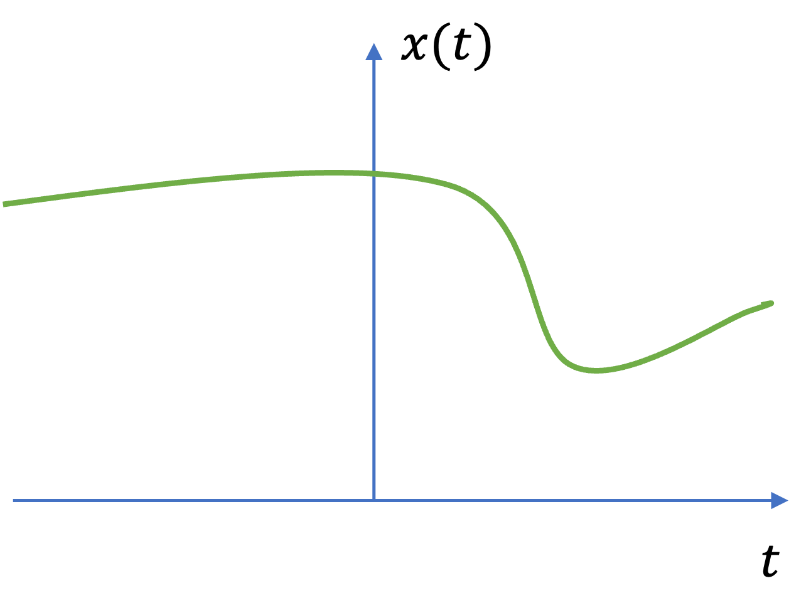
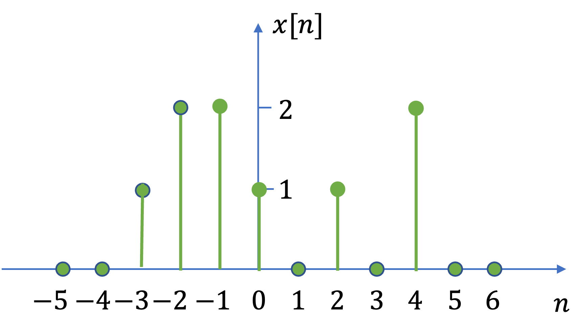
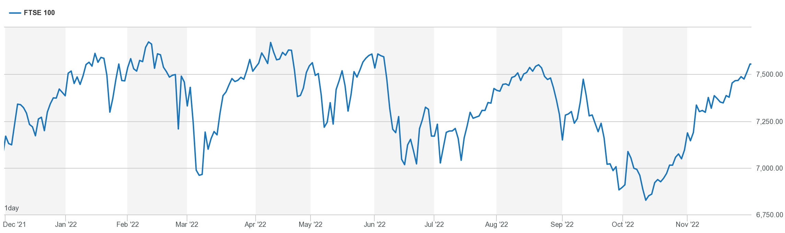
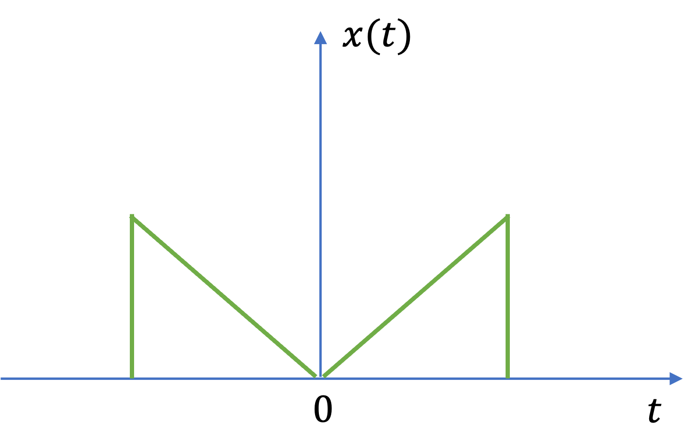
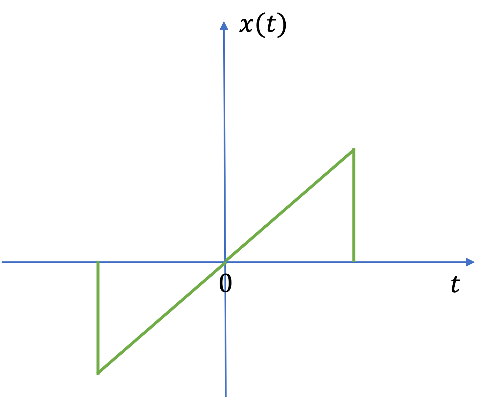
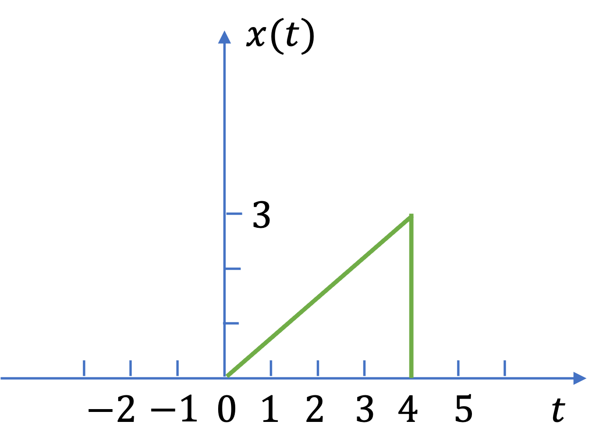
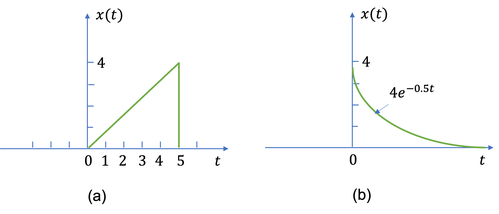

---
jupytext:
  formats: ipynb,md:myst
  text_representation:
    extension: .md
    format_name: myst
    format_version: 0.13
    jupytext_version: 1.16.6
kernelspec:
  display_name: MATLAB Kernel
  language: matlab
  name: jupyter_matlab_kernel
---

+++ {"slideshow": {"slide_type": "slide"}}

(signals1)=
# Unit 2.1: Signals and Classification of Signals

This section is based on Section 1.2 of {cite}`schaum`.

+++ {"slideshow": {"slide_type": "subslide"}}

Follow along at [cpjobling.github.io/eg-150-textbook/signals_and_systems/signals](https://cpjobling.github.io/eg-150-textbook/signals_and_systems/signals)


+++ {"slideshow": {"slide_type": "subslide"}}

A *signal* is a function representing a physical quatity or variable, and typically it contains information about the behaviour or nature of the phenomenon.

+++ {"slideshow": {"slide_type": "fragment"}}

For instance, in an *RC* circuit the signal may represent the voltage across the capacitor or the current flowing in the resistor.

+++ {"slideshow": {"slide_type": "fragment"}}

* Mathematically, a signal is represented as a function of an independent variable, $t$.

+++ {"slideshow": {"slide_type": "fragment"}}

* Usually $t$ represents time.

+++ {"slideshow": {"slide_type": "fragment"}}

* Thus a signal is denoted by $x(t)$.

+++ {"slideshow": {"slide_type": "notes"}}

## Subjects to be covered

* {ref}`ct_signals`
* {ref}`dt_signals`
* {ref}`more_on_dt_signals`
* {ref}`a_n_d`
* {ref}`r_n_c`
* {ref}`det_n_rand`
* {ref}`even_n_odd`

+++ {"slideshow": {"slide_type": "slide"}}

(ct_signals)=
## Continuous-Time Signals

+++ {"slideshow": {"slide_type": "fragment"}}

A signal $x(t)$ is a *continuous-time* (CT) signal if $t$ is a continuous variable. For an example of a continuous-time signal, please see {numref}`ct-signal`.

+++ {"slideshow": {"slide_type": "subslide"}}

:::{figure-md} ct-signal


Graphical representation of a continuous-time signal
:::

+++ {"slideshow": {"slide_type": "slide"}}

(dt_signals)=
## Discrete-Time Signals

+++ {"slideshow": {"slide_type": "fragment"}}

If $t$ is a discrete variable&mdash;that is, $x(t)$ is defined at discrete times&mdash;then $x(t)$ is a *discrete-time* (DT) signal. For an example of a discrete-time signal, please see {numref}`dt-signal`.

+++ {"slideshow": {"slide_type": "subslide"}}

:::{figure-md} dt-signal


Graphical representation of a discrete-time signal
:::

+++ {"slideshow": {"slide_type": "notes"}}

Since a discrete-time signal is defined at discrete times, a discrete-time signal is often defined as a *sequence* of numbers, donated by $x[n]$, where $n$ is an integer (mathematically: $n \in \mathbb{Z}$).

+++ {"slideshow": {"slide_type": "notes"}}

Because discrete-time signals are defined as sequences, it is easy to define and plot a sequence in MATLAB. For example, to redraw {ref}`dt-signal`, execute the following code.

```{code-cell}
---
slideshow:
  slide_type: notes
---
n = -5:6;
xn = [0,0,1,2,2,1,0,1,0,2,0,0];
stem(n,xn),title('Graphical representation of a discrete-time signal'),xlabel('n'),ylabel('x[n]')
```

+++ {"slideshow": {"slide_type": "subslide"}}

(more_on_dt_signals)=
### More on discrete-time signals

A discrete-time signal $x[n]$ may represent a phenomenon for which the independent variable is inherently discrete: e.g. daily stock market average prices.

+++ {"slideshow": {"slide_type": "fragment"}}

E.g. [FTSE 100](https://www.londonstockexchange.com/indices/ftse-100) ({numref}`ftse-100`)

:::{figure-md} ftse-100


An example of discrete data&mdash;the FTSE 100. Year from Dec. 2021 to November 2022. (c) London Stock Exchange.
:::

+++ {"slideshow": {"slide_type": "subslide"}}

### Sampled data

In electronic engineering, we mostly use discrete-time signals to represent the *sampling* of continuous-time signals.

+++ {"slideshow": {"slide_type": "fragment"}}

For example, a discrete-time signal $x[n]$ may be obtained by *sampling* a continuous-time signal $x(t)$ such as

$$x(t_0), x(t_1), x(t_2),\ldots,x(t_n),\ldots$$

+++ {"slideshow": {"slide_type": "fragment"}}

or in a shorter form as

$$x[0], x[1], x[2],\ldots,x[n],\ldots$$

$$x_0,x_1, x_2,\ldots,x_n,\ldots$$

+++ {"slideshow": {"slide_type": "subslide"}}

where

$$x_n = x[n] = x(t_n)$$

+++ {"slideshow": {"slide_type": "fragment"}}

The $x_n$'s are called *samples* and the time interval between them is called the *sampling interval*.

+++ {"slideshow": {"slide_type": "notes"}}

```{admonition} ADCs and sampling
In the EG-151 Microcontroller's course the analogue to digital converter (ADC) that you used in one of the experiments sampled the votage on the wiper of the potentiometer to a binary number in the range 0-1023.
```

+++ {"slideshow": {"slide_type": "subslide"}}

### Uniform sampling

When the sampling intervals are equal (uniform sampling), then

$$x_n = x[n] = x(nT_s)$$

where the constant $T_s$ is the sampling interval.

+++ {"slideshow": {"slide_type": "subslide"}}

There is much more about discrete-time signals in Chapter 1 of {cite}`schaum` but we will leave it here for now. 

We will return to the study of discrete-time signals and discrete-time systems in **EG-247 Digital Signal Processing** next year.

+++ {"slideshow": {"slide_type": "slide"}}

(a_n_d)=
## Analogue and Digital Signals

If a continuous-time signal $x(t)$ can take on any value in the continuous interval $(a,b)$, where $a$ may be $-\infty$ and $b$ may be $+\infty$, then the continuous-time signal $x(t)$ is called an *analogue* signal.

+++ {"slideshow": {"slide_type": "fragment"}}

If a discrete-time signal $x[n]$ can take on only a finite number of distinct values, then we call this signal a *digital signal*.

+++ {"slideshow": {"slide_type": "fragment"}}

In modern electronics, most physical phenomena which we wish to deal are represented by analogue signals. But more often than not these days, we will process such data by sampling the signals and converting them into digital signals.

+++ {"slideshow": {"slide_type": "notes"}}

```{admonition} Digital signals
The output of an ADC is not a continuous signal. Instead there will be $2^N-1$ integer values (where $N$ is the number of *bits* used for the ADC). If the range maximum voltage supplied to an ADC is 5V, what is the quantization level, in volts, of each step?
```

+++ {"slideshow": {"slide_type": "subslide"}}

(r_n_c)=
## Real and Complex Signals

A signal $x(t)$ is a *real* signal if its value if a real number, and a signal $x(t)$ is a *complex* signal if its value is a complex number.

+++ {"slideshow": {"slide_type": "fragment"}}

A general complex signal is a signal $x(t)$ is a function of the form

$$x(t) = x_1(t) + jx_2(t)$$

where $x_1(t)$ and $x_2(t)$ are real signals and $j=\sqrt{-1}$.

+++ {"slideshow": {"slide_type": "notes"}}

Note that $t$ could represent either a comtinuous or a discrete variable.

+++ {"slideshow": {"slide_type": "fragment"}}

We won't see any examples of complex signals in this course.

+++ {"slideshow": {"slide_type": "slide"}}

(det_n_rand)=
## Deterministic and Random Signals

+++ {"slideshow": {"slide_type": "subslide"}}

### Deterministic and Random Signals

+++ {"slideshow": {"slide_type": "fragment"}}

*Deterministic signals* are those signals whose values are completely specified for any given time. Thus a deterministic signal can be modelled by a known function of time $t$.

+++ {"slideshow": {"slide_type": "fragment"}}

For example consider $x(t) = 5 \sin(10 t + \pi/4)$

```{code-cell}
---
slideshow:
  slide_type: subslide
---
t = linspace(0,2*pi*20,100);
xt = 5*sin(10*t + pi/4);
plot(t,xt),grid,xlabel('t'),ylabel('x(t)')
```

+++ {"slideshow": {"slide_type": "subslide"}}

### Random signals

*Random signals* are those signals that take random values at any given time and must be characterised statistically.

+++ {"slideshow": {"slide_type": "fragment"}}

Random signals are often used to simulate noise on a signal.

```{code-cell}
---
slideshow:
  slide_type: subslide
---
%% Plot a Random Signal
plot(0.5 + 0.25 * rand(100,1)),ylim([0,1]),grid,title('Random Signal'),...
xlabel('Time t (s)'),ylabel('Amplitude')
```

+++ {"slideshow": {"slide_type": "notes"}}

We will not discuss random signals in this module or the next, but if you are interested, they are covered in detail in Chapters 8 and 9 of {cite}`schaum`.

+++ {"slideshow": {"slide_type": "subslide"}}

(even_n_odd)=
## Even and Odd Signals

+++ {"slideshow": {"slide_type": "subslide"}}

### An even signal 

A signal $x(t)$ is referred to as an *even* signal if

$$x(t) = x(-t)$$

See {numref}`even-signal` for an example of an even signal.

+++ {"slideshow": {"slide_type": "subslide"}}

:::{figure-md} even-signal


An example of an even signal
:::

+++ {"slideshow": {"slide_type": "subslide"}}

### An odd signal 

A signal $x(t)$ is referred to as an *odd* signal if

$$x(-t) = -x(t)$$

See {numref}`odd-signal` for an example of an odd signal.

+++ {"slideshow": {"slide_type": "subslide"}}

:::{figure-md} odd-signal


An example of an even signal
:::

+++ {"slideshow": {"slide_type": "fragment"}}

A signal $x(t)$ is referred to as an *even* signal if

$$x(t) = x(-t)$$

+++ {"slideshow": {"slide_type": "subslide"}}

### Decomposing signals into even and odd parts

Any signal $x(t)$ can be expressed as the sum of two signals, one of which is even and one of which is odd. That is:

$$x(t) = x_e(t) + x_o(t)$$

+++ {"slideshow": {"slide_type": "fragment"}}

Where

$$x_e(t) = \frac{1}{2}\left\{x(t) + x(-t)\right\}$$

+++ {"slideshow": {"slide_type": "fragment"}}

$$x_o(t) = \frac{1}{2}\left\{x(t) - x(-t)\right\}$$

+++ {"slideshow": {"slide_type": "notes"}}

Note the product of two even signals or two odd signals is an even signal and that the product of an even signal and an odd signal is an odd signal.

+++ {"slideshow": {"slide_type": "slide"}}

(worked_examples_1)=
## Exercises 1

+++ {"slideshow": {"slide_type": "subslide"}}

(ex1.1)=
### Exercise 1.1: Signals

`````{admonition} MATLAB Example
:class: tip
We will solve these examples by hand and then give the solution in the MATLAB lab.
`````

A continuous-time signal $x(t)$ is shown in {numref}`example1`. 

:::{figure-md} example1


The signal for Example 1.1
:::

+++ {"slideshow": {"slide_type": "subslide"}}

Sketch and label each of the following signals.

a). $x(t-2)$;

+++ {"slideshow": {"slide_type": "fragment"}}

b). $x(2t)$;

+++ {"slideshow": {"slide_type": "fragment"}}

c). $x(t/2)$;

+++ {"slideshow": {"slide_type": "fragment"}}

d). $x(-t)$.

+++ {"slideshow": {"slide_type": "notes"}}

For the answer, refer to the lecture recording or see solved problem 1.1 in {cite}`schaum`

+++ {"slideshow": {"slide_type": "subslide"}}

(ex1.2)=
### Exercise 1.2: Uniform sampling

`````{admonition} MATLAB Example
:class: tip
We will solve these examples by hand and then give the solution in the MATLAB lab.
`````

+++ {"slideshow": {"slide_type": "fragment"}}

(ex1.3)=

1.2). Given the continuous-time signal specified by

$$x\left(t\right)=\left\lbrace \begin{array}{ll}
1-\left|t\right| & -1\le t\le 1\\
0 & \mathrm{otherwise}
\end{array}\right.$$

determine the discrete-time sequence obtained by uniform sampling of $x(t)$ with a sampling interval of

+++ {"slideshow": {"slide_type": "fragment"}}

a). 0.25 s

+++ {"slideshow": {"slide_type": "fragment"}}

b). 0.5 s, and

+++ {"slideshow": {"slide_type": "fragment"}}

c). 1 s.

+++ {"slideshow": {"slide_type": "notes"}}

For the answer, refer to the lecture recording or see solved problem 1.3 in {cite}`schaum`.

+++ {"slideshow": {"slide_type": "subslide"}}

(ex1.3)=
### Exercise 1.3: Odd and even signals

`````{admonition} MATLAB Example
:class: tip
We will solve these examples by hand and then give the solution in the MATLAB lab.
`````

+++ {"slideshow": {"slide_type": "fragment"}}

Sketch and label the even and odd components of the signals shown in {numref}`example3`.


:::{figure-md} example3


Signals for Example 1.3.
:::

+++ {"slideshow": {"slide_type": "notes"}}

For the answer, refer to the lecture recording or see solved problem 1.5 in {cite}`schaum`.

+++ {"slideshow": {"slide_type": "subslide"}}

(ex1.4)=

### Exercise 1.4

Find the odd and even components of $x(t) = e^{jt}$.

+++ {"slideshow": {"slide_type": "notes"}}

For the answer, refer to the lecture recording or see solved problem 1.6 in {cite}`schaum`.

+++ {"slideshow": {"slide_type": "subslide"}}

(ex1.5)=

### Exercise 1.5

Show that the product of two even signals or of two odd signals is an even signal and that the product of an even signal and an odd signal is an odd signal.

+++ {"slideshow": {"slide_type": "notes"}}

For the answer, refer to the lecture recording or see solved problem 1.7 in {cite}`schaum`.

+++ {"slideshow": {"slide_type": "subslide"}}

(ex1.6)=

### Exercise 1.6

Show that 

a). If $x(t)$ is even 

$$\int_{-a}^{a} x(t)\, dt = 2 \int_0^a x(t)\, dt.$$

+++ {"slideshow": {"slide_type": "fragment"}}

b). If $x(t)$ is odd 

$$x(0) = 0$$

$$\int_{-a}^{a} x(t)\, dt = 0.$$

+++ {"slideshow": {"slide_type": "notes"}}

For the answer, refer to the lecture recording or see solved problem 1.8 in {cite}`schaum`.

+++ {"slideshow": {"slide_type": "notes"}}

(unit2_1_summary)=
## Summary

In this lecture we have started our look at signals and the classification of signals. 

In particular we have looked at

* {ref}`ct_signals` $x(t)$
* {ref}`dt_signals` $x[n]$
* {ref}`more_on_dt_signals` 
* {ref}`a_n_d`
* {ref}`r_n_c`
* {ref}`det_n_rand`
* {ref}`even_n_odd`

(unit2.1:takeaways)=
### Unit 2.1: Take aways

* *Continuous-time signal*: $x(t)$
* *Discrete-time signal*: $x[n]$
* *Sampled data*: $x_n = x[n] = x(t_n)$
* *Uniform sampling*: $x_n = x[n] = x(nT_s)$ where $T_s$ is the sampling period.
* *Even signal*: $x(t) = x(-t)$
* *Odd signal*: $x(-t) = -x(t)$
* *Decomposing signals into even and odd parts*: $x(t) = x_e(t) + x_o(t)$ where 

$$x_e(t) = \frac{1}{2}\left\{x(t) + x(-t)\right\}\;\mathrm{and}$$

$$x_o(t) = \frac{1}{2}\left\{x(t) - x(-t)\right\}.$$

+++ {"slideshow": {"slide_type": "notes"}}

## Next Time

* {ref}`p_n_np`
* {ref}`e_n_p`

+++ {"slideshow": {"slide_type": "notes"}}

## References

```{bibliography}
:filter: docname in docnames
```
