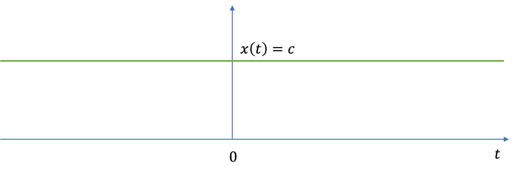
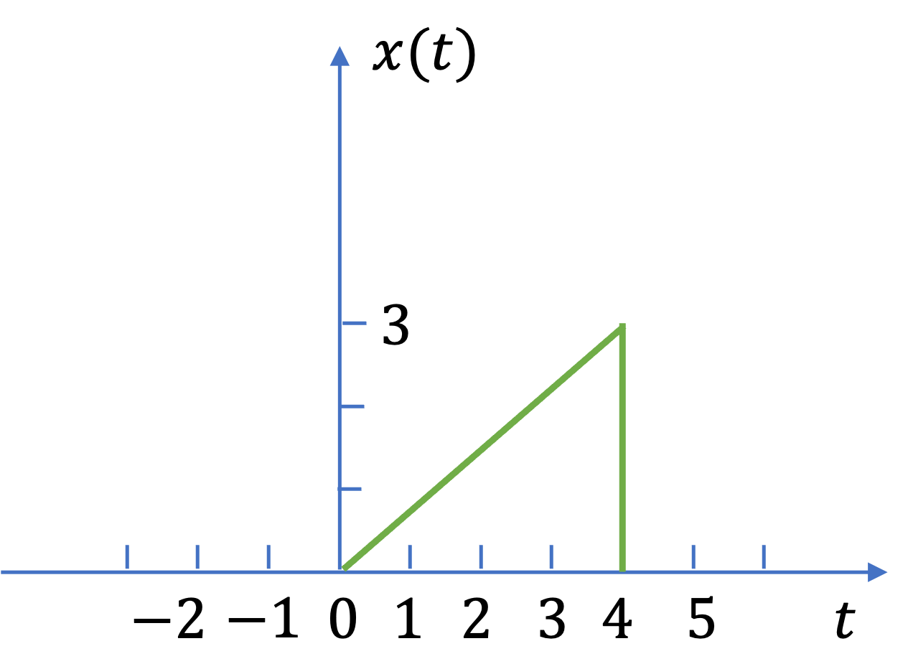

---
jupytext:
  formats: ipynb,md:myst
  text_representation:
    extension: .md
    format_name: myst
    format_version: 0.13
    jupytext_version: 1.14.0
kernelspec:
  display_name: Matlab
  language: matlab
  name: matlab
---

+++ {"slideshow": {"slide_type": "slide"}}

# Periodic, Energy and Power Signals

We continue with our survey of [Signals and Classification of Signals](index.md) by looking at {ref}`p_n_np` and {ref}`e_n_p`.

This section is based on Section 1.2 of {cite}`schaum`.

+++ {"slideshow": {"slide_type": "slide"}}

(p_n_np)=
## Periodic and Nonperiodic Signals

+++ {"slideshow": {"slide_type": "fragment"}}

(periodic_signals)=
### Periodic signals

A continuous-time signal $x(t)$ is said to be *periodic* with *period* $T$ is there is a apositive nonzero value of $T$ for which

$$x(t + T) = x(t)\;\mathrm{all}\;t$$

An example of such a signal is given in Fig. {numref}`periodic-signal`.

+++ {"slideshow": {"slide_type": "subslide"}}

:::{figure-md} periodic-signal


An example of a periodic signal.
:::

+++ {"slideshow": {"slide_type": "subslide"}}

We can use the periodicity to synthesize a periodic signal such as that shown in Fig. {numref}`periodic-signal`.

+++ {"slideshow": {"slide_type": "fragment"}}

Let's first define the signal over one period. We will use MATLAB and the symbolic toolbox for this example:

+++ {"slideshow": {"slide_type": "fragment"}}

Let one period of periodic signal be defined by

$$x\left(t\right)=\left\lbrace \begin{array}{ll}
t & 0\le t\le 1\\
0 & \mathrm{otherwise}
\end{array}\right.$$

+++ {"slideshow": {"slide_type": "fragment"}}

We can use the Heaviside function (unit step) (MATLAB function `heaviside`: see {ref}`heaviside`) to sythesise this signal.

```{code-cell}
---
slideshow:
  slide_type: subslide
---
syms t
T = 1; % period of periodic signal
x(t) = t*(heaviside(t)-heaviside(t-T));
fplot(x(t)),ylim([0 2]),grid,title('A Single period of x(t)')
```

+++ {"slideshow": {"slide_type": "subslide"}}

One period earlier:

$$x(t + T)$$

```{code-cell}
---
slideshow:
  slide_type: fragment
---
signal1 = x(t + T)
fplot(signal1),ylim([0 2]),grid,title('A Single period of x(t+T)')
```

+++ {"slideshow": {"slide_type": "subslide"}}

Two periods later:

$$x(t - 2T)$$

```{code-cell}
---
slideshow:
  slide_type: subslide
---
signal2 = x(t-2*T)
fplot(signal2),ylim([0 2]),grid,title('A Single period of x(t)')
```

+++ {"slideshow": {"slide_type": "fragment"}}

It follows that

$$x(t + mT) = x(t)$$

for all $t$ and any integer $m$.

+++ {"slideshow": {"slide_type": "subslide"}}

Now we use a loop and the definition of periodic function to repeat this signal multiple times

```{code-cell}
---
slideshow:
  slide_type: fragment
---
periodic_signal = 0;
for n = 5:-1:-5
    periodic_signal = periodic_signal + x(t + n*T);
end
periodic_signal
```

+++ {"slideshow": {"slide_type": "subslide"}}

Now we plot the result

```{code-cell}
---
slideshow:
  slide_type: fragment
---
fplot(periodic_signal,'g-',"LineWidth",2),...
    grid,ylabel('x(t)'),xlabel('t'),title('T = 1')
xlim([-3.00 3.00])
ylim([0.00 2.00])
```

+++ {"slideshow": {"slide_type": "fragment"}}

(fundemental_period)=
### Fundamental period

The *fundamental period* $T_0$ of $x(t)$ is the smallest value of $T$ for which $x(t + mT) = x(t)$ holds.

+++ {"slideshow": {"slide_type": "subslide"}}

(dc_signal)=
### DC signals
Note that the definition of the *fundamental period*  does not hold for a constant signal $x(t)$ (known as a dc signal).

+++ {"slideshow": {"slide_type": "fragment"}}

For a constant signal $x(t) = c$ the fundamental period is undefined since $x(t)$ is periodic for any choice of $T$ (and so there is no smallest postive value). See Fig. {numref}`dc_signal`.

+++ {"slideshow": {"slide_type": "fragment"}}

:::{figure-md} dc_signal


A DC signal
:::

+++ {"slideshow": {"slide_type": "subslide"}}

(nonperiodic_signals)=
### Nonperiodic signals

Any continuous-time signal which is not periodic is called a *nonperiodic* (or *aperiodic*) sigmal. For example see Fig. {numref}`aperiodic_signal`

+++ {"slideshow": {"slide_type": "subslide"}}

:::{figure-md} aperiodic_signal


A nonperiodic signal
:::

+++ {"slideshow": {"slide_type": "slide"}}

(e_n_p)=
## Energy and Power Signals

Consider $v(t)$ to be the voltage across a resistor $R$ prtoducing a current $i(t)$. (Fig. {numref}`resistor_circuit`)

+++ {"slideshow": {"slide_type": "subslide"}}

:::{figure-md} resistor_circuit


A simple resistor circuit.
:::


+++ {"slideshow": {"slide_type": "subslide"}}

The instantaneous power $p(t)$ per ohm is defined as

$$p(t) = \frac{v(t)i(t)}{R} = i(t)^2$$

+++ {"slideshow": {"slide_type": "fragment"}}

Total energy $E$ and average power $P$ on a per-ohm basis are

+++ {"slideshow": {"slide_type": "fragment"}}

$$E = \int_{-\infty}^{\infty}i(t)^2\,dt\quad\mathrm{joules}$$

+++ {"slideshow": {"slide_type": "fragment"}}

$$P = \lim_{T\to \infty}\frac{1}{T}\int_{-T/2}^{T/2}i(t)^2\;dt\quad\mathrm{watts}$$

+++ {"slideshow": {"slide_type": "subslide"}}

(normalised_energy_content_of_a_signal)=
### Normalised energy content of a signal

+++ {"slideshow": {"slide_type": "fragment"}}

For an arbitrary continuous-time signal $x(t)$, the *normalised energy content* $E$ of $x(t)$ is defined as

$$E = \int_{-\infty}^{\infty}\left|i(t)\right|^2\,dt$$

+++ {"slideshow": {"slide_type": "subslide"}}

(normalised_average_power_of_a_signal)=
### Normalised average power of a signal

+++ {"slideshow": {"slide_type": "fragment"}}

The *normalised average power* $P$ of $x(t)$ is defined as

$$P = \lim_{T\to \infty}\frac{1}{T}\int_{-T/2}^{T/2}\left|x(t)\right|^2\;dt\quad\mathrm{watts}$$

+++ {"slideshow": {"slide_type": "slide"}}

(worked_examples_2)=
## Worked Examples 2

1). A continuous-time signal $x(t)$ is shown in Fig. {numref}`example1`. 

:::{figure-md} example1


The signal for example 1
:::

+++ {"slideshow": {"slide_type": "subslide"}}

Sketch and label each of the following signals.

a). $x(t-2)$;

+++ {"slideshow": {"slide_type": "fragment"}}

b). $x(2t)$;

+++ {"slideshow": {"slide_type": "fragment"}}

c). $x(2/t)$;

+++ {"slideshow": {"slide_type": "fragment"}}

d). $x(-t)$.

+++ {"slideshow": {"slide_type": "notes"}}

For the answer, refer to the lecture recording or see solved problem 1.1 in {cite}`schaum`

+++ {"slideshow": {"slide_type": "subslide"}}

2). Given the continuous-time signal specified by

$$x\left(t\right)=\left\lbrace \begin{array}{ll}
1-\left|t\right| & -1\le t\le 1\\
0 & \mathrm{otherwise}
\end{array}\right.$$

determine the discrete-time sequence obtained by uniform sampling of $x(t)$ with a sampling intervale of

+++ {"slideshow": {"slide_type": "fragment"}}

a). 0.25 s

+++ {"slideshow": {"slide_type": "fragment"}}

b). 0.5 s, and

+++ {"slideshow": {"slide_type": "fragment"}}

c). 1 s.

+++ {"slideshow": {"slide_type": "subslide"}}

For the answer, refer to the lecture recording or see solved problem 1.3 in {cite}`schaum`.

+++ {"slideshow": {"slide_type": "subslide"}}

3). Sketch and label the even and odd components of the signals shown in Fig. {numref}`example3`.


:::{figure-md} example3


Signals for Example 3.
:::

+++ {"slideshow": {"slide_type": "notes"}}

For the answer, refer to the lecture recording or see solved problem 1.5 in {cite}`schaum`.

+++ {"slideshow": {"slide_type": "subslide"}}

4). Find the odd and even components of $x(t) = e^{jt}$.

+++ {"slideshow": {"slide_type": "notes"}}

For the answer, refer to the lecture recording or see solved problem 1.6 in {cite}`schaum`.

+++ {"slideshow": {"slide_type": "subslide"}}

5). Show that the product of two even signals or of two odd signals is an even signal and that the product of an even signal and an odd signal is an odd signal.

+++ {"slideshow": {"slide_type": "notes"}}

For the answer, refer to the lecture recording or see solved problem 1.7 in {cite}`schaum`.

+++ {"slideshow": {"slide_type": "subslide"}}

6). Show that 

a). If $x(t)$ is even 

$$\int_{-a}^{a} x(t)\, dt = 2 \int_0^a x(t)\, dt.$$

+++ {"slideshow": {"slide_type": "fragment"}}

b). If $x(t)$ is odd 

$$x(0) = 0$$

$$\int_{-a}^{a} x(t)\, dt = 0.$$

```{code-cell}

```

+++ {"slideshow": {"slide_type": "notes"}}

For the answer, refer to the lecture recording or see solved problem 1.8 in {cite}`schaum`.

+++ {"slideshow": {"slide_type": "notes"}}

## Summary

In this lecture we completed our look at signals and the classification of signals. 

In particular we have looked at

* {ref}`p_n_np`
* {ref}`e_n_p`

+++ {"slideshow": {"slide_type": "notes"}}

## Next Time

* {ref}`elementary_signals`
