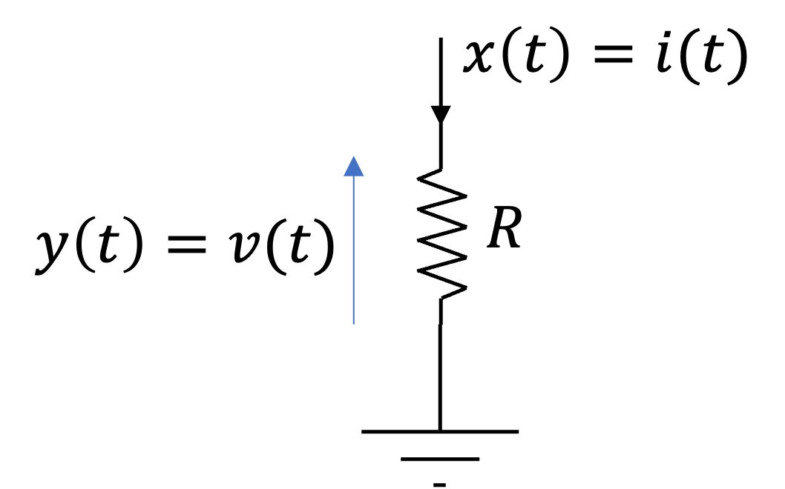
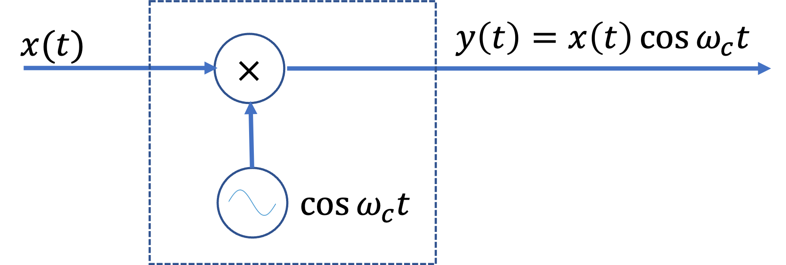

---
jupytext:
  formats: ipynb,md:myst
  text_representation:
    extension: .md
    format_name: myst
    format_version: 0.13
    jupytext_version: 1.14.4
kernelspec:
  display_name: Matlab
  language: matlab
  name: matlab
---

+++ {"slideshow": {"slide_type": "slide"}}

# Unit 2.4: Systems and Classification of Systems

This section is based on Section 1.5 of {cite}`schaum`.

+++ {"slideshow": {"slide_type": "fragment"}}

Follow along at [cpjobling.github.io/eg-150-textbook/signals_and_systems/systems](https://cpjobling.github.io/eg-150-textbook/signals_and_systems/systems)


+++ {"slideshow": {"slide_type": "notes"}}

## Subjects to be covered

* {ref}`system_representation`
* {ref}`deterministic_and_stochastic_systems`
* {ref}`continuous_time_and_discrete_time_systems`
* {ref}`systems_with_memory_and_without_memory`
* {ref}`causal_and_non-causal_systems`
* {ref}`linear_systems_and_nonlinear_systems`
* {ref}`time_invariant_and_time_varying_systems`
* {ref}`linear_time_invariant_systems`
* {ref}`stable_systems`
* {ref}`feedback_systems`
* {ref}`worked_examples_4`

+++ {"slideshow": {"slide_type": "slide"}}

(system_representation)=
## System Representation

A *system* is a mathematical model of a physical process that relates the *input* (or *excitation*) signal to the *output* (or *response*) signal.

+++ {"slideshow": {"slide_type": "fragment"}}

Let $x$ and $y$ be the input and output signals, respectively, of a system. Then the system is viewed as a *transformation* (or *mapping*) of $x$ into $y$. The transformation is represented by the mathematical notation

$$y = \mathbf{T}x$$

where $\mathbf{T}$ is the *operator* representing some well defined rule by which $x$ is transformed into $y$.

+++ {"slideshow": {"slide_type": "notes"}}

The relationship is depicted graphically as shown in {numref}`fig:system`(a).

+++ {"slideshow": {"slide_type": "notes"}}

Multiple input and/or output systems are possible as shown in {numref}`fig:system`(b). In this module we will restrict our attention to the single-input, single-output case.

+++ {"slideshow": {"slide_type": "subslide"}}

:::{figure-md} fig:system


System with single or multiple inputs and outputs
:::

+++ {"slideshow": {"slide_type": "slide"}}

(deterministic_and_stochastic_systems)=
## Deterministic and Stochastic Systems

+++ {"slideshow": {"slide_type": "fragment"}}

If the input and output signals $x$ and $y$ are deterministic signals, then the system is called a *deterministic* system.

+++ {"slideshow": {"slide_type": "fragment"}}

If the input and output signals $x$ and $y$ are random signals, then the system is called a *stochastic* system.

+++ {"slideshow": {"slide_type": "slide"}}

(continuous_time_and_discrete_time_systems)=

## Continuous-Time and Discrete-Time Systems

+++ {"slideshow": {"slide_type": "fragment"}}

If the input and output signals  𝑥  and  𝑦  are continuous-time signals, then the system is called a *continuous-time system* ({numref}`fig:ct_n_dt_system`(a)).

+++ {"slideshow": {"slide_type": "fragment"}}

If the input and output signals  𝑥  and  𝑦  are discrete-time signals or sequences, then the system is called a *discrete-time system* ({numref}`fig:ct_n_dt_system`(b)).

+++ {"slideshow": {"slide_type": "fragment"}}

:::{figure-md} fig:ct_n_dt_system


(a) Continuous-time system; (b) discrete time system.
:::

+++ {"slideshow": {"slide_type": "notes"}}

Note that in a continuous-time system the input $x(t)$ and $y(t)$ are often expressed as a *differential equation* (see {ref}`worked_examples_4`) and in a discrete-time system $x[n]$ and $y[n]$ are often expressed by a *difference equation*.

+++ {"slideshow": {"slide_type": "slide"}}

(systems_with_memory_and_without_memory)=
## Systems with Memory and without Memory

+++ {"slideshow": {"slide_type": "fragment"}}

A system is said to be *memoryless* if the output at any time only depends on the input at the same time.

+++ {"slideshow": {"slide_type": "fragment"}}

Otherwise the system is said to have *memory*.

+++ {"slideshow": {"slide_type": "subslide"}}

### A memoryless system

An example of a memoryless system is a resistor $R$ with and the input $x(t)$ taken as the current and the voltage taken as the output $y(t)$.

+++ {"slideshow": {"slide_type": "fragment"}}

:::{figure-md}  fig:resistor


A memoryless system: a resistor
:::

+++ {"slideshow": {"slide_type": "subslide"}}

The input-output relationship (Ohm's law) of a resistor is

$$y(t) = Rx(t)$$

+++ {"slideshow": {"slide_type": "subslide"}}

### A system with memory

An example of a system with memory is a capacitor $C$ with and the current as the input $x(t)$ taken as the current and the voltage as the output $y(t)$.

+++ {"slideshow": {"slide_type": "fragment"}}

:::{figure-md}  fig:capacitor


A system with memory: a capacitor
:::

+++ {"slideshow": {"slide_type": "subslide"}}

Then:

$$y(t) = \frac{1}{C}\int_{-\infty}^{t}x(\tau)\,d\tau$$

+++ {"slideshow": {"slide_type": "slide"}}

(causal_and_non-causal_systems)=
## Causal and Non-Causal Systems

A system is called *causal* if its output at the present time depends only on the present and/or past values of the input.

+++ {"slideshow": {"slide_type": "fragment"}}

Thus, in a causal system, it is not possible to obtain an output before an input is applied to the system.

+++ {"slideshow": {"slide_type": "fragment"}}

A system is called *noncausal* (or *anticipative*) if its output at the present time depends on future values of the input.

+++ {"slideshow": {"slide_type": "fragment"}}

An example of a noncausal system is

$$y(t) = x(t + 1)$$

+++ {"slideshow": {"slide_type": "notes"}}

Note that all memoryless systems are causal but not all *vice versa*.

+++ {"slideshow": {"slide_type": "slide"}}

(linear_systems_and_nonlinear_systems)=
## Linear Systems and Nonlinear Systems

If an operator $\mathbf{T}$ satisfies the following two conditions, then $\mathbf{T}$ is called a *linear operator* and the system represented by the linear operator $\mathbf{T}$ is called a *linear system*:

+++ {"slideshow": {"slide_type": "subslide"}}

### Properties of Linear Systems

+++ {"slideshow": {"slide_type": "subslide"}}

#### 1. Additivity

Given that $\mathbf{T}\left\{x_1\right\} = y_1$ and  $\mathbf{T}\left\{x_2\right\} = y_2$,

+++ {"slideshow": {"slide_type": "fragment"}}

then

$$\mathbf{T}\left\{x_1 + x_2\right\} = y_1 + y_2$$

for any signals $x_1$ and $x_2$.

+++ {"slideshow": {"slide_type": "subslide"}}

#### 2. Homogeneity (or *Scaling*)

$$\mathbf{T}\left\{\alpha x\right\} = \alpha y$$

for any signals $x$ and any scalar $\alpha$.

+++ {"slideshow": {"slide_type": "subslide"}}

#### Nonlinear systems

Any system that does not satisfy the additivity and homogeneity conditions is classified as a *nonlinear system*.

+++ {"slideshow": {"slide_type": "subslide"}}

### Superposition property

The additivity and homogeneity conditions can combined in a single condition (known as the *superposition property*) as

$$\mathbf{T}\left\{\alpha_1 x_1 + \alpha_2 x_2 \right\} = \alpha_1 y_1 + \alpha_2 y_2$$

where $\alpha_1$ and $\alpha_2$ are arbitrary scalars.

+++ {"slideshow": {"slide_type": "subslide"}}

### Example linear systems

Examples of linear systems are the resistor and capacitor discussed earlier.

+++ {"slideshow": {"slide_type": "subslide"}}

### Example nonlinear systems

Examples of nonlinear systems are

$$y = x^2$$

$$y = \cos x$$

+++ {"slideshow": {"slide_type": "subslide"}}

### Zero input property

Note that a consequence of the homegenity (or scaling) property of linear systems is that a *zero input yields a zero output*. This follows readilty by setting $\alpha = 0$ in the equation $\mathbf{T}\left\{\alpha x\right\} = \alpha y$. This is another important property of linear systems.

+++ {"slideshow": {"slide_type": "slide"}}

(time_invariant_and_time_varying_systems)=
## Time-Invariant and Time-Varying Systems

+++ {"slideshow": {"slide_type": "fragment"}}

A system is called *time-invariant* if a time-shift (delay or advance) in the input signal causes the same time-shift in the output signal.

+++ {"slideshow": {"slide_type": "fragment"}}

Thus for a continuous-time system, the system is time-invariant if

$$\mathbf{T}\left\{x(t - \tau)\right\}=y(t - \tau)$$

for any real value of $\tau$.

+++ {"slideshow": {"slide_type": "subslide"}}

### Time-varying system

A system that does not satisfy the equation $\mathbf{T}\left\{x(t - \tau)\right\}=y(t - \tau)$ is called a *time-varying system*.

+++ {"slideshow": {"slide_type": "subslide"}}

### Testing for time-invariance

To check for time invariance, we can compare the time-shifted output with the output produced by the time-shifted input (See {ref}`ex4_2` and {ref}`ex4_3`).

+++ {"slideshow": {"slide_type": "slide"}}

(linear_time_invariant_systems)=
## Linear Time-Invariant Systems

+++ {"slideshow": {"slide_type": "fragment"}}

If a system is linear and also time-invariant it is called a *linear time-invariant* (LTI) system.

+++ {"slideshow": {"slide_type": "fragment"}}

All ths systems analysed in in the rest of the module and in **EG-247 Digital Signal Processing** and **EG-243 Control Systems** next year will be LTI systems.

+++ {"slideshow": {"slide_type": "slide"}}

(stable_systems)=
## Stable Systems

A system is *bounded-input/bounded-output* (BIBO) *stable* if for any bounded input signal $x$ defined by

$$|x|\le k_1$$

the corresponding output $y$ is also bounded defined by

$$|y|\le k_2$$

where $k_1$ and $k_2$ are finite real constants.

+++ {"slideshow": {"slide_type": "subslide"}}

### Unstable systems

An *unstable* system is one in which not all bounded inputs lead to a bounded output.

+++ {"slideshow": {"slide_type": "fragment"}}

For example, consider the system where output 

$$y(t) = t x(t)$$

and input $x(t)$ is the unit step $u_0(t)$

+++ {"slideshow": {"slide_type": "fragment"}}

In this case $x(t) = 1$ (so is bounded) but the output $y(t)$ increases without bound as $t$ increases.

+++ {"slideshow": {"slide_type": "slide"}}

(feedback_systems)=
## Feedback Systems

A special class of systems of great importance consists of systems having *feedback*.

+++ {"slideshow": {"slide_type": "fragment"}}

In a *feedback system*, a portion of the output signal is fed back and added to the input as shown in {numref}`fig:feedback`.

+++ {"slideshow": {"slide_type": "fragment"}}

:::{figure-md} fig:feedback


A feedback system with negative feedback: $e(t) = x(t) - y(t)$.
:::

+++ {"slideshow": {"slide_type": "notes"}}

You will see examples of systems with feedback when you study op-amp circuits in **EG-152 Practical Electronics**, the simple closed-loop systems to be studied in **EG-142 Instrumentation and Control**.  Feedback, and its impact on system stability, is also the basis of control theory to be studied next year in **EG-243 Control Systems**.

+++ {"slideshow": {"slide_type": "slide"}}

(worked_examples_4)=
## Examples 4

```{admonition} MATLAB Example
:class: tip
We will solve this example by hand and then give the solution in the MATLAB lab.
```

(ex4.1)=

### Example 4.1: RC Circuit 

Consider the RC circuit shown in {numref}`fig:rc_circuit`. Find the relationship between the input $x(t)$ and the output $y(t)$

(a) If $x(t) = v_s(t)$ and $y(t) = v_c(t)$.

(b) If $x(t) = v_s(t)$ and $y(t) = i(t)$.

:::{figure-md} fig:rc_circuit


RC circuit
:::

+++ {"slideshow": {"slide_type": "notes"}}

For the answer, refer to the lecture recording or see solved problem 1.32 in {cite}schaum.

+++ {"slideshow": {"slide_type": "subslide"}}

(ex4_2)=
### Example 4.2: Capacitor circuit

 ```{admonition} MATLAB Example
:class: tip
We will solve this example by hand and then give the solution in the MATLAB lab.
```

Consider the capacitor shown in {numref}`fig:cap_circuit`. Let the input $x(t) = i(t)$ and the output $y(t) = v_c(t)$.

(a) Find the input-output relationship.

(b) Determine whether the system is (i) memoryless, (ii) causal, (iii) linear, (iv) time invariant, or (v) stable.

:::{figure-md} fig:cap_circuit


A capacitor citcuit.
:::

+++ {"slideshow": {"slide_type": "notes"}}

For the answer, refer to the lecture recording or see solved problem 1.33 in {cite}schaum.

+++ {"slideshow": {"slide_type": "subslide"}}

(ex4_3)=


### Example 4.3: Signal modulator

```{admonition} MATLAB Example
:class: tip
We will solve this example by hand and then give the solution in the MATLAB lab.
```


Consider the system shown in {numref}`fig:4_3`. Determine whether it is (a) memoryless, (b) causal, (c) linear, (d) time invariant, or (e) stable.

:::{figure-md} fig:4_3


A signal modulator
:::

+++ {"slideshow": {"slide_type": "notes"}}

For the answer, refer to the lecture recording or see solved problem 1.34 in {cite}schaum.

+++ {"slideshow": {"slide_type": "subslide"}}

(ex4_4)=
### Example 4.4 

A system has the input-output relationship given by

$$y = \mathbf{T}\left\{x\right\} = x^2$$

Show that this system is nonlinear.

+++ {"slideshow": {"slide_type": "notes"}}

For the answer, refer to the lecture recording or see solved problem 1.35 in {cite}schaum.

+++ {"slideshow": {"slide_type": "subslide"}}

(ex4_5)=
### Example 4.5

Consider the system whose input-output relationship is given by the linear equation 

$$y = ax + b$$

where $x$ and $y$ are the input and output respectively and $s$ and $b$ are constant. Is this system linear?

+++ {"slideshow": {"slide_type": "notes"}}

For the answer, refer to the lecture recording or see solved problem 1.40 in {cite}schaum.

+++ {"slideshow": {"slide_type": "subslide"}}

(ex4_6)=
### Example 4.6 

(a) Show that the causality for a continuous-time linear system is equivalent to the following statement: For any time $t_0$ and any input $x(t)$ with $x(t) = 0$ for $t \le t_0$, the output $y(t)$ is zero for $t \le t_0$.

(b) Find a nonlinear system that is causal but does not satisfy this condition.

(c) Find a nonlinear system that satisfies this condition but is not causal.

+++ {"slideshow": {"slide_type": "notes"}}

For the answer, refer to the lecture recording or see solved problem 1.43 in {cite}schaum.

+++ {"slideshow": {"slide_type": "subslide"}}

(ex4_7)=


### Example 4.7

Let $\mathbf{T}$ represent a continuous-time LTI system. Then show that

$$\mathbf{T}\left\{e^{st}\right\}= \lambda e^{st}$$

where $s$ is a complex variable and $\lambda$ is a complex constant.

+++ {"slideshow": {"slide_type": "notes"}}

For the answer, refer to the lecture recording or see solved problem 1.44 in {cite}schaum.

+++ {"slideshow": {"slide_type": "notes"}}

## Summary

In this lecture we have started our look at systems and the classification of systems.

In particular we have looked at

* {ref}`system_representation`
* {ref}`deterministic_and_stochastic_systems`
* {ref}`continuous_time_and_discrete_time_systems`
* {ref}`systems_with_memory_and_without_memory`
* {ref}`causal_and_non-causal_systems`
* {ref}`linear_systems_and_nonlinear_systems`
* {ref}`time_invariant_and_time_varying_systems`
* {ref}`linear_time_invariant_systems`
* {ref}`stable_systems`
* {ref}`feedback_systems`

+++ {"slideshow": {"slide_type": "notes"}}

## Next time

* {ref}`lti_systems`

## References

```{bibliography}
:filter: docname in docnames
```
