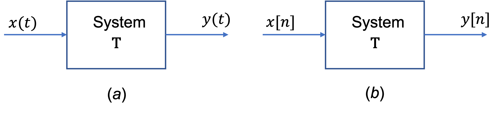

---
jupytext:
  formats: ipynb,md:myst
  text_representation:
    extension: .md
    format_name: myst
    format_version: 0.13
    jupytext_version: 1.14.0
kernelspec:
  display_name: Matlab
  language: matlab
  name: matlab
---

+++ {"slideshow": {"slide_type": "slide"}}

# Systems and Classification of Systems

This section is based on Section 1.5 of {cite}`schaum`.

+++ {"slideshow": {"slide_type": "notes"}}

## Subjects to be covered

* {ref}`system_representation`
* {ref}`deterministic_and_stochastic_systems`
* {ref}`continuous_time_and_discrete_time_systems`
* {ref}`aystems_with_memory_and_without_memory`
* {ref}`causal_and_non-causal_systems`
* {ref}`linear_systems_and_nonlinear_systems`
* {ref}`linear_time_invariant_systems`
* {ref}`stable_systems`
* {ref}`feedback_systems`

+++ {"slideshow": {"slide_type": "slide"}}

(system_representation)=
## System Representation

A *system* is a mathematical model of a physical process that relates the *input* (or *excitation*) signal to the *output* (or *response*) signal.

+++ {"slideshow": {"slide_type": "fragment"}}

Let $x$ and $y$ be the input and output signals, respectively, of a system. Then the system is viewed as a *transformation* (or *mapping*) of $x$ into $y$. The transformation is represented by the mathematical notation

$$y = \mathbf{T}x$$

where $\mathbf{T}$ is the *operator* representing some well defined rule by which $x$ is transformed into $y$.

+++ {"slideshow": {"slide_type": "notes"}}

The relationship is depicted graphically as shown in {numref}`fig:system`(a).

+++ {"slideshow": {"slide_type": "notes"}}

Multiple input and/or output ssystems are possible as shown in {numref}`fig:system`(b). In this module we will restrict our attention to the single-input, single-output case.

+++ {"slideshow": {"slide_type": "subslide"}}

:::{figure-md} fig:system

System with single or multiple inputs and outputs
:::

+++ {"slideshow": {"slide_type": "slide"}}

(deterministic_and_stochastic_systems)=
## Deterministic and Stochastic Systems

+++ {"slideshow": {"slide_type": "fragment"}}

If the input and output signals $x$ and $y$ are deterministic signals, then the system is called a deterministic system.

+++ {"slideshow": {"slide_type": "fragment"}}

If the input and output signals $x$ and $y$ are random signals, then the system is called a *stochastic* system.

+++ {"slideshow": {"slide_type": "slide"}}

(continuous_time_and_discrete_time_systems)=
## Continuous-Time and Discrete-Time Systems

+++ {"slideshow": {"slide_type": "fragment"}}

If the input and output signals  𝑥  and  𝑦  are continuous-time signals, then the system is called a *continuous-time system* ({numref}`fig:ct_n_dt_system`(a)).

+++ {"slideshow": {"slide_type": "fragment"}}

If the input and output signals  𝑥  and  𝑦  are discrete-time signals or sequences, then the system is called a *discrete-time system* ({numref}`fig:ct_n_dt_system`(b)).

+++ {"slideshow": {"slide_type": "fragment"}}

:::{figure-md} fig:ct_n_dt_system

(a) Continuous-time system; (b) discrete time system.
:::

+++ {"slideshow": {"slide_type": "slide"}}

(aystems_with_memory_and_without_memory)=
## Systems with Memory and without Memory

+++ {"slideshow": {"slide_type": "slide"}}

(causal_and_non-causal_systems)=
## Causal and Non-Causal Systems

+++ {"slideshow": {"slide_type": "slide"}}

(linear_systems_and_nonlinear_systems)=
## Linear Systems and Nonlinear Systems

+++ {"slideshow": {"slide_type": "slide"}}

(linear_time_invariant_systems)=
## Linear Time-Invariant Systems

+++ {"slideshow": {"slide_type": "slide"}}

(stable_systems)=
## Stable Systems

+++ {"slideshow": {"slide_type": "slide"}}

(feedback_systems)=
## Feedback Systems

+++ {"slideshow": {"slide_type": "notes"}}

## Summary

In this lecture we have started our look at systems and the classification of systems.

In particular we have looked at

* {ref}`system_representation`
* {ref}`deterministic_and_stochastic_systems`
* {ref}`continuous_time_and_discrete_time_systems`
* {ref}`aystems_with_memory_and_without_memory`
* {ref}`causal_and_non-causal_systems`
* {ref}`linear_systems_and_nonlinear_systems`
* {ref}`linear_time_invariant_systems`
* {ref}`stable_systems`
* {ref}`feedback_systems`

+++ {"slideshow": {"slide_type": "notes"}}

## Next time

* {ref}`elementary_signals`
